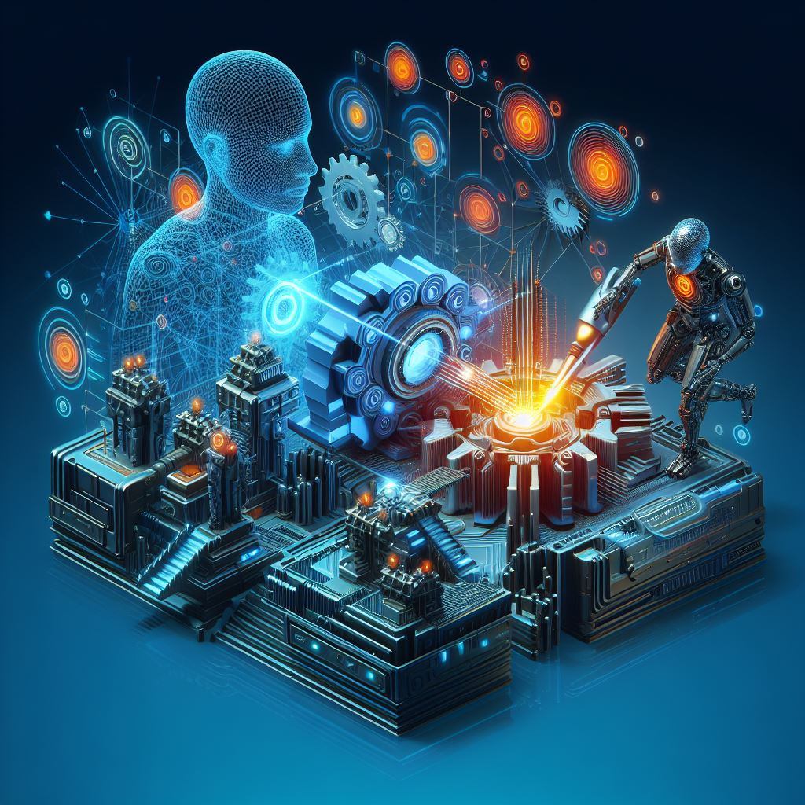

## 3DPresso: Redefining 3D Design with AI-Enabled Innovations

### Summary
3DPresso, available at [3dpresso.ai](https://3dpresso.ai), is an innovative platform harnessing AI to revolutionize 3D design creation. This article explores how 3DPresso utilizes advanced AI algorithms to transform and render intricate 3D designs effortlessly.



### Key Points

1. **Introduction to 3DPresso:** Unveiling the role of [3dpresso.ai](https://3dpresso.ai) in reshaping 3D design through AI-driven advancements.
2. **AI's Role in 3D Design:** Discovering how 3DPresso simplifies and elevates the process of 3D design creation by leveraging AI capabilities.
3. **Pros and Cons** (Table Format):

| Pros                                 | Cons                                |
|--------------------------------------|-------------------------------------|
| Streamlined 3D design creation        | Learning curve for new users        |
| Diverse tools for 3D modeling        | Dependency on predefined models     |
| Simplifies complex design processes  | Variability in output quality       |

### Tips for the Reader 💡
Exploring 3D Design with 3DPresso:
- Experiment with various tools and features available on the platform to understand its capabilities.
- Engage with tutorials and user communities to unlock the full potential of 3DPresso's AI-driven tools.
- Explore various design styles and options to leverage the platform's AI-powered enhancements effectively.

### Examples

#### Example 1: AI-Generated 3D Model
**Prompt:** Generating AI-Driven 3D Models with 3DPresso

**Input**
```dart
3d_model = 3DPresso.generate_3d_model(style, elements)
```

**Output**
```dart
A 3D model generated based on the specified style and elements using 3DPresso's AI-driven tools.
```

#### Example 2: Advanced 3D Sculpting
**Prompt:** Sculpting Advanced 3D Designs using 3DPresso

**Input**
```dart
sculpted_design = 3DPresso.sculpt_3d_design(design, techniques)
```

**Output**
```dart
An advanced 3D design sculpted using specified techniques and tools within 3DPresso's platform.
```

#### Example 3: AI-Enhanced 3D Rendering
**Prompt:** Rendering AI-Enhanced 3D Images with 3DPresso

**Input**
```dart
rendered_image = 3DPresso.render_3d_image(model, preferences)
```

**Output**
```dart
A 3D image rendered based on the provided model and preferences using 3DPresso's AI-enhanced rendering capabilities.
```

Try for Yourself 👉 <a href="https://3dpresso.ai" target="_blank">Explore 3DPresso</a>

## URL Address
- <a href="https://3dpresso.ai" target="_blank">3DPresso - AI-Enabled 3D Design Innovations</a>

### Follow our Social Media for more information:
- 📘 <a href="https://www.facebook.com/groups/trionxai" target="_blank">Facebook Group</a>
- 👍 <a href="https://www.facebook.com/ai.trionxai" target="_blank">Facebook Page</a>
- 📸 <a href="https://www.instagram.com/trionxai/" target="_blank">Instagram</a>
- ▶️ <a href="https://www.youtube.com/@robotdocs/" target="_blank">Youtube</a>

<hr>

### SEO High Ranking Page Tags
AI, 3DPresso, 3D Design, AI-Driven Innovations, Innovative 3D Modeling, Artificial Intelligence, Advanced 3D Tools, AI Applications, Design Enhancement, AI Advancements