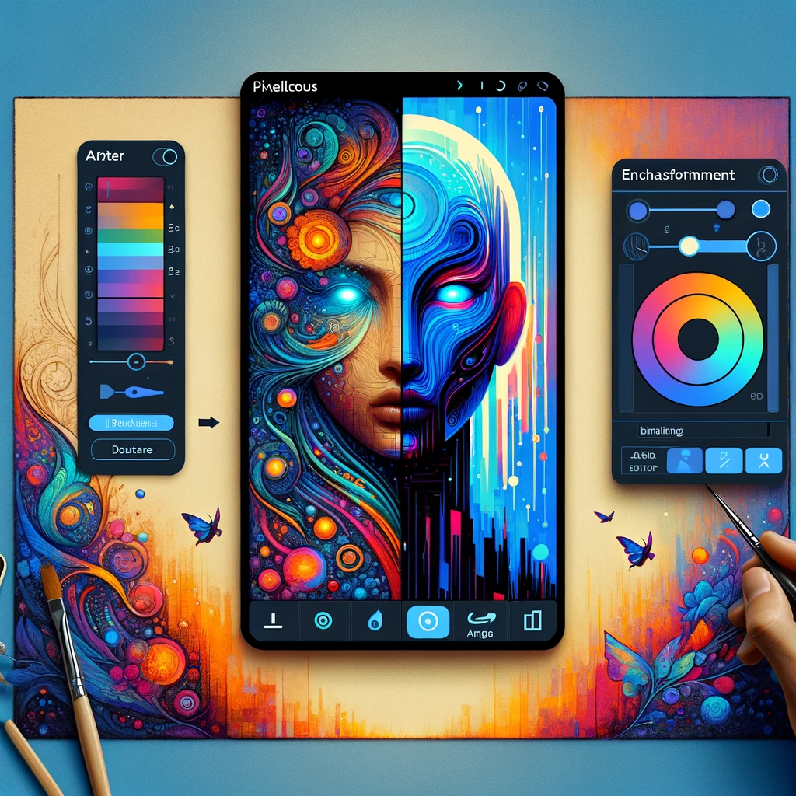

# Pixelicious: Redefining Digital Art with Advanced AI

## Summary:
Pixelicious is an innovative AI-powered platform that is transforming the landscape of digital art creation. It leverages artificial intelligence to help artists and designers produce stunning visuals, offering tools for image enhancement, style transfer, and creative exploration. This platform is ideal for graphic artists, digital marketers, and anyone interested in pushing the boundaries of digital creativity.

## Key Points:
- AI-driven enhancement and creation of digital art.
- User-friendly tools for style transfer and image editing.
- Versatile application for various creative fields.

## Pros and Cons:

| Pros                                | Cons                                      |
|-------------------------------------|-------------------------------------------|
| Streamlines digital art creation    | Learning curve for complex features       |
| High-quality image outputs          | Dependence on input image quality         |
| Encourages creative experimentation | Requires internet connectivity for access |

## 🌟 Tips for the Reader:
- 🎨 Experiment with different styles to find unique artistic expressions.
- 🖼️ Use high-resolution images for the best results.
- 💡 Stay updated on new features to continually enhance your art.

## Examples:

### Example 1: Transforming Landscapes
- **Prompt:** Enchanting Landscapes
- **Input:** Basic landscape photo.
- **Output:** Artistically enhanced landscape with a unique style.

### Example 2: Modernizing Classic Art
- **Prompt:** Digital Art Revival
- **Input:** Reproduction of a classic painting.
- **Output:** A modern reinterpretation of the classic artwork.

👉 [**Try for yourself**]{(<https://www.pixelicious.xyz/>):target="_blank"}

## URL Address of Pixelicious:
- [Pixelicious Official Site]{(<https://www.pixelicious.xyz/>):target="_blank"}

---

**Follow our Social Media for more information:**
- 📘 [FB group: Trionx AI Group]{(https://www.facebook.com/groups/trionxai):target="_blank"}
- 👍 [FB page: Trionx AI Page]{(https://www.facebook.com/ai.trionxai):target="_blank"}
- 📸 [Instagram: Trionx AI Instagram]{(https://www.instagram.com/trionxai/):target="_blank"}
- ▶️ [Youtube: Trionx AI YouTube]{(https://www.youtube.com/@robotdocs/):target="_blank"}

---

## SEO High Ranking Page Tags:
Pixelicious, AI digital art, style transfer, image enhancement, creative AI, digital creativity, graphic design, art technology, AI tools, visual art, digital marketing, artistic expression, innovative design, AI in art, digital graphics, image editing, modern art, digital painting, creative exploration, art enhancement

*Image Prompt for Dall-E 3: "A visually striking illustration depicting the Pixelicious interface, showcasing its capabilities in transforming and enhancing digital artworks with AI, rendered in an artistic and contemporary digital art style."*

