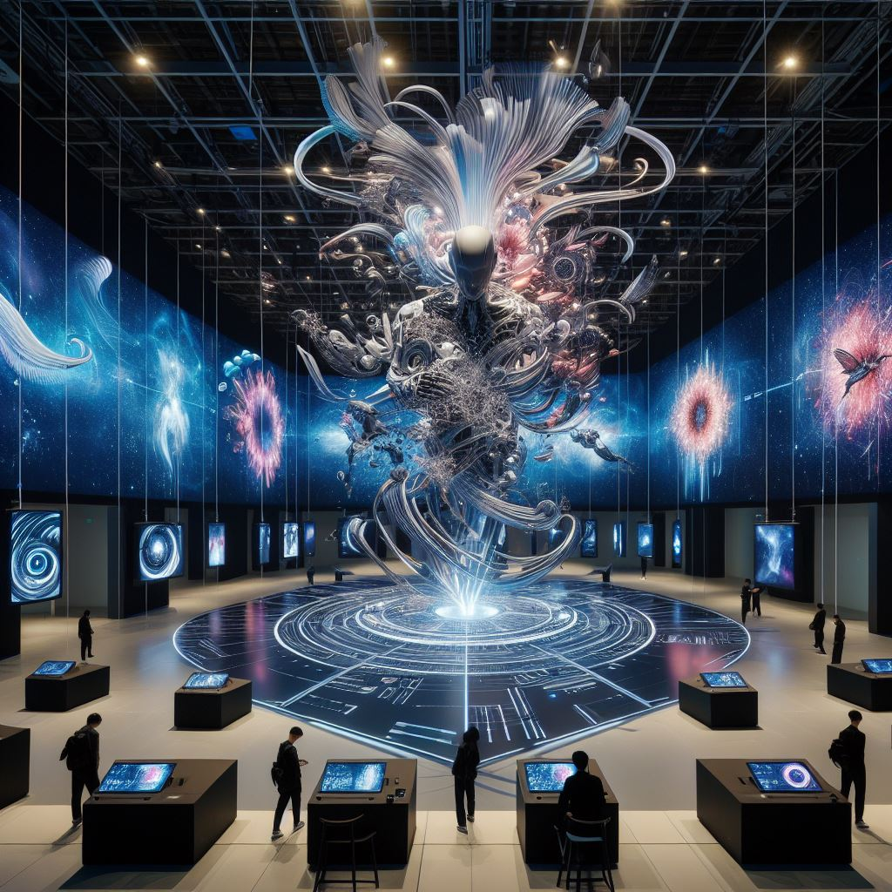

## AI Gallery: Exploring a Fusion of Art and AI in a Digital Showcase

### Summary
AI Gallery, accessible at [AIGallery.app](https://aigallery.app), is a digital platform presenting the amalgamation of art and AI. This article delves into how AI Gallery utilizes AI algorithms to curate and exhibit captivating digital artworks.



### Key Points

1. **Introduction to AI Gallery:** Unveiling the role of [AIGallery.app](https://aigallery.app) in integrating AI for digital art curation and presentation.
2. **AI's Role in Digital Art Showcase:** Exploring how AI Gallery employs AI algorithms to curate, categorize, and exhibit diverse digital art forms.
3. **Pros and Cons** (Table Format):

| Pros                                 | Cons                                |
|--------------------------------------|-------------------------------------|
| Wide array of curated digital art     | Limited personalization options     |
| AI-driven art curation and discovery | Dependency on pre-defined styles    |
| Exposure to various artistic styles   | Limited interaction with artists    |

### Tips for the Reader 💡
Navigating AI Gallery's Artistic Showcase:
- Explore different categories and collections to witness diverse AI-generated art.
- Engage with the displayed art pieces to understand AI's role in their creation.
- Stay updated with new additions and exhibitions to experience the evolving AI art scene.

### Examples

#### Example 1: AI-Generated Painting Showcase
**Prompt:** Exploring AI-Generated Paintings in AI Gallery

**Input**
```dart
paintings = AIGallery.explore_paintings(style)
```

**Output**
```dart
A collection of AI-generated paintings based on the specified style showcased in AI Gallery's digital platform.
```

#### Example 2: AI-Curated Photography Exhibition
**Prompt:** Discovering AI-Curated Photography Exhibitions in AI Gallery

**Input**
```dart
photography = AIGallery.discover_photography(style)
```

**Output**
```dart
A curated collection of photographs grouped by style and theme, showcasing AI-curated exhibitions on AI Gallery.
```

#### Example 3: AI-Driven Digital Art Showcase
**Prompt:** Exploring AI-Driven Digital Art Exhibits in AI Gallery

**Input**
```dart
digital_art = AIGallery.explore_digital_art(theme)
```

**Output**
```dart
A display of digital art forms influenced by the specified theme, highlighted in AI Gallery's digital exhibitions.
```

Try for Yourself 👉 <a href="https://aigallery.app" target="_blank">Explore AI Gallery</a>

## URL Address
- <a href="https://aigallery.app" target="_blank">AI Gallery - Fusion of Art and AI</a>

### Follow our Social Media for more information:
- 📘 <a href="https://www.facebook.com/groups/trionxai" target="_blank">Facebook Group</a>
- 👍 <a href="https://www.facebook.com/ai.trionxai" target="_blank">Facebook Page</a>
- 📸 <a href="https://www.instagram.com/trionxai/" target="_blank">Instagram</a>
- ▶️ <a href="https://www.youtube.com/@robotdocs/" target="_blank">Youtube</a>

<hr>

### SEO High Ranking Page Tags
AI, AI Gallery, Digital Art Showcase, AI-Driven Curation, Digital Art Fusion, Artificial Intelligence, Digital Art Curation, AI Applications, Artistic Presentations, AI Advancements