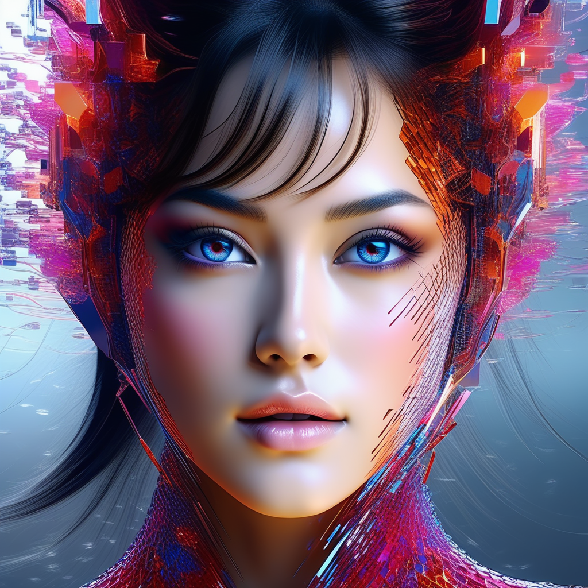
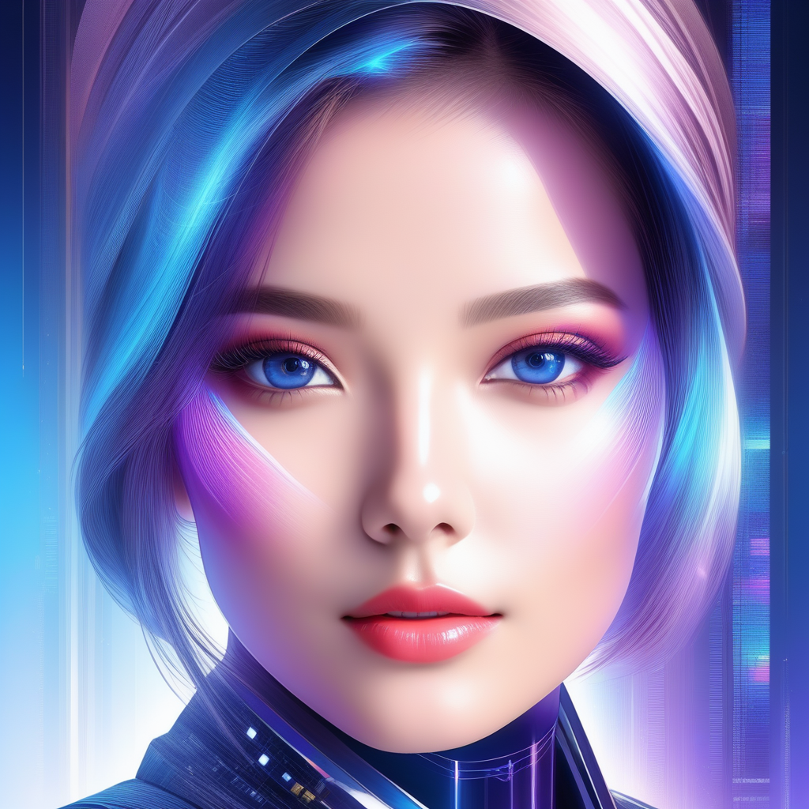

# AI Portrait Generator: Unveiling Digital Artistry

## Summary:
AI Portrait Generator is a state-of-the-art tool designed to transform photographs into unique digital portraits using advanced AI algorithms. This tool caters to artists, photographers, and hobbyists, offering an intuitive way to create stunning, artistic renditions of portraits with just a few clicks.

## Key Points:
- Utilizes advanced AI for artistic transformations.
- Simple and user-friendly interface.
- Ideal for creating unique digital art and portraits.

## Pros and Cons:

| Pros                               | Cons                                     |
|------------------------------------|------------------------------------------|
| Easy to use with instant results   | Limited control over artistic styles     |
| High-quality digital portrait output| Dependence on original photo quality     |
| Creative and fun for all skill levels| Internet connection required            |

## 🌟 Tips for the Reader:
- 📸 Use high-resolution photos for better output quality.
- 🎨 Experiment with different photos to explore various art styles.
- 🌐 Share your AI-generated portraits on social media for feedback and inspiration.

🔵 **Unlock your creativity with AI Portrait Generator!**

## Examples:

### Example 1: Transforming Selfies
- **Prompt:** Selfie to Digital Art
- **Input:** A regular selfie.
- **Output:** Artistic AI-rendered portrait.

### Example 2: Revamping Family Photos
- **Prompt:** Family Memories Reimagined
- **Input:** Old family photo.
- **Output:** Stylized, modern portrait rendition.

### 👉 [Try for yourself](<https://www.media.io/ai-portrait-generator.html or https://www.ai-portraits.org/ >)

### URL Address of the AI Topic / Vendor
### [Insert Vendor URL Here](<https://www.media.io/ai-portrait-generator.html or https://www.ai-portraits.org/>)

### Follow our Social Media for more information
- 📘 [FB group: Trionx AI Group](https://www.facebook.com/groups/trionxai){:target="_blank"}
- 👍 [FB page: Trionx AI Page](https://www.facebook.com/ai.trionxai){:target="_blank"}
- 📸 [Instagram: Trionx AI Instagram](https://www.instagram.com/trionxai/){:target="_blank"}
- ▶️ [Youtube: Trionx AI YouTube](https://www.youtube.com/@robotdocs/){:target="_blank"}

## SEO High Ranking Page Tags:
AI Portrait Generator, digital art, AI algorithms, portrait transformation, creative photography, artistic AI, digital portrait, photo to art, AI art, user-friendly AI tool, digital creativity, photography enhancement, portrait artistry, artistic transformation, AI technology in art, digital portrait creation, AI for artists, creative AI applications, portrait innovation, AI-generated art

