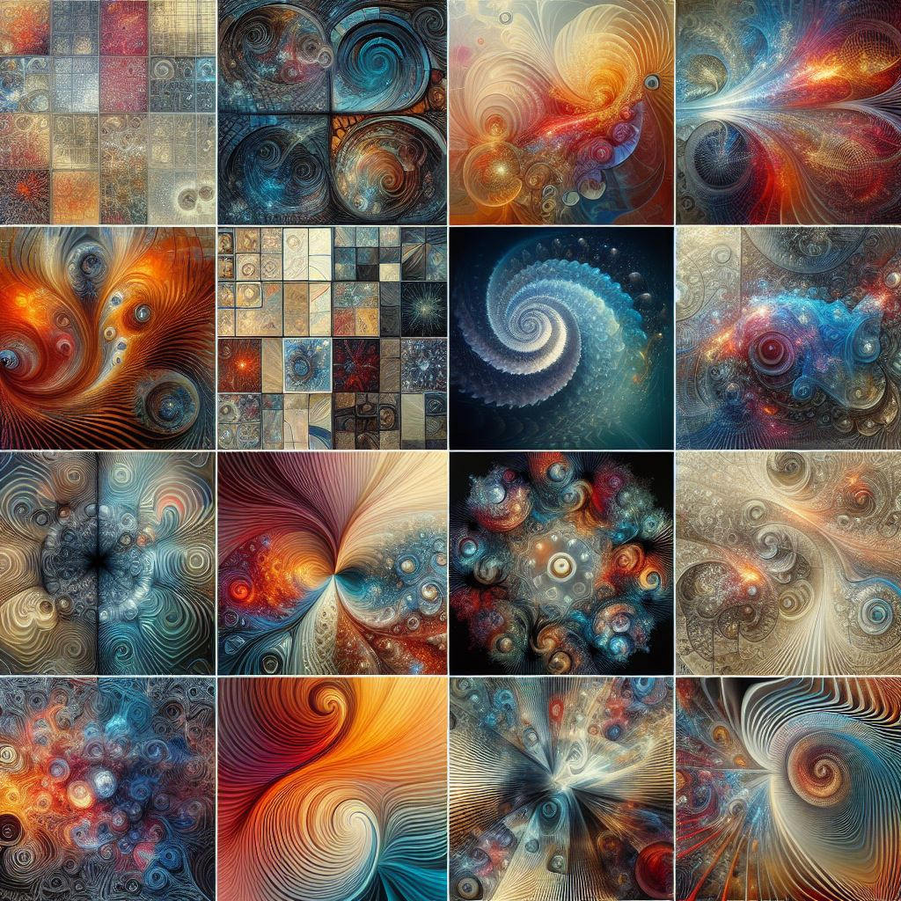

## aiart.fm: Unleashing Creative Potential through AI-Generated Artistry

### Summary
aiart.fm is an innovative platform utilizing AI to craft captivating artwork. This article delves into how aiart.fm harnesses AI algorithms, empowering users to create diverse and imaginative artistic compositions.



### Key Points

1. **Introduction to aiart.fm:** Revealing the role of aiart.fm in employing AI for art creation and fostering artistic exploration.
2. **AI's Role in Artistic Creation:** Exploring how aiart.fm's AI capabilities enable users to produce a broad spectrum of unique and expressive artworks.
3. **Pros and Cons** (Table Format):

| Pros                                     | Cons                                    |
|------------------------------------------|-----------------------------------------|
| Diverse range of AI-generated art styles | Learning curve for complex designs       |
| Encourages artistic experimentation      | Limitations in customization             |
| Simplifies art creation for non-artists   | Dependency on predefined AI models       |

### Tips for the Reader 💡
Exploring Artistry with aiart.fm:
- Experiment with various AI-generated art styles available on the platform.
- Combine AI-generated suggestions with personal artistic touches for unique creations.
- Explore different mediums and styles to fully explore the potential of AI-generated art.

### Examples

#### Example 1: AI-Generated Painting
**Prompt:** Creating AI-Generated Paintings on aiart.fm

**Input**
```dart
painting = aiartfm.generate_painting(style, elements)
```

**Output**
```dart
A unique and creative painting generated based on the specified style and elements using aiart.fm's AI capabilities.
```

#### Example 2: AI-Enhanced Photography Art
**Prompt:** Transforming Photos into AI-Generated Artwork on aiart.fm

**Input**
```dart
artistic_photo = aiartfm.transform_photo(photography, style)
```

**Output**
```dart
A visually enhanced photograph transformed into an artistic style using aiart.fm's AI-generated art techniques.
```

#### Example 3: AI-Generated Design Suggestions
**Prompt:** Generating AI-Driven Artistic Designs on aiart.fm

**Input**
```dart
design = aiartfm.generate_design(input, preferences)
```

**Output**
```dart
AI-generated design suggestions based on input and specified preferences using aiart.fm's creative AI tools.
```

Try for Yourself 👉 <a href="https://aiart.fm" target="_blank">Explore aiart.fm</a>

## URL Address
- <a href="https://aiart.fm" target="_blank">aiart.fm - AI-Generated Artistry</a>

### Follow our Social Media for more information:
- 📘 <a href="https://www.facebook.com/groups/trionxai" target="_blank">Facebook Group</a>
- 👍 <a href="https://www.facebook.com/ai.trionxai" target="_blank">Facebook Page</a>
- 📸 <a href="https://www.instagram.com/trionxai/" target="_blank">Instagram</a>
- ▶️ <a href="https://www.youtube.com/@robotdocs/" target="_blank">Youtube</a>

<hr>

### SEO High Ranking Page Tags
AI, aiart.fm, AI-Generated Art, Creative Art, AI-Driven Creations, Artistic Exploration, Artificial Intelligence, Creative Expression, AI Applications, Artistic Innovations, AI Advancements