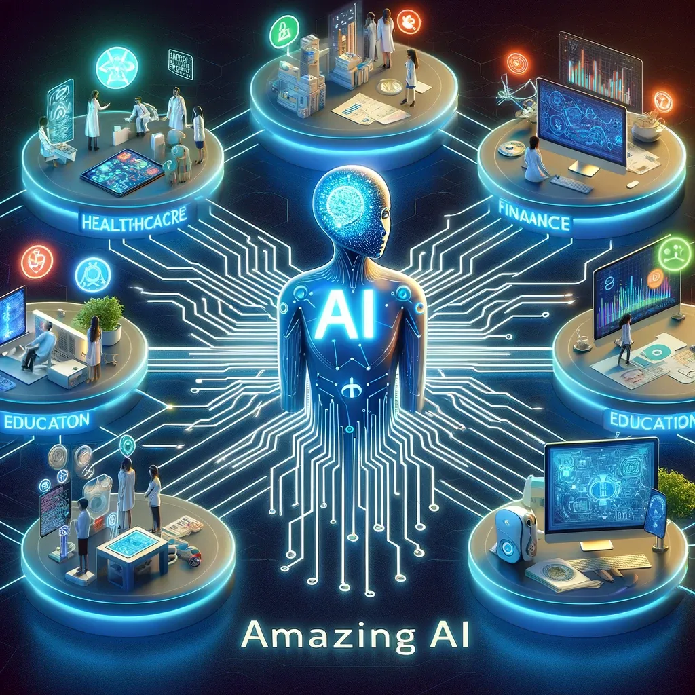

# Amazing AI: Transforming the Future with Intelligent Technology

## Summary:
Amazing AI is a cutting-edge platform that showcases the latest advancements in artificial intelligence. It offers a suite of AI tools and applications designed to transform various sectors, including healthcare, finance, and education. With its focus on innovation, Amazing AI is committed to making AI technology accessible and impactful for businesses and individuals alike.

## Key Points:
- Wide range of AI tools and applications.
- Applications in healthcare, finance, education, and more.
- User-friendly interface and accessible technology.

## Pros and Cons:

| Pros                               | Cons                                 |
|------------------------------------|--------------------------------------|
| Diverse range of applications      | Complexity of some tools for beginners |
| High accuracy and efficiency       | May require significant data input    |
| Strong customer support            | Can be resource-intensive             |

## 🌟 Tips for the Reader:
- 🤖 Start with basic tools to understand AI capabilities.
- 📊 Use Amazing AI for data-driven insights and decision making.
- 🚀 Keep abreast of updates to leverage new features.

🔵 **Make the most of Amazing AI with these tips!**

## Examples:

### Example 1: AI in Healthcare
- **Prompt:** Enhancing Patient Care
- **Input:** Patient data and medical history.
- **Output:** Tailored treatment plans and predictive healthcare insights.

### Example 2: AI in Finance
- **Prompt:** Financial Forecasting
- **Input:** Market data and financial trends.
- **Output:** Predictive financial models and investment insights.

👉 **[Try for yourself](https://www.futuretools.io/tools/amazing-ai)**

**Explore the capabilities of Amazing AI!**

## URL Address of Amazing AI:
- [Amazing AI Official Site](<https://www.futuretools.io/tools/amazing-ai>)

---

## Follow our Social Media for more information

- 📘 <a href="https://www.facebook.com/groups/trionxai" target="_blank">FB group: Trionx AI Group</a>
- 👍 <a href="https://www.facebook.com/ai.trionxai" target="_blank">FB page: Trionx AI Page</a>
- 📸 <a href="https://www.instagram.com/trionxai/" target="_blank">Instagram: Trionx AI Instagram</a>
- ▶️ <a href="https://www.youtube.com/@robotdocs/" target="_blank">Youtube: Trionx AI YouTube</a>

## SEO High Ranking Page Tags:
Amazing AI, artificial intelligence, AI tools, AI technology, AI in healthcare, AI in finance, AI in education, intelligent technology, AI applications, data-driven insights, predictive analytics, AI for business, technology innovation, user-friendly AI, AI platforms, AI advancements, machine learning, digital transformation, smart solutions, AI insights

