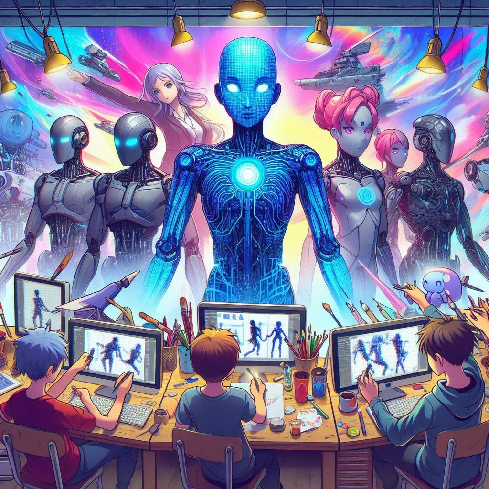

## Anime AI: Elevating Animation with Intelligent Artistry

### Summary
Anime AI takes the stage as a revolutionary platform, elevating the world of animation with intelligent artistry. This article explores the key features of Anime AI, uncovers its pros and cons, provides actionable tips for users, and showcases real-world examples of how it transforms artistic visions into animated realities.



### Key Points
- AI-Powered Animation Creation
- Customizable Artistic Elements
- Intuitive Animation Editing Tools
- Seamless Integration into Animation Workflows

### Pros and Cons

| Pros                             | Cons                                               |
| -------------------------------- | -------------------------------------------------- |
| AI-Powered Diverse Animation Styles| Some Advanced Features Limited to Premium Users   |
| Customizable Artistic Elements    | Learning Curve for Complex Animation Styles       |
| Intuitive Animation Editing Tools | Internet Connection Required for Real-Time Editing |
| Animation Workflow Integration     | Premium Subscription May Be Required for Full Access|

### Tips for the Reader 💡
Maximize your Anime AI experience with these tips:
- Explore various animation styles and customize them to match your artistic vision.
- Utilize the intuitive animation editing tools for efficient tweaks and adjustments.
- Consider the premium features for access to an expanded library of advanced animation elements.

### Examples

#### Example 1: Dynamic Action Sequence
**Prompt:** Creating a Dynamic Action Sequence with Anime AI

**Input:**
```dart
{
  "style": "action",
  "elements": ["fighting scenes", "dynamic poses", "fast-paced animation"]
}
```

**Output:**
```dart
[AI-generated dynamic action sequence with fighting scenes, dynamic poses, and fast-paced animation]
```

#### Example 2: Whimsical Fantasy Animation
**Prompt:** Designing a Whimsical Fantasy Animation with Anime AI

**Input:**
```dart
{
  "style": "fantasy",
  "elements": ["magical creatures", "enchanted landscapes", "dreamy animation"]
}
```

**Output:**
```dart
[AI-generated whimsical fantasy animation with magical creatures, enchanted landscapes, and dreamy animation]
```

👉 <a href="https://animeai.app/" target="_blank">Try for yourself</a>

### URL Address of the AI Topic / Vendor
<a href="https://animeai.app/" target="_blank">Anime AI</a>

---

Follow our Social Media for more information:

- 📘 <a href="https://www.facebook.com/groups/trionxai" target="_blank">Facebook Group</a>
- 👍 <a href="https://www.facebook.com/ai.trionxai" target="_blank">Facebook Page</a>
- 📸 <a href="https://www.instagram.com/trionxai/" target="_blank">Instagram</a>
- ▶️ <a href="https://www.youtube.com/@robotdocs/" target="_blank">YouTube</a>

### SEO High-Ranking Page Tags
Anime AI, Animation, Intelligent Artistry, Customizable Elements, Animation Styles, Intuitive Tools, Premium Features, Advanced Animation Elements