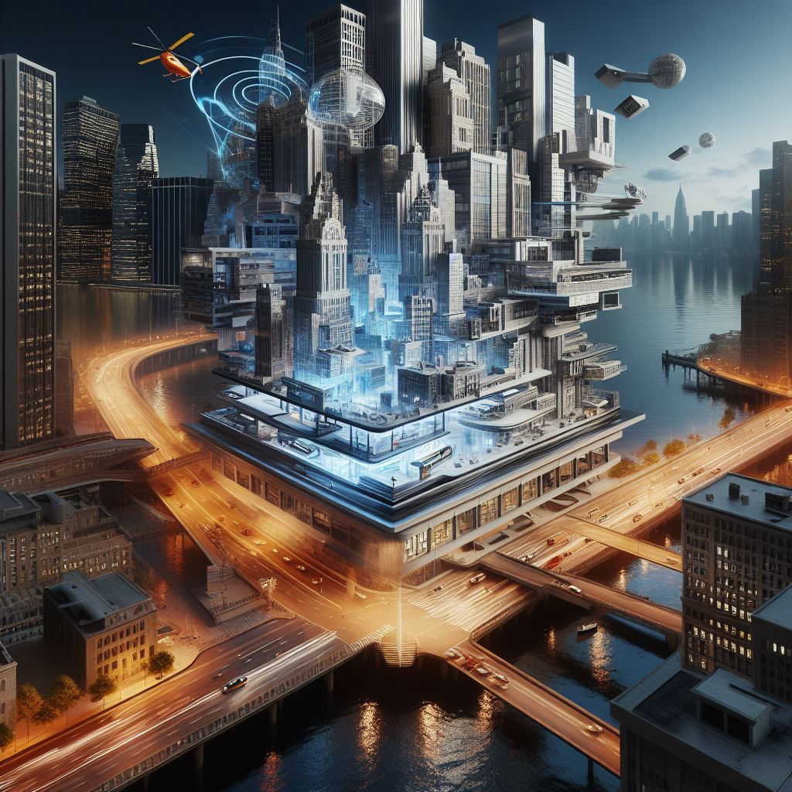

## Architect Render: Transforming Architectural Visualization with Cutting-Edge Technology

### Summary
Architect Render, accessible at [architectrender.com](https://architectrender.com), introduces a platform revolutionizing architectural visualization through advanced technology. This article explores how Architect Render utilizes innovative tools to create lifelike renderings, reshaping the architectural design process.



### Key Points

1. **Introduction to Architect Render:** Spotlighting [architectrender.com](https://architectrender.com)'s role in reshaping architectural visualization through cutting-edge technology.
2. **Advanced Technology in Architectural Design:** Exploring how Architect Render integrates innovative technology to provide realistic and immersive architectural renderings.
3. **Pros and Cons** (Table Format):

| Pros                                 | Cons                                |
|--------------------------------------|-------------------------------------|
| High-quality architectural renderings | Learning curve for new users        |
| Realistic visualization               | Dependency on specific software     |
| Improved design presentation         | Varied rendering complexity         |

### Tips for the Reader 💡
Maximizing Architectural Visualization with Architect Render:
- Experiment with various visualization tools available on the platform to understand their functionalities.
- Engage with tutorials and community resources to make the most of Architect Render's innovative features.
- Utilize diverse architectural design scenarios to leverage the platform effectively.

### Examples

#### Example 1: Realistic Architectural Rendering
**Prompt:** Creating Realistic Renderings with Architect Render

**Input**
```dart
realistic_render = ArchitectRender.create_render(model, preferences)
```

**Output**
```dart
Realistic architectural rendering based on specified preferences using Architect Render's advanced rendering tools.
```

#### Example 2: Interactive Design Presentation
**Prompt:** Presenting Designs Interactively with Architect Render

**Input**
```dart
interactive_presentation = ArchitectRender.create_presentation(design, options)
```

**Output**
```dart
Interactive design presentation with specified options using Architect Render's immersive visualization tools.
```

Try for Yourself 👉 <a href="https://www.architectrender.com" target="_blank">Explore Architect Render</a>

## URL Address
- <a href="https://www.architectrender.com" target="_blank">Architect Render - Innovative Architectural Visualization</a>

### Follow our Social Media for more information:
- 📘 <a href="https://www.facebook.com/groups/trionxai" target="_blank">Facebook Group</a>
- 👍 <a href="https://www.facebook.com/ai.trionxai" target="_blank">Facebook Page</a>
- 📸 <a href="https://www.instagram.com/trionxai/" target="_blank">Instagram</a>
- ▶️ <a href="https://www.youtube.com/@robotdocs/" target="_blank">Youtube</a>

<hr>

### SEO High Ranking Page Tags
Architect Render, Architectural Visualization, Technology in Architecture, Innovative Design Tools, Architectural Renderings, Cutting-Edge Technology, Architectural Design, Visualization Software, Technology Advancements