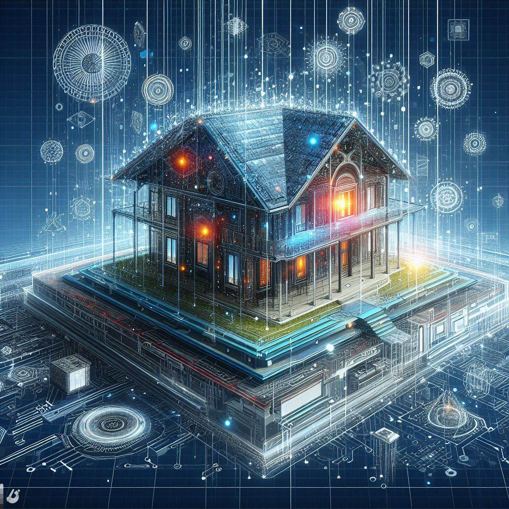

## Arch Synth: Harmonizing Architecture and AI for Innovative Designs

### Summary
Arch Synth takes center stage as a groundbreaking platform, harmonizing architecture and AI to usher in a new era of innovative designs. This article explores the key features of Arch Synth, unveils its pros and cons, offers actionable tips for users, and showcases real-world examples of how it transforms architectural visions into digital masterpieces.



### Key Points
- Fusion of Architecture and AI
- Intelligent Design Synthesis
- User-Friendly Interface for Architectural Creativity
- Seamless Integration into Architectural Workflows

### Pros and Cons

| Pros                             | Cons                                               |
| -------------------------------- | -------------------------------------------------- |
| Fusion of Architecture and AI     | Some Advanced Features Limited to Premium Users   |
| Intelligent Design Synthesis      | Learning Curve for Complex Design Styles         |
| User-Friendly Interface           | Internet Connection Required for Real-Time Editing |
| Architectural Workflow Integration| Premium Subscription May Be Required for Full Access|

### Tips for the Reader 💡
Maximize your Arch Synth experience with these tips:
- Explore various architectural styles and let AI synthesize unique design elements.
- Utilize the user-friendly interface for efficient tweaks and adjustments to your architectural designs.
- Consider the premium features for access to an expanded library of advanced architectural elements.

### Examples

#### Example 1: Modern Residential Facade Synthesis
**Prompt:** Synthesizing a Modern Residential Facade with Arch Synth

**Input:**
```dart
{
  "style": "modern",
  "elements": ["clean lines", "large windows", "minimalist features"]
}
```

**Output:**
```dart
[Arch Synth-generated modern residential facade with clean lines, large windows, and minimalist features]
```

#### Example 2: Futuristic Urban Landscape Design
**Prompt:** Designing a Futuristic Urban Landscape with Arch Synth

**Input:**
```dart
{
  "style": "futuristic",
  "elements": ["innovative structures", "green spaces", "smart city features"]
}
```

**Output:**
```dart
[Arch Synth-generated futuristic urban landscape with innovative structures, green spaces, and smart city features]
```

👉 <a href="https://www.archsynth.com/" target="_blank">Try for yourself</a>

### URL Address of the AI Topic / Vendor
<a href="https://www.archsynth.com/" target="_blank">Arch Synth</a>

---

Follow our Social Media for more information:

- 📘 <a href="https://www.facebook.com/groups/trionxai" target="_blank">Facebook Group</a>
- 👍 <a href="https://www.facebook.com/ai.trionxai" target="_blank">Facebook Page</a>
- 📸 <a href="https://www.instagram.com/trionxai/" target="_blank">Instagram</a>
- ▶️ <a href="https://www.youtube.com/@robotdocs/" target="_blank">YouTube</a>

### SEO High-Ranking Page Tags
Arch Synth, Architecture and AI, Innovative Designs, Design Synthesis, User-Friendly Interface, Architectural Styles, Premium Features, Advanced Architectural Elements