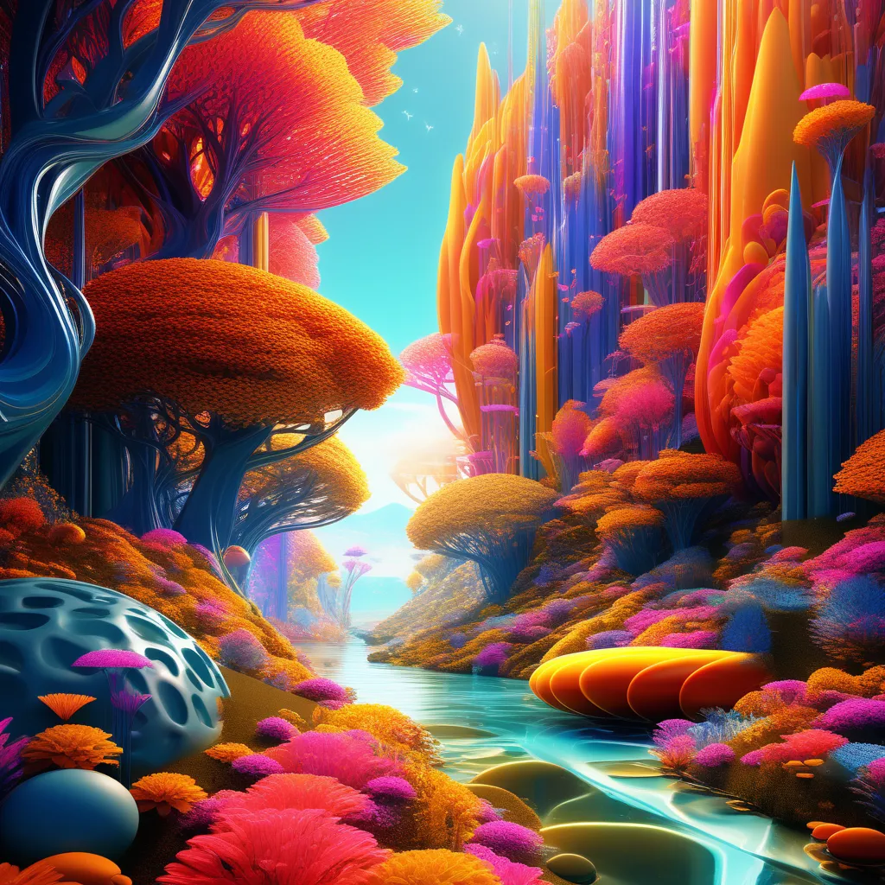
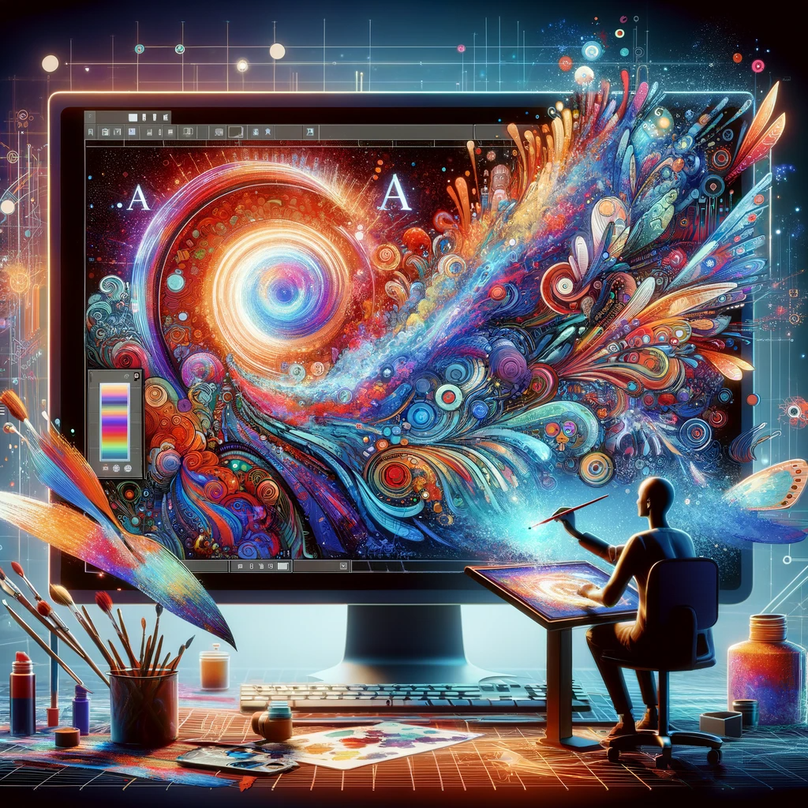

# ARTSMART AI: Unleashing Creativity with Advanced Technology

## Summary:
ARTSMART AI is a cutting-edge platform that uses artificial intelligence to transform the art and design world. It offers tools for artists, designers, and creatives to explore new realms of digital art, providing innovative features that allow for the creation of unique and complex designs with ease.

## Key Points:
- AI-driven tools for art creation and design.
- User-friendly interface suitable for all skill levels.
- Facilitates creativity with a range of artistic styles and techniques.

## Pros and Cons:

| Pros                                     | Cons                                     |
|------------------------------------------|------------------------------------------|
| Enables intricate and unique art designs | Learning curve for advanced features     |
| Accessible to both amateurs and professionals | Dependence on digital platforms           |
| Encourages experimentation in art        | Requires a stable internet connection    |

## 🌟 Tips for the Reader:
- 🎨 Experiment with different AI tools to discover unique styles.
- 🖌️ Take advantage of tutorials to enhance skills.
- 🔄 Keep exploring new updates for expanded capabilities.

## Examples:

### Example 1: Digital Portrait Creation
- **Prompt:** AI-Assisted Portraits
- **Input:** Basic sketch or concept.
- **Output:** A fully realized digital portrait with intricate details.

### Example 2: Abstract Art Generation
- **Prompt:** Abstract Art Exploration
- **Input:** Color palette and theme.
- **Output:** A unique piece of abstract art created by AI algorithms.

👉 [**Try for yourself**](https://artsmart.ai/)

## URL Address of the AI Topic / vendor:
- [ARTSMART AI Official Website](https://artsmart.ai/)

---

**Follow our Social Media for more information:**
- 📘 <a href="https://www.facebook.com/groups/trionxai" target="_blank">FB group: Trionx AI Group</a>
- 👍 <a href="https://www.facebook.com/ai.trionxai" target="_blank">FB page: Trionx AI Page</a>
- 📸 <a href="https://www.instagram.com/trionxai/" target="_blank">Instagram: Trionx AI Instagram</a>
- ▶️ <a href="https://www.youtube.com/@robotdocs/" target="_blank">Youtube: Trionx AI YouTube</a>

---

## SEO High Ranking Page Tags:
ARTSMART AI, AI art creation, digital art platform, AI technology in art, creative design tools, artificial intelligence art, digital creativity, modern art tools, art innovation, design automation, AI for artists, digital artists, abstract art generation, AI in design, art experimentation, digital painting, AI-driven art, creative exploration, artistic software, technology in art

