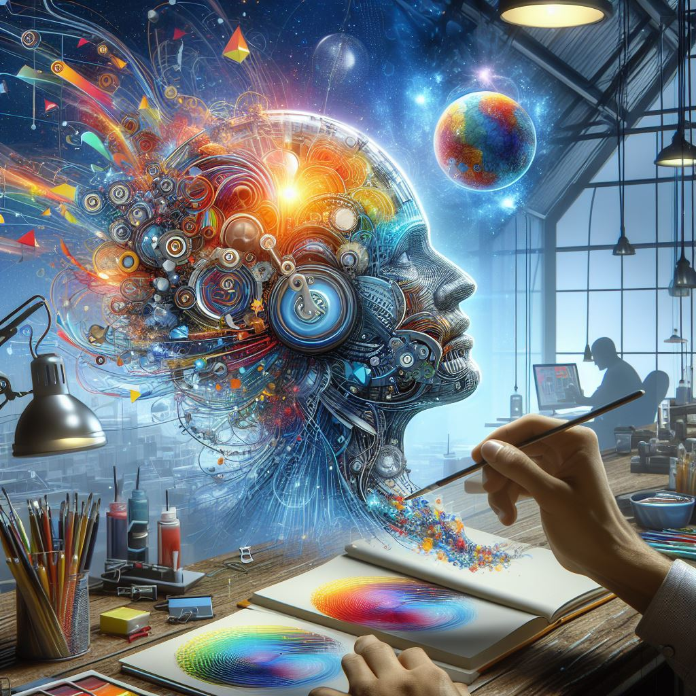

## Canva Image Generator: Redefining Creativity with AI-Driven Graphic Design

### Summary
Canva's AI Image Generator pioneers graphic design by leveraging AI, empowering users with tools for effortless and innovative visual content creation. This article delves into the impact of Canva's AI-driven platform on revolutionizing graphic design processes.



### Key Points

1. **Introduction to Canva Image Generator:** Unveiling Canva's innovative platform that uses AI for graphic design and image generation.
2. **AI's Role in Graphic Design:** Exploring how Canva's AI Image Generator simplifies design tasks and enhances creativity.
3. **Pros and Cons** (Table Format):

| Pros                                     | Cons                                           |
|------------------------------------------|------------------------------------------------|
| User-friendly interface for design creation | Limitations in advanced design customization     |
| Wide range of design templates and elements | Dependence on pre-defined design elements        |
| Simplifies design creation for non-designers | Potential design similarity across users          |

### Tips for the Reader 💡
Maximize Design Creativity with Canva:
- Explore diverse design templates and elements available on Canva.
- Combine AI-generated suggestions with personal design touches for unique creations.
- Utilize Canva's platform for quick and effective design solutions.

### Examples

#### Example 1: Social Media Post Design
**Prompt:** Creating Social Media Posts Using Canva

**Input**
```dart
social_media_post = Canva.create_social_media_post(template, elements)
```

**Output**
```dart
Craft visually appealing social media posts using Canva's AI-driven design features.
```

#### Example 2: Marketing Graphic Design
**Prompt:** Designing Marketing Graphics with Canva

**Input**
```dart
marketing_graphics = Canva.create_marketing_graphics(template, branding_elements)
```

**Output**
```dart
Develop eye-catching marketing graphics with tailored branding elements using Canva's AI Image Generator.
```

#### Example 3: Presentation Slide Creation
**Prompt:** Crafting Presentation Slides Using Canva

**Input**
```dart
presentation_slides = Canva.create_presentation_slides(theme, content)
```

**Output**
```dart
Generate professional and engaging presentation slides effortlessly through Canva's AI-driven platform.
```

Try for Yourself 👉 <a href="https://www.canva.com/ai-image-generator" target="_blank">Explore Canva Image Generator</a>

## URL Address
- <a href="https://www.canva.com/ai-image-generator" target="_blank">Canva Image Generator - AI-Driven Graphic Design</a>

### Follow our Social Media for more information:
- 📘 <a href="https://www.facebook.com/groups/trionxai" target="_blank">Facebook Group</a>
- 👍 <a href="https://www.facebook.com/ai.trionxai" target="_blank">Facebook Page</a>
- 📸 <a href="https://www.instagram.com/trionxai/" target="_blank">Instagram</a>
- ▶️ <a href="https://www.youtube.com/@robotdocs/" target="_blank">Youtube</a>

<hr>

### SEO High Ranking Page Tags
AI, Canva, AI Image Generator, Graphic Design, AI-Driven Design, Visual Content Creation, Design Templates, AI in Graphic Design, Artificial Intelligence, Creativity Tools, Design Innovation, AI Applications, Design Simplification, AI Advancements