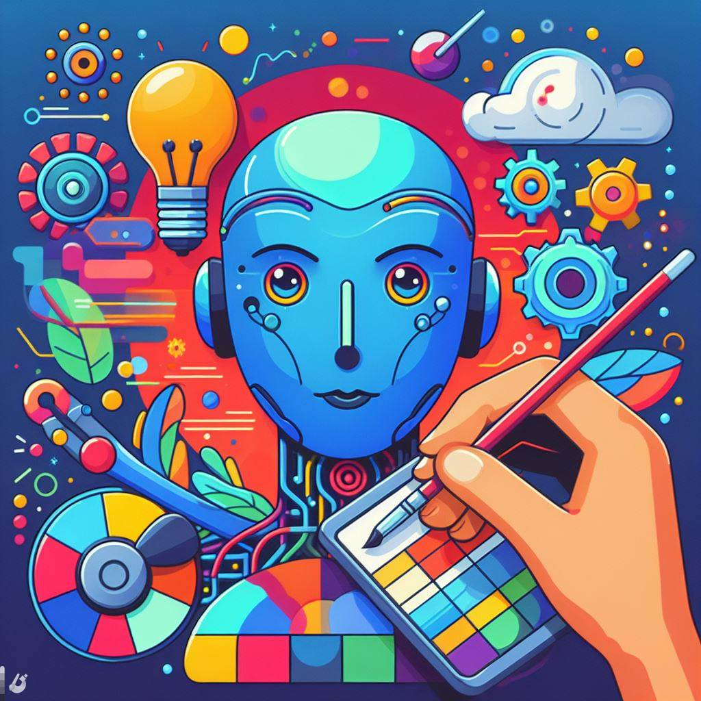

## Character.AI: Unleashing Creative Potential with AI-Driven Character Development

### Summary
Unlock the realm of creative storytelling with Character.AI, a cutting-edge platform that harnesses artificial intelligence to revolutionize character development. This article explores the key features of Character.AI, outlines its pros and cons, provides actionable tips for users, and presents real-world examples showcasing how it unleashes creative potential through AI-driven character development.



### Key Points
- AI-Driven Character Development for Creative Storytelling
- Dynamic Character Traits Exploration and Customization
- User-Friendly Interface for Effortless Character Creation
- Seamless Integration into Diverse Narrative Scenarios

### Pros and Cons

| Pros                             | Cons                                               |
| -------------------------------- | -------------------------------------------------- |
| AI-Driven Character Development   | Some Advanced Features Limited to Premium Users   |
| Dynamic Traits Exploration        | Learning Curve for Customizing Advanced Features |
| User-Friendly Interface           | Internet Connection Required for Real-Time Character Creation |
| Seamless Narrative Scenario Integration | Premium Subscription May Be Required for Full Access|

### Tips for the Reader 💡
Maximize your Character.AI experience with these tips:
- Utilize AI-driven character development for unique and engaging storylines.
- Explore dynamic character traits exploration and customization for rich narratives.
- Consider the premium features for access to advanced tools in diverse narrative scenarios.

### Examples

#### Example 1: AI-Enhanced Character Backstory
**Prompt:** AI-Enhanced Character Backstory with Character.AI

**Input:**
```dart
{
  "user": "Storyteller",
  "character_type": "Protagonist",
  "personality_traits": ["Courageous", "Compassionate", "Inquisitive"]
}
```

**Output:**
```dart
[Character.AI assisting Storyteller in AI-enhanced development of a Protagonist character with dynamic personality traits, including Courageous, Compassionate, and Inquisitive]
```

#### Example 2: Dynamic Antagonist Creation
**Prompt:** Dynamic Antagonist Creation with Character.AI

**Input:**
```dart
{
  "user": "NarrativeCreator",
  "character_type": "Antagonist",
  "conflict_type": "InternalStruggle"
}
```

**Output:**
```dart
[Character.AI facilitating the dynamic creation of an Antagonist character for NarrativeCreator, focusing on internal struggle as a key conflict type for a compelling narrative]
```

👉 <a href="https://beta.character.ai/" target="_blank">Try for yourself</a>

### URL Address of the AI Topic / Vendor
<a href="https://beta.character.ai/" target="_blank">Character.AI</a>

---

Follow our Social Media for more information:

- 📘 <a href="https://www.facebook.com/groups/trionxai" target="_blank">Facebook Group</a>
- 👍 <a href="https://www.facebook.com/ai.trionxai" target="_blank">Facebook Page</a>
- 📸 <a href="https://www.instagram.com/trionxai/" target="_blank">Instagram</a>
- ▶️ <a href="https://www.youtube.com/@robotdocs/" target="_blank">YouTube</a>

### SEO High-Ranking Page Tags
Character.AI, AI-Driven Character Development, Dynamic Traits Exploration, User-Friendly Interface, Narrative Scenarios, Premium Features, Creative Storytelling Tools