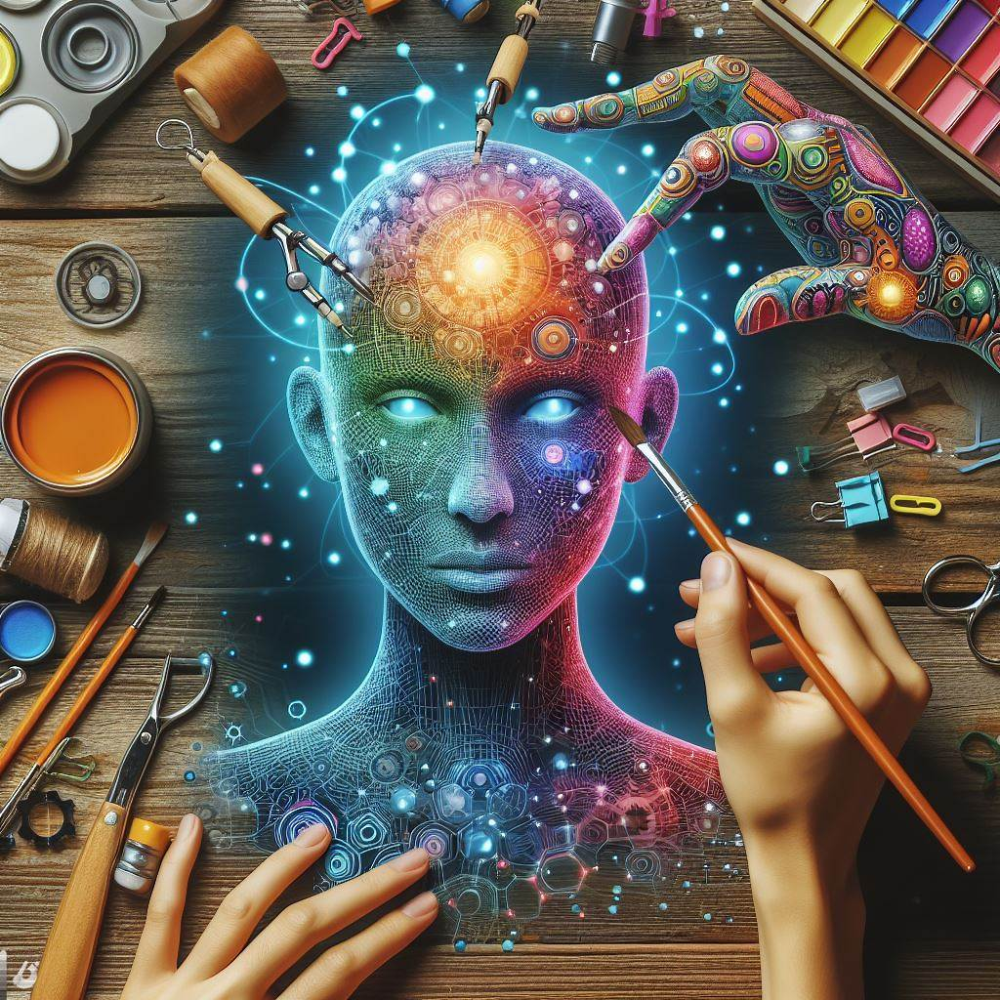

## Character GPT: Unleashing Creative Narratives with AI-Driven Character Generation

### Summary
Embark on a journey of creative storytelling with Character GPT, a platform that unleashes the power of AI-driven character generation. This article explores the key features of Character GPT, outlines its pros and cons, offers valuable tips for users, and presents real-world examples showcasing how it transforms narrative creation through cutting-edge AI technology.



### Key Points
- AI-Driven Character Generation for Creative Narratives
- Diverse and Dynamic Character Profiles
- User-Friendly Interface for Intuitive Storytelling
- Seamless Integration into Creative Writing Workflows

### Pros and Cons

| Pros                             | Cons                                               |
| -------------------------------- | -------------------------------------------------- |
| AI-Driven Character Generation    | Some Advanced Features Limited to Premium Users   |
| Diverse and Dynamic Character Profiles | Learning Curve for Customizing Advanced Features |
| User-Friendly Interface           | Internet Connection Required for Real-Time Storytelling |
| Creative Writing Workflow Integration | Premium Subscription May Be Required for Full Access|

### Tips for the Reader 💡
Maximize your Character GPT experience with these tips:
- Utilize AI-driven character generation for diverse and dynamic character profiles.
- Leverage the user-friendly interface for intuitive and seamless storytelling.
- Consider the premium features for access to advanced AI-driven creative writing capabilities.

### Examples

#### Example 1: AI-Generated Protagonist
**Prompt:** AI-Generated Protagonist with Character GPT

**Input:**
```dart
{
  "character_type": "protagonist",
  "personality": "adventurous",
  "backstory": "lost in a magical realm"
}
```

**Output:**
```dart
[Character GPT generating an adventurous protagonist with a backstory of being lost in a magical realm]
```

#### Example 2: AI-Generated Antagonist
**Prompt:** AI-Generated Antagonist with Character GPT

**Input:**
```dart
{
  "character_type": "antagonist",
  "personality": "conniving",
  "motivation": "world domination"
}
```

**Output:**
```dart
[Character GPT crafting a conniving antagonist with a motivation for world domination]
```

👉 <a href="https://alethea.ai/" target="_blank">Try for yourself</a>

### URL Address of the AI Topic / Vendor
<a href="https://alethea.ai/" target="_blank">Character GPT</a>

---

Follow our Social Media for more information:

- 📘 <a href="https://www.facebook.com/groups/trionxai" target="_blank">Facebook Group</a>
- 👍 <a href="https://www.facebook.com/ai.trionxai" target="_blank">Facebook Page</a>
- 📸 <a href="https://www.instagram.com/trionxai/" target="_blank">Instagram</a>
- ▶️ <a href="https://www.youtube.com/@robotdocs/" target="_blank">YouTube</a>

### SEO High-Ranking Page Tags
Character GPT, AI-Driven Character Generation, Creative Narratives, Diverse Character Profiles, User-Friendly Interface, Creative Writing Workflows, Premium Features, AI-Driven Creative Writing Capabilities