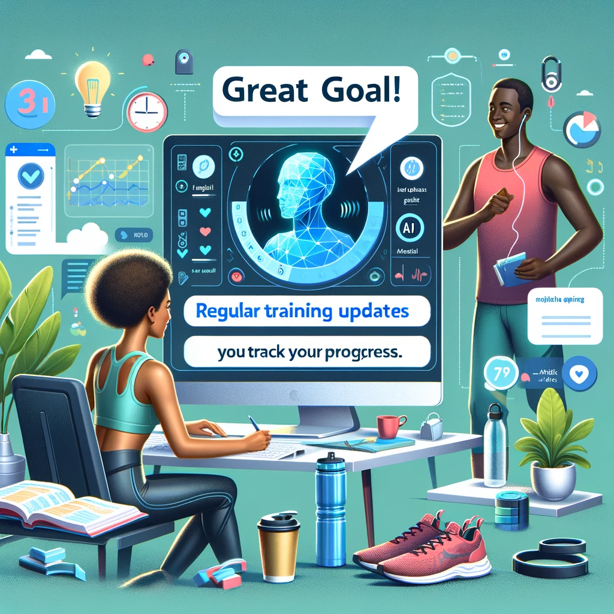

# AI Diary: Revolutionizing Personal Journaling with AI

## Summary
AI Diary is a groundbreaking application that combines the traditional aspects of diary-keeping with advanced artificial intelligence. This platform allows users to record their thoughts, experiences, and memories, which are then analyzed by AI for insights into patterns, trends, and emotional well-being. AI Diary offers a unique way to understand and reflect on personal experiences.

## Key Points
- Integrates AI with Personal Journaling
- Analyzes Emotional Patterns and Trends
- Provides Insights for Personal Growth

## Pros and Cons of AI Diary
| Pros | Cons |
|------|------|
| Personalized AI Analysis | Internet Dependency for AI Features |
| Emotional Pattern Recognition | User Privacy Considerations |
| Encourages Reflective Practices | Initial Familiarization with AI Tools |

## Tips for the Reader 📓💡
- Utilize AI Diary as a tool for self-reflection and growth. 🌱
- Regularly record your thoughts to allow for more accurate AI insights. 🖋️
- Balance AI suggestions with your personal understanding and experiences. ⚖️

🔹 Be honest in your entries for genuine AI feedback.
🔹 Reflect on AI-generated insights to gain deeper self-awareness.
🔹 Use the AI Diary as a means to track and achieve personal goals.

## Examples
### Example 1: Emotional Insight - AI Diary
**Input**: 
"Today, I felt overwhelmed with work."

**Output**: 
"AI Analysis: It seems you've been feeling stressed about work lately. Consider setting clear boundaries and taking breaks."

### Example 2: Goal Tracking - AI Diary
**Input**: 
"My goal is to run a marathon this year."

**Output**: 
"AI Analysis: Great goal! Regular training updates can help you track your progress."

👉 **[Try for yourself](https://aidiary.io/){:target="_blank" rel="noopener"}**

## URL Address of the AI Topic / Vendor
[AI Diary Official Website](https://aidiary.io/)

## Follow Our Social Media for More Information
- 📘 **[Facebook Group](https://www.facebook.com/groups/trionxai){:target="_blank"}**
- 👍 **[Facebook Page](https://www.facebook.com/ai.trionxai){:target="_blank"}**
- 📸 **[Instagram](https://www.instagram.com/trionxai/){:target="_blank"}**
- ▶️ **[Youtube](https://www.youtube.com/@robotdocs/){:target="_blank"}**

### SEO Tags
AI Diary, Personal Journaling, AI Integration, Emotional Analysis, Reflective Practice, Personal Growth, Diary Application, Emotional Well-being, Pattern Recognition, AI Insights, Self-awareness, Personal Memories, AI Technology, Emotional Intelligence, Goal Tracking, Personal Reflection, Journal Analysis, AI-Powered Diary, Self-Improvement, Personal Experiences

