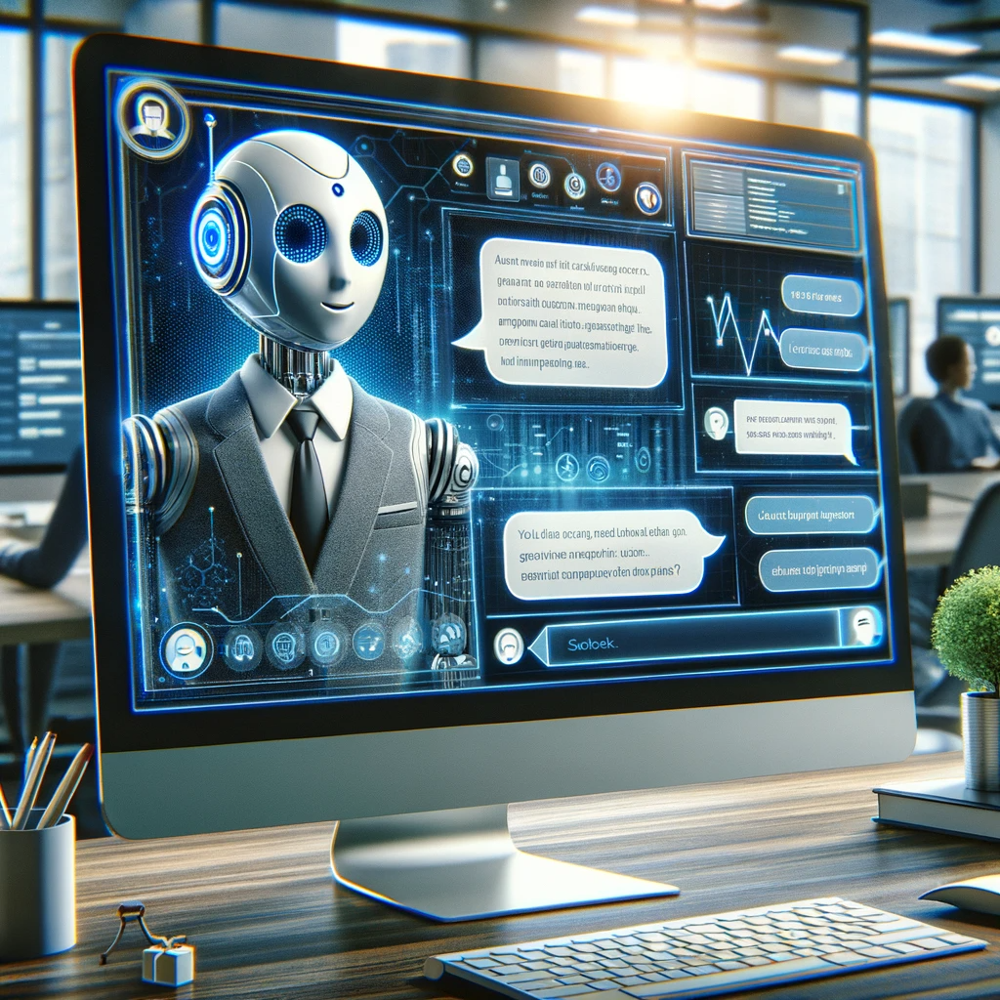
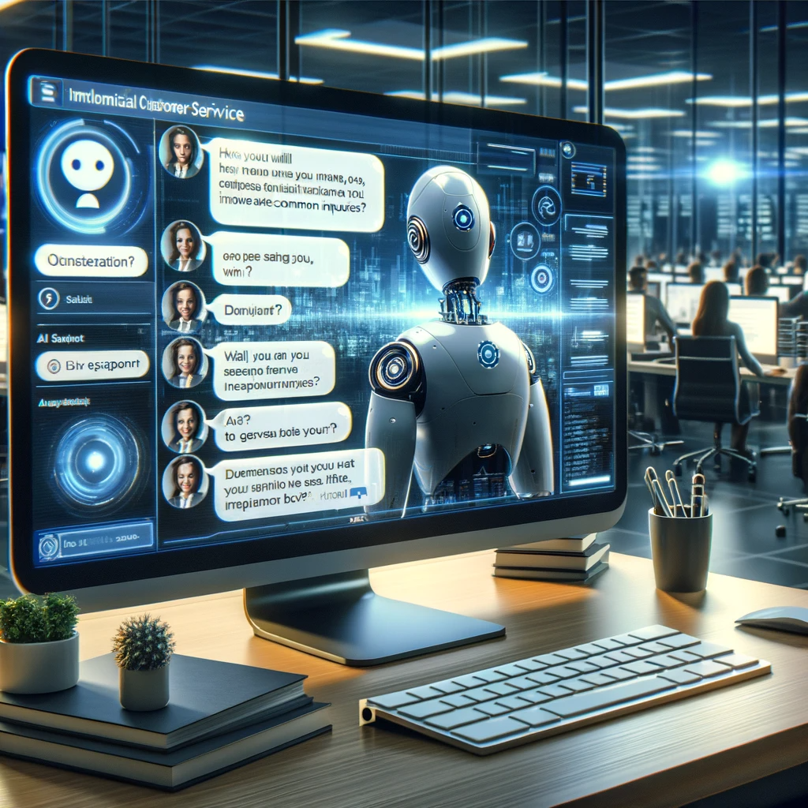
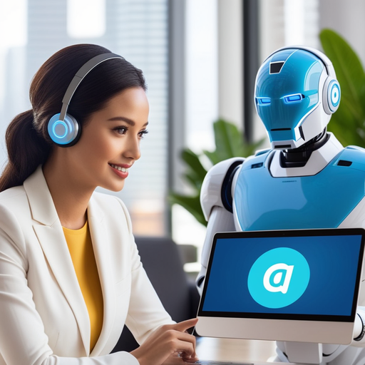

# Automatic Chat: Enhancing Communication with AI

## Summary
Automatic Chat is a groundbreaking AI-driven platform designed to revolutionize the way we communicate digitally. By integrating advanced artificial intelligence, it offers seamless, efficient, and intelligent conversation experiences. This tool is perfect for businesses and individuals looking to enhance their digital interaction capabilities.

## Key Points
- AI-Powered Communication
- Seamless and Efficient Conversations
- Intelligent Interaction Capabilities

## Pros and Cons of Automatic Chat
| Pros | Cons |
|------|------|
| Enhanced Communication Efficiency | Reliance on Internet Connectivity |
| AI-Driven Intelligent Responses | May Lack Personalization of Human Interaction |
| User-Friendly Interface | Learning Curve for New Users |

## Tips for the Reader 🤖💬
- Embrace the power of AI to enhance your digital conversations. 🚀
- Provide clear inputs for more accurate and helpful responses. 🔍
- Regularly update to leverage the evolving capabilities of AI technology. 🔄

🔹 Balance AI communication with personal touch.
🔹 Remember to protect your privacy when interacting online.
🔹 Use Automatic Chat to streamline, not replace, human interactions.

## Examples
### Example 1: Customer Inquiry Handling - Automatic Chat
**Input**: 
"How do I handle frequent customer inquiries efficiently?"

**Output**: 
"Implement AI chatbots to provide instant responses to common inquiries."

### Example 2: Improving Response Quality - Automatic Chat
**Input**: 
"I want to improve the quality of my responses."

**Output**: 
"Use AI analysis to understand inquiry patterns and tailor your responses."

👉 **[Try for yourself](https://automatic.chat/?){:target="_blank" rel="noopener"}**

## URL Address of the AI Topic / Vendor
[Automatic Chat Official Website](https://automatic.chat/?)

## Follow Our Social Media for More Information
- 📘 **[Facebook Group](https://www.facebook.com/groups/trionxai){:target="_blank"}**
- 👍 **[Facebook Page](https://www.facebook.com/ai.trionxai){:target="_blank"}**
- 📸 **[Instagram](https://www.instagram.com/trionxai/){:target="_blank"}**
- ▶️ **[Youtube](https://www.youtube.com/@robotdocs/){:target="_blank"}**

### SEO Tags
Automatic Chat, AI Communication, Digital Interaction, Artificial Intelligence, Intelligent Responses, User-Friendly AI, Conversation Efficiency, Chatbots, Response Quality, AI Technology, Customer Inquiries, Digital Conversations, AI-Powered Tools, Online Privacy, Human-AI Interaction, Communication Enhancement, AI Updates, Intelligent Conversation, AI Analysis, Communication Technology

