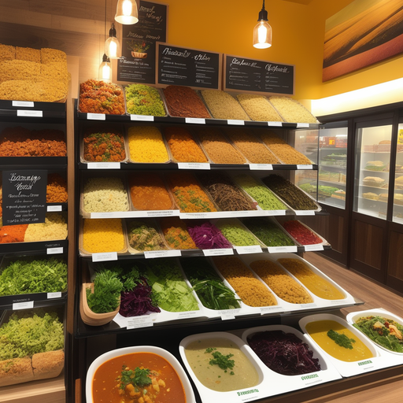
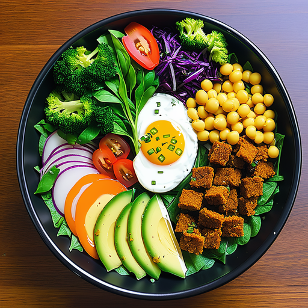
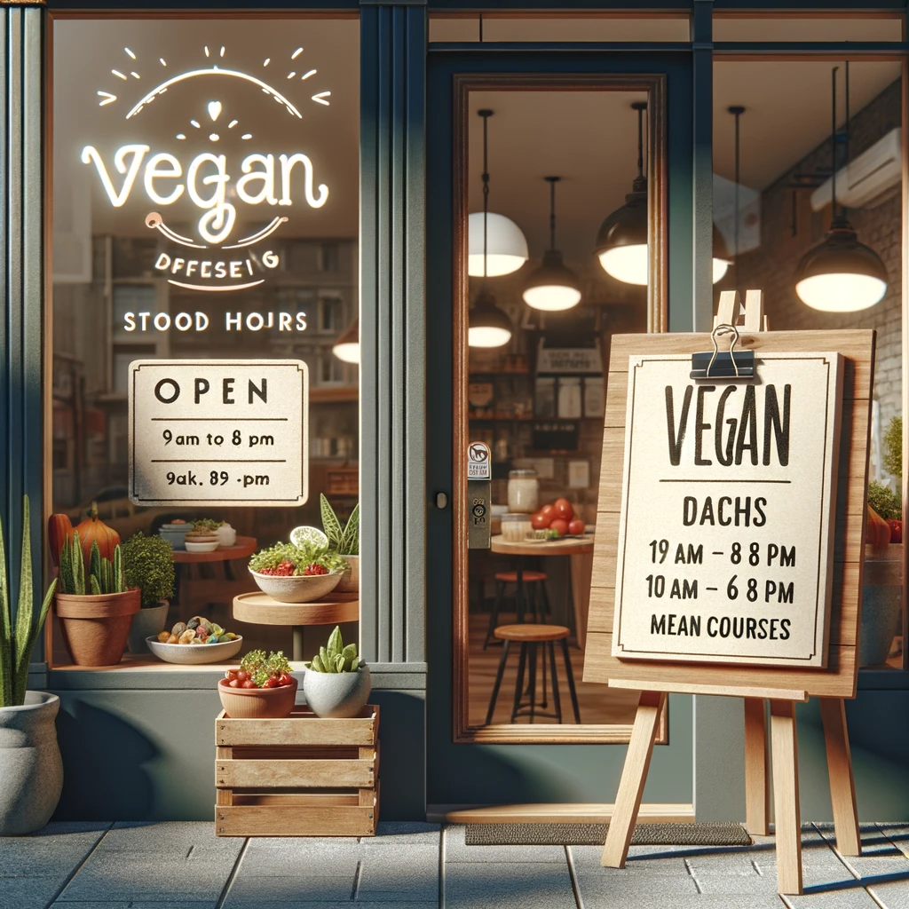

# AutoResponder.ai: Transforming Communication with AI

## Summary
AutoResponder.ai is an advanced AI-powered communication tool designed to revolutionize the way businesses interact with their clients. By automating responses and providing intelligent, context-aware replies, AutoResponder.ai significantly enhances customer engagement and satisfaction.

## Key Points
- Automated AI Responses
- Context-Aware Communication
- Enhanced Customer Engagement

## Pros and Cons of AutoResponder.ai
| Pros | Cons |
|------|------|
| Efficient Response Management | Requires Integration with Existing Systems |
| Enhanced Customer Experience | Dependence on AI for Communication |
| 24/7 Availability | Potential for Misinterpretation in Complex Queries |

## Tips for the Reader 📘💡
- Leverage AutoResponder.ai to manage high volumes of inquiries efficiently. 🚀
- Regularly update the AI's knowledge base to ensure accurate responses. 🧠
- Monitor AI interactions for continuous improvement and customization. 🔧

🔹 Utilize analytics to understand customer trends and preferences.
🔹 Ensure a balance between AI automation and human touch in customer service.
🔹 Stay informed about the latest updates to maximize AutoResponder.ai's potential.

## Examples
### Example 1: Handling Customer Queries - AutoResponder.ai
**Input**: 
"What are your store's opening hours?"

**Output**: 
"Our store is open from 9 AM to 8 PM on weekdays and 10 AM to 6 PM on weekends."

### Example 2: Product Inquiry - AutoResponder.ai
**Input**: 
"Do you have vegan options in your menu?"

**Output**: 
"Yes, we offer a variety of vegan dishes, including salads, soups, and main courses."

👉 **[Try for yourself](https://www.autoresponder.ai/){:target="_blank" rel="noopener"}**

## URL Address of the AI Topic / Vendor
[AutoResponder.ai Official Website](https://www.autoresponder.ai/)

## Follow Our Social Media for More Information
- 📘 **[Facebook Group](https://www.facebook.com/groups/trionxai){:target="_blank"}**
- 👍 **[Facebook Page](https://www.facebook.com/ai.trionxai){:target="_blank"}**
- 📸 **[Instagram](https://www.instagram.com/trionxai/){:target="_blank"}**
- ▶️ **[Youtube](https://www.youtube.com/@robotdocs/){:target="_blank"}**

### SEO Tags
AutoResponder.ai, AI Communication, Customer Engagement, Automated Responses, AI Customer Service, Efficient Inquiry Management, 24/7 Customer Support, AI-Powered Tools, Business Communication, Enhanced Customer Experience, AI Response System, Intelligent Replies, Customer Service Automation, Context-Aware AI, Communication Technology, AI Interaction, Customer Query Handling, Product Inquiries, AI for Businesses, Customer Support Innovation

