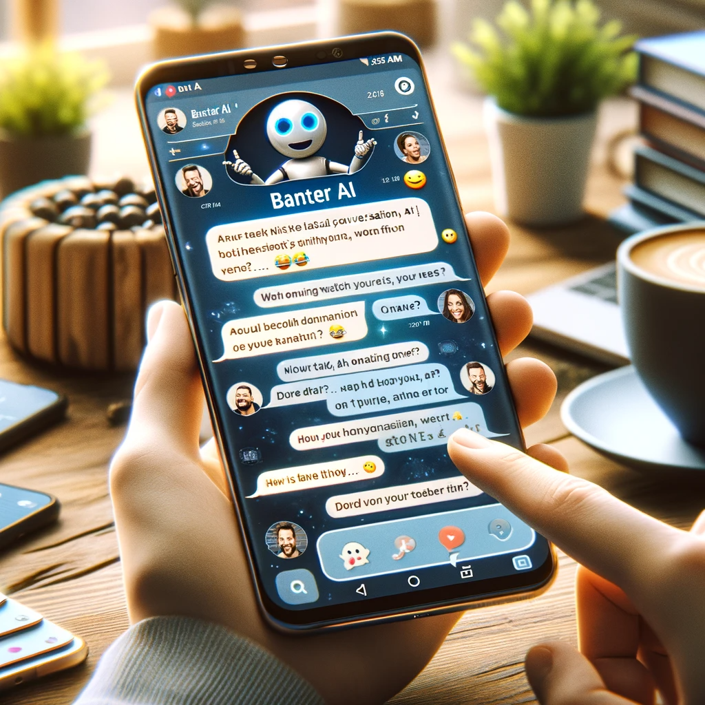

# Banter AI: Revolutionizing Conversational AI

## Summary
Banter AI is a cutting-edge conversational AI platform designed to provide realistic and engaging dialogue experiences. It leverages advanced machine learning algorithms to simulate human-like conversations, making it ideal for various applications, including customer service, entertainment, and personal assistants.

## Key Points
- Realistic Dialogue Simulation
- Advanced Machine Learning Algorithms
- Wide Range of Applications

## Pros and Cons of Banter AI
| Pros | Cons |
|------|------|
| Engaging Conversational Experiences | Requires High-Quality Data for Learning |
| Versatile Use Cases | Potential for Misunderstandings in Complex Conversations |
| Continuous Learning and Adaptation | Dependence on Continuous Updates |

## Tips for the Reader 🤖💬
- Explore Banter AI for innovative conversational solutions. 🚀
- Keep updating the AI for enhanced performance and realism. 🔄
- Remember, AI is a tool to assist, not a replacement for human interaction. 👥

🔹 Experiment with various conversational scenarios to fully utilize Banter AI's capabilities.
🔹 Balance AI interaction with human oversight for quality control.
🔹 Use Banter AI to gain insights into user preferences and behaviors.

## Examples
### Example 1: Customer Service Enhancement - Banter AI
**Input**: 
"How can we improve online customer service?"

**Output**: 
"Implement Banter AI to provide prompt, interactive, and realistic responses to customer queries."

### Example 2: Personalized Entertainment - Banter AI
**Input**: 
"Suggestions for engaging with users in a casual chat setting."

**Output**: 
"Banter AI can simulate casual conversations, offering humorous and witty responses for an entertaining experience."

👉 **[Try for yourself](https://banterai.app/){:target="_blank" rel="noopener"}**

## URL Address of the AI Topic / Vendor
[Banter AI Official Website](https://banterai.app/)

## Follow Our Social Media for More Information
- 📘 **[Facebook Group](https://www.facebook.com/groups/trionxai){:target="_blank"}**
- 👍 **[Facebook Page](https://www.facebook.com/ai.trionxai){:target="_blank"}**
- 📸 **[Instagram](https://www.instagram.com/trionxai/){:target="_blank"}**
- ▶️ **[Youtube](https://www.youtube.com/@robotdocs/){:target="_blank"}**

### SEO Tags
Banter AI, Conversational AI, Dialogue Simulation, Machine Learning, Customer Service AI, AI Assistants, Realistic Conversations, AI Learning Algorithms, Conversational Experiences, AI Updates, AI Interaction, Conversational Scenarios, User Preferences, Behavior Insights, Online Customer Service, Entertainment AI, Chat AI, Interactive AI, AI Communication, AI Technology

