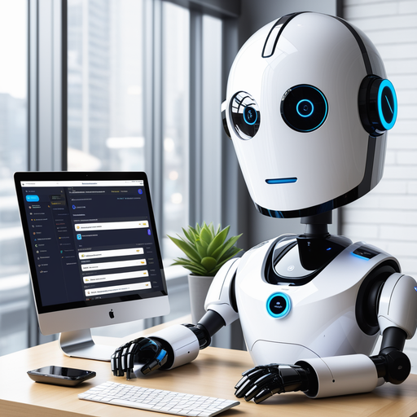

# BrightBot: Streamlining Interactions with Advanced AI

## Summary
BrightBot is an AI-powered platform designed to revolutionize user interactions and automate various processes. Leveraging state-of-the-art AI technology, BrightBot offers intuitive chatbot solutions that are tailored to enhance customer service, streamline business operations, and provide seamless interaction experiences.

## Key Points
- Advanced AI-driven Chatbot Solutions
- Customization for Various Business Needs
- Enhanced Customer Interaction and Service

## Pros and Cons of BrightBot
| Pros | Cons |
|------|------|
| Automated Customer Service | Requires Regular Updates and Maintenance |
| Customizable Chatbot Features | Dependence on Internet Connectivity |
| Streamlined Business Operations | Learning Curve for Initial Setup |

## Tips for the Reader 🤖🌟
- Utilize BrightBot to automate routine tasks and improve efficiency. 🚀
- Personalize the chatbot to align with your brand's voice and customer needs. 🔍
- Continuously monitor and update the AI to cater to evolving business requirements. 🔄

🔹 Embrace the AI revolution to stay ahead in customer service.
🔹 Blend AI capabilities with human empathy for a balanced approach.
🔹 Keep data privacy and security at the forefront of your AI strategy.

## Examples
### Example 1: Customer Support Enhancement - BrightBot
**Input**: 
"How can we improve online customer support?"

**Output**: 
"Implement BrightBot for 24/7 automated customer support with instant query resolution."

### Example 2: Streamlining Business Queries - BrightBot
**Input**: 
"Optimize our business inquiry process."

**Output**: 
"BrightBot configured to handle and sort business inquiries for efficient processing."

👉 **[Try for yourself](https://www.brightbot.app/){:target="_blank" rel="noopener"}**

## URL Address of the AI Topic / Vendor
[BrightBot Official Website](https://www.brightbot.app/)

## Follow Our Social Media for More Information
- 📘 **[Facebook Group](https://www.facebook.com/groups/trionxai){:target="_blank"}**
- 👍 **[Facebook Page](https://www.facebook.com/ai.trionxai){:target="_blank"}**
- 📸 **[Instagram](https://www.instagram.com/trionxai/){:target="_blank"}**
- ▶️ **[Youtube](https://www.youtube.com/@robotdocs/){:target="_blank"}**

### SEO Tags
BrightBot, AI Chatbot, Automated Customer Service, AI Technology, Chatbot Solutions, Business Automation, Customer Interaction, Artificial Intelligence, Streamlined Operations, Customizable AI, Business Efficiency, Online Support, AI Integration, Customer Queries, Chatbot Customization, AI Strategy, Data Privacy, Business Queries, Technology in Business, Digital Transformation

