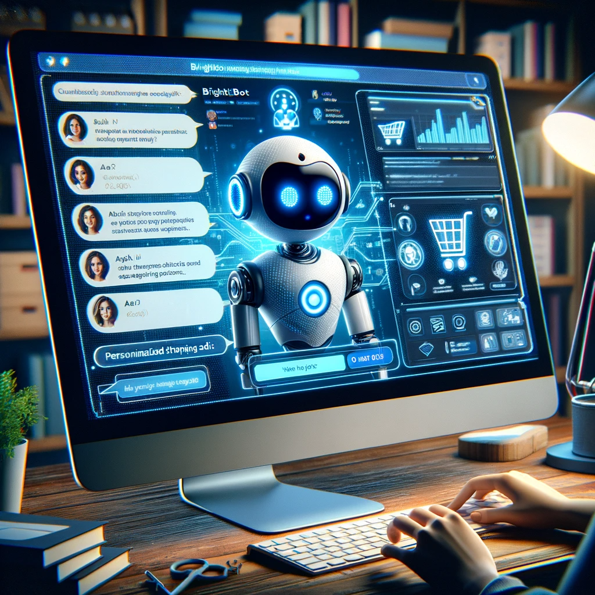

# BrightBot: The Future of Conversational AI

## Summary
BrightBot is an advanced conversational AI platform that enhances user interaction and engagement through intelligent chatbot solutions. This platform utilizes cutting-edge artificial intelligence to provide natural and efficient communication experiences, making it ideal for businesses looking to automate and improve their customer service.

## Key Points
- Advanced Conversational AI Technology
- Enhanced User Interaction and Engagement
- Efficient and Intelligent Communication Solutions

## Pros and Cons of BrightBot
| Pros | Cons |
|------|------|
| Streamlined Customer Service | Requires Internet Connectivity |
| AI-Driven, Natural Conversations | Learning Curve for Customization |
| 24/7 Automated Interaction | Initial Setup and Integration Effort |

## Tips for the Reader 🌟💬
- Utilize BrightBot to optimize customer interaction. 🚀
- Customize the AI to align with your brand's voice and values. ✍️
- Keep up with AI updates for continuous improvement. 🔄

🔹 Balance AI automation with personal customer service.
🔹 Protect user data and privacy in all interactions.
🔹 Use feedback to enhance and refine AI communication.

## Examples
### Example 1: Customer Query Resolution - BrightBot
**Input**: 
"How can I improve response time to customer queries?"

**Output**: 
"Implement BrightBot to provide instant, AI-powered responses to common queries."

### Example 2: Enhancing Online Shopping Experience - BrightBot
**Input**: 
"Create a more engaging online shopping experience."

**Output**: 
"Use BrightBot to offer personalized shopping recommendations and support."

👉 **[Try for yourself](https://www.brightbot.app/){:target="_blank" rel="noopener"}**

## URL Address of the AI Topic / Vendor
[BrightBot Official Website](https://www.brightbot.app/)

## Follow Our Social Media for More Information
- 📘 **[Facebook Group](https://www.facebook.com/groups/trionxai){:target="_blank"}**
- 👍 **[Facebook Page](https://www.facebook.com/ai.trionxai){:target="_blank"}**
- 📸 **[Instagram](https://www.instagram.com/trionxai/){:target="_blank"}**
- ▶️ **[Youtube](https://www.youtube.com/@robotdocs/){:target="_blank"}**

### SEO Tags
BrightBot, Conversational AI, Intelligent Chatbots, Customer Service Automation, AI Technology, User Engagement, Communication Solutions, Chatbot Customization, AI Updates, Brand Voice, Customer Interaction, Online Shopping Experience, AI-Powered Responses, Business Efficiency, Automated Customer Support, Natural Language Processing, AI Integration, Customer Experience, Digital Interaction, AI Conversation

