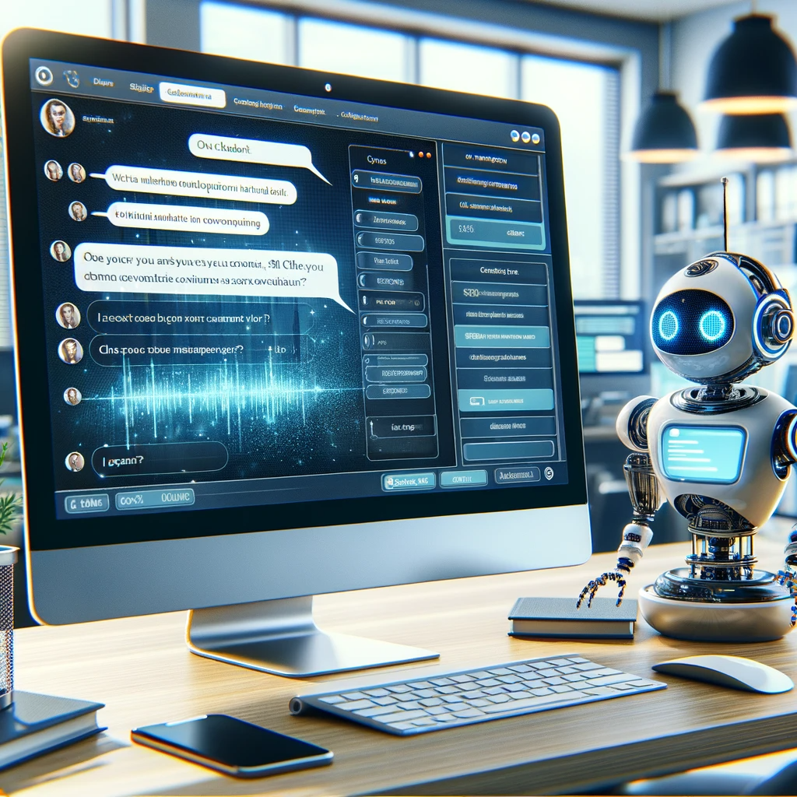
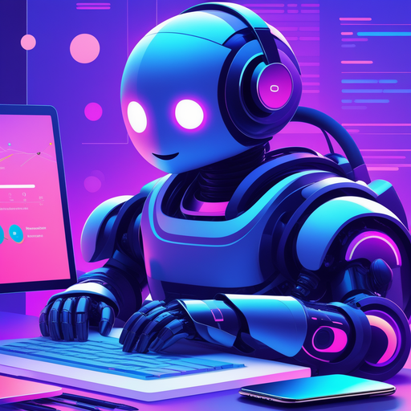

# Chatbot Arena: Revolutionizing Conversational AI

## Summary
Chatbot Arena is a pioneering platform in the conversational AI landscape, offering innovative solutions for creating and managing chatbots. It enables users to craft interactive and intelligent chatbots for a variety of purposes, ranging from customer service to automated personal assistants. Chatbot Arena focuses on user-friendly interfaces, advanced AI capabilities, and versatile applications.

## Key Points
- User-Friendly Chatbot Creation
- Advanced AI Capabilities
- Versatility in Chatbot Applications

## Pros and Cons of Chatbot Arena
| Pros | Cons |
|------|------|
| Intuitive Design for Easy Use | Requires Internet Connectivity |
| Versatile Chatbot Applications | Learning Curve for Advanced Features |
| Regular Updates and AI Improvements | Dependence on AI Technology |

## Tips for the Reader 🤖
Embrace the power of conversational AI by experimenting with different chatbot functionalities. 🚀 Keep your chatbots updated to leverage the latest AI advancements. 💡 Use Chatbot Arena to streamline customer interactions and automate routine tasks. 🛠

## Examples
### Example 1: Customer Service Chatbot - Chatbot Arena
**Input**: 
"Create a chatbot for handling customer queries on a website."

**Output**: 
"[Chatbot configured to handle customer queries efficiently]"

### Example 2: Personal Assistant Chatbot - Chatbot Arena
**Input**: 
"Develop a personal assistant chatbot for scheduling and reminders."

**Output**: 
"[Personal assistant chatbot ready to manage schedules and send reminders]"

👉 **[Try for yourself](https://chat.lmsys.org/?arena%3Fref=futuretools.io){:target="_blank" rel="noopener"}**

## URL Address of the AI Topic / Vendor
[Chatbot Arena Official Website](https://chat.lmsys.org/?arena%3Fref=futuretools.io){:target="_blank"}

## Follow our Social Media for more information
- 📘 **[Facebook Group](https://www.facebook.com/groups/trionxai){:target="_blank"}**
- 👍 **[Facebook Page](https://www.facebook.com/ai.trionxai){:target="_blank"}**
- 📸 **[Instagram](https://www.instagram.com/trionxai/){:target="_blank"}**
- ▶️ **[Youtube](https://www.youtube.com/@robotdocs/){:target="_blank"}**

### SEO Tags:
Chatbot Arena, conversational AI, chatbot creation, AI technology, customer service chatbots, personal assistant chatbots, AI advancements, user-friendly design, chatbot applications, automated interactions, AI improvements, AI personal assistants, chatbot configuration, intelligent chatbots, AI automation, customer queries, scheduling chatbots, reminder chatbots, interactive chatbots, AI solutions

