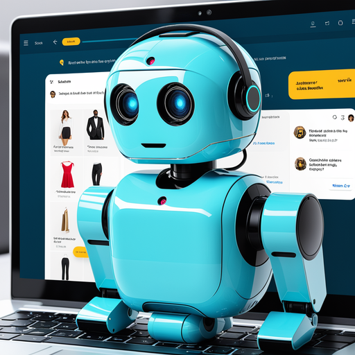
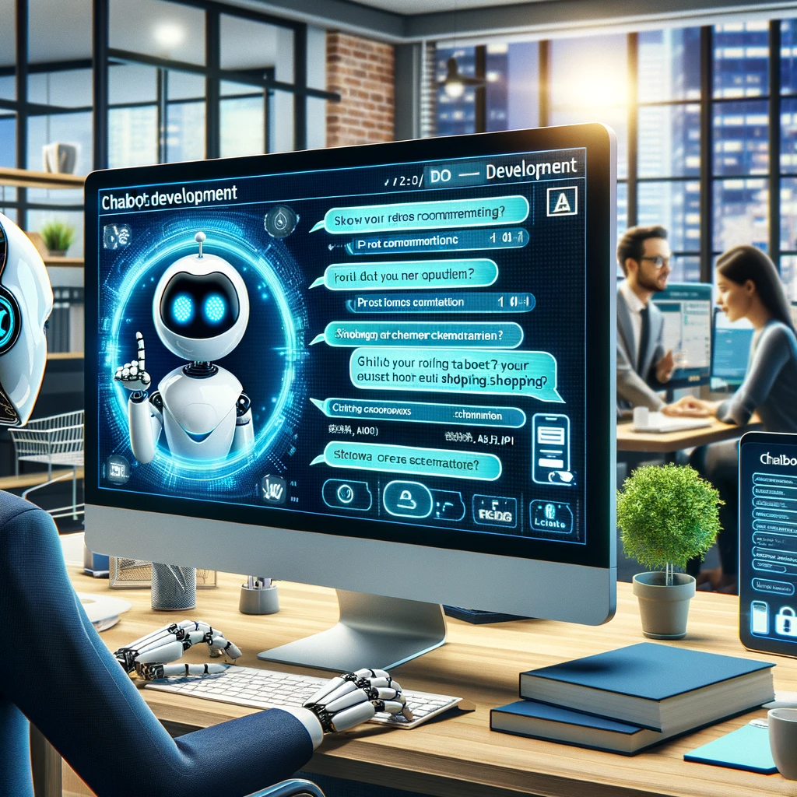
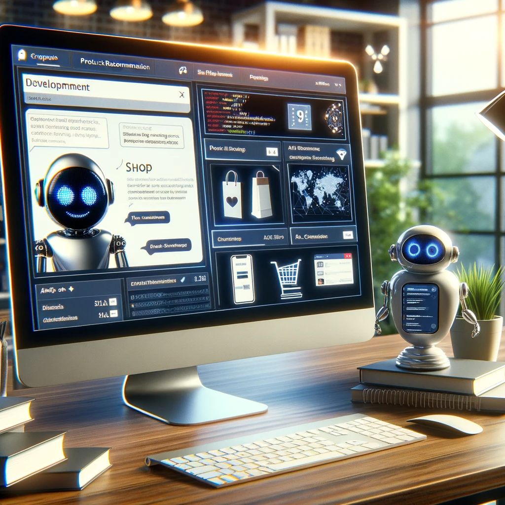

# Chatbot Arena: Advancing AI in Conversational Interfaces

## Summary
Chatbot Arena is an innovative platform dedicated to the development and enhancement of AI-powered chatbots. It offers a comprehensive environment for creating, training, and deploying chatbots tailored for various industries and applications. With its focus on AI and machine learning, Chatbot Arena provides an ideal solution for businesses seeking to improve customer interaction and automate communication processes.

## Key Points
- AI-Powered Chatbot Development
- Comprehensive Training and Deployment Tools
- Customization for Various Industries

## Pros and Cons of Chatbot Arena
| Pros | Cons |
|------|------|
| Advanced AI and ML Capabilities | Requires Consistent Internet Access |
| Customizable for Different Use Cases | Learning Curve for Beginners |
| Efficient Customer Interaction Automation | Subscription Model for Full Features |

## Tips for the Reader 🤖
To maximize the benefits of Chatbot Arena, focus on defining clear objectives for your chatbot. 🎯 Regularly update and train your chatbot with new data to ensure its effectiveness. 💡 Explore different features and integrations to fully leverage the platform’s capabilities. 🚀

## Examples
### Example 1: Customer Service Enhancement - Chatbot Arena
**Input**: 
"Create a chatbot to handle common customer service inquiries."

**Output**: 
"[Chatbot configured to respond to frequent customer queries]"

### Example 2: E-commerce Assistant - Chatbot Arena
**Input**: 
"Develop a chatbot to assist with online shopping."

**Output**: 
"[E-commerce chatbot designed to help customers navigate the online store]"

👉 **[Try for yourself](https://chat.lmsys.org/?arena%3Fref=futuretools.io){:target="_blank" rel="noopener"}**

## URL Address of the AI Topic / Vendor
[Chatbot Arena Official Website](https://chat.lmsys.org/?arena%3Fref=futuretools.io){:target="_blank"}

## Follow our Social Media for more information
- 📘 **[Facebook Group](https://www.facebook.com/groups/trionxai){:target="_blank"}**
- 👍 **[Facebook Page](https://www.facebook.com/ai.trionxai){:target="_blank"}**
- 📸 **[Instagram](https://www.instagram.com/trionxai/){:target="_blank"}**
- ▶️ **[Youtube](https://www.youtube.com/@robotdocs/){:target="_blank"}**

### SEO Tags:
Chatbot Arena, AI-powered chatbots, machine learning, chatbot development, customer service automation, e-commerce assistant, conversational AI, chatbot training, industry-specific chatbots, AI communication, customer interaction, automated responses, online shopping, AI technology, chatbot deployment, business automation, intelligent chatbots, AI integration, machine learning algorithms, digital customer service

