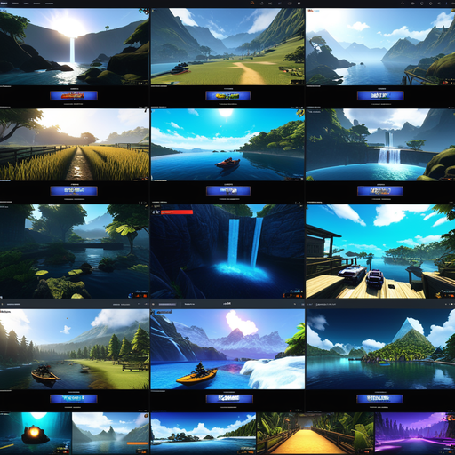

# ChatTube: Navigating the Future of AI-Driven Communication

## Summary
ChatTube is a revolutionary AI platform that enhances online communication and content creation. It integrates advanced machine learning algorithms with user-friendly interfaces, making it an ideal tool for content creators, marketers, and casual users alike. ChatTube aims to simplify the creation of engaging digital content, offering tools that streamline video production, scriptwriting, and interactive features.

## Key Points
- AI-Driven Content Creation
- User-Friendly Design
- Versatile Use Cases

## Pros and Cons of ChatTube
| Pros | Cons |
|------|------|
| Streamlined Content Creation | Requires Basic Technical Know-How |
| Diverse Application Spectrum | Internet Dependency |
| Regular Feature Updates | Data Privacy Considerations |

## Tips for the Reader 🌟
Maximize your experience with ChatTube by clearly defining your content goals. 🎯 Stay updated with its latest features to enhance your creative output. 🎥 Remember, the more specific your input, the better the AI can assist you in crafting unique content. 🚀💡

## Examples
### Example 1: Scriptwriting Assistance - ChatTube
**Input**: 
"Write a script for a 2-minute tech news update."

**Output**: 
"[Generated script focusing on the latest tech updates]"

### Example 2: Video Editing Magic - ChatTube
**Input**: 
"Create a highlight reel from my recent gaming stream."

**Output**: 
"[Automatically edited video showcasing key moments]"

### Example 3: Interactive Content Creation - ChatTube
**Input**: 

"Generate an interactive quiz on cybersecurity."

**Output**: 
"[Interactive quiz focusing on cybersecurity concepts]"

👉 **[Try for yourself](https://chattube.io/){:target="_blank" rel="noopener"}**

## URL Address of the AI Topic / Vendor
[ChatTube Official Website](https://chattube.io/){:target="_blank"}

## Follow our Social Media for more information
- 📘 [Facebook Group](https://www.facebook.com/groups/trionxai){:target="_blank"}
- 👍 [Facebook Page](https://www.facebook.com/ai.trionxai){:target="_blank"}
- 📸 [Instagram](https://www.instagram.com/trionxai/){:target="_blank"}
- ▶️ [Youtube](https://www.youtube.com/@robotdocs/){:target="_blank"}

---

### SEO Tags:
AI, ChatTube, content creation, machine learning, digital marketing, scriptwriting, video editing, interactive content, technology, online communication, content creators, user interface, video production, AI tools, creative assistance, internet technology, data privacy, innovation, marketing strategies, social media engagement

