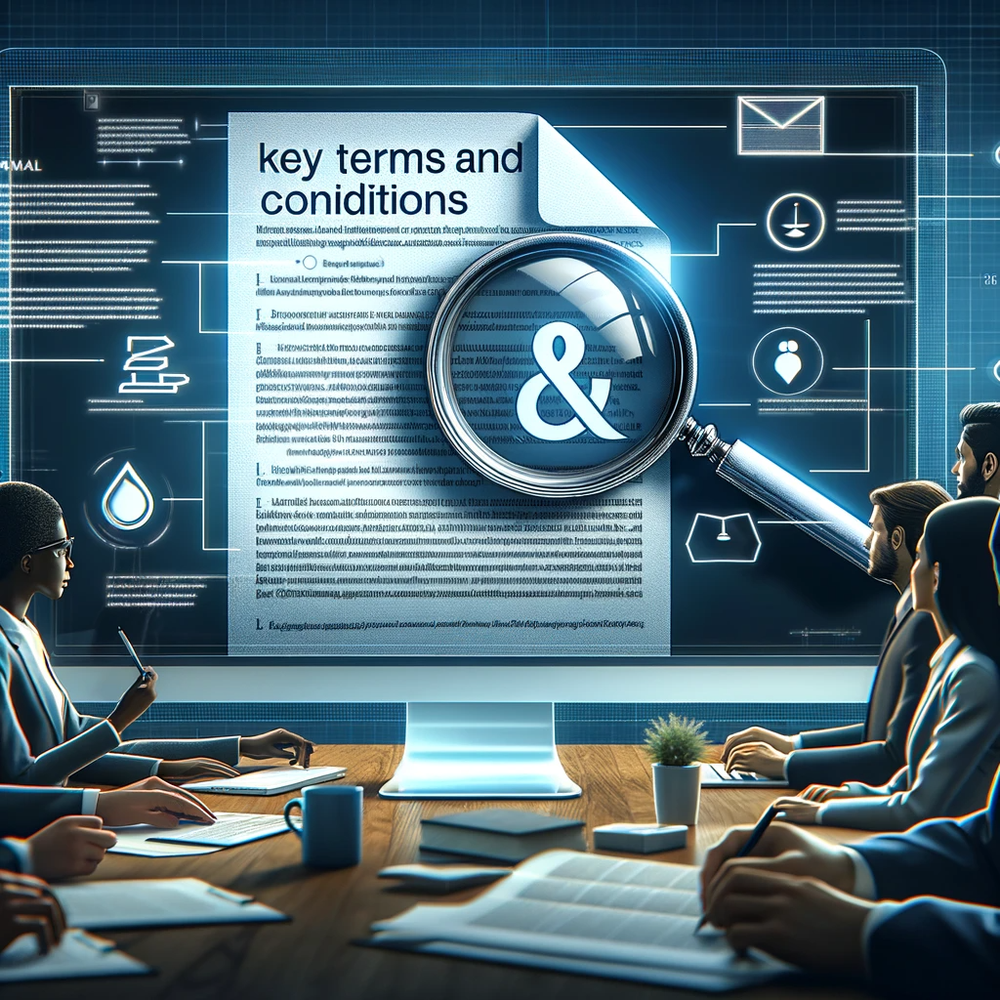

# Docs AI: Streamlining Documentation with Artificial Intelligence

## Summary
Docs AI is an innovative platform that leverages artificial intelligence to revolutionize how we handle documentation. It automates document processing, analysis, and management, making it an invaluable tool for businesses and individuals seeking efficiency in document-related tasks. With its advanced AI algorithms, Docs AI simplifies complex documentation processes, saving time and increasing accuracy.

## Key Points
- AI-Powered Document Processing
- Advanced Analysis and Management
- Time-Saving and Accuracy

## Pros and Cons of Docs AI
| Pros | Cons |
|------|------|
| Automated Document Handling | Requires Internet Connection |
| Enhanced Accuracy and Efficiency | Learning Curve for Advanced Features |
| Time-Saving in Document Management | Subscription for Premium Services |

## Tips for the Reader 📄
To maximize the benefits of Docs AI, familiarize yourself with its range of features. 🚀 Regularly update the app to access the latest AI improvements. 🛠 Customize your settings to suit your specific documentation needs. 📁

## Examples
### Example 1: Automated Invoice Processing - Docs AI
**Input**: 
"Process and summarize the content of received invoices."

**Output**: 
"[Automated summary and categorization of invoice details]"

### Example 2: Legal Document Analysis - Docs AI
**Input**: 
"Analyze the legal document for key terms and conditions."

**Output**: 
"[Extracted key terms and conditions from the legal document]"

👉 **[Try for yourself](https://docsai.app/){:target="_blank" rel="noopener"}**

## URL Address of the AI Topic / Vendor
[Docs AI Official Website](https://docsai.app/){:target="_blank"}

## Follow our Social Media for more information
- 📘 **[Facebook Group](https://www.facebook.com/groups/trionxai){:target="_blank"}**
- 👍 **[Facebook Page](https://www.facebook.com/ai.trionxai){:target="_blank"}**
- 📸 **[Instagram](https://www.instagram.com/trionxai/){:target="_blank"}**
- ▶️ **[Youtube](https://www.youtube.com/@robotdocs/){:target="_blank"}**

### SEO Tags:
Docs AI, artificial intelligence, document processing, automation, business efficiency, document analysis, document management, AI algorithms, invoice processing, legal document analysis, AI technology, data accuracy, document handling, productivity tools, advanced analysis, time-saving solutions, AI document solutions, digital documentation, AI advancements, document automation

