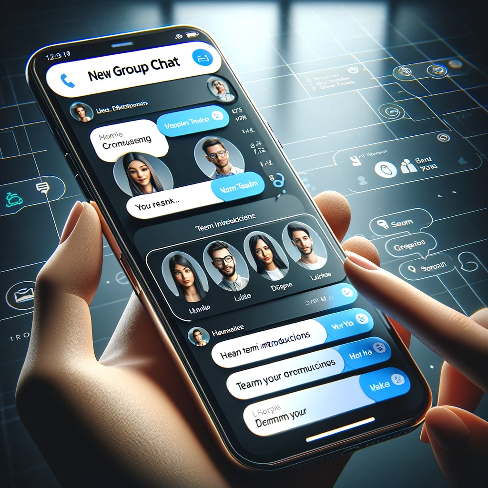

# Dropchat: Revolutionizing Communication in the Digital Age

## Summary
Dropchat is a state-of-the-art communication platform designed to enhance digital interactions in a versatile and user-friendly manner. It integrates advanced messaging features with seamless usability, making it ideal for both personal and professional communication. Dropchat's focus is on providing a secure and efficient way to stay connected in today's fast-paced digital world.

## Key Points
- Advanced Messaging Features
- User-Friendly Interface
- Secure and Efficient Communication

## Pros and Cons of Dropchat
| Pros | Cons |
|------|------|
| Intuitive User Experience | Requires Stable Internet Connection |
| High-Level Security Protocols | Subscription Model for Premium Features |
| Multi-Platform Accessibility | Initial Setup Complexity |

## Tips for the Reader 📱
To get the most out of Dropchat, familiarize yourself with its diverse features. 🚀 Keep your app updated to the latest version to enjoy new functionalities. 🔒 Use custom settings to tailor your communication experience to your needs. 💬

## Examples
### Example 1: Streamlining Team Communication - Dropchat
**Input**: 
"Create a group chat for the project team."

**Output**: 
"[Setup of a group chat with project team members]"

### Example 2: Secure Data Transfer - Dropchat
**Input**: 
"Send encrypted files to a colleague."

**Output**: 
"[Secure file transfer protocol initiated]"

👉 **[Try for yourself](https://app.dropchat.co/){:target="_blank" rel="noopener"}**

## URL Address of the AI Topic / Vendor
[Dropchat Official Website](https://app.dropchat.co/){:target="_blank"}

## Follow our Social Media for more information
- 📘 **[Facebook Group](https://www.facebook.com/groups/trionxai){:target="_blank"}**
- 👍 **[Facebook Page](https://www.facebook.com/ai.trionxai){:target="_blank"}**
- 📸 **[Instagram](https://www.instagram.com/trionxai/){:target="_blank"}**
- ▶️ **[Youtube](https://www.youtube.com/@robotdocs/){:target="_blank"}**

### SEO Tags:
Dropchat, digital communication, messaging platform, user-friendly interface, secure messaging, efficient communication, team collaboration, data encryption, file transfer, communication technology, messaging app, digital interaction, online chat, privacy protection, chat groups, advanced messaging, digital connectivity, professional communication, personal chat, communication security

