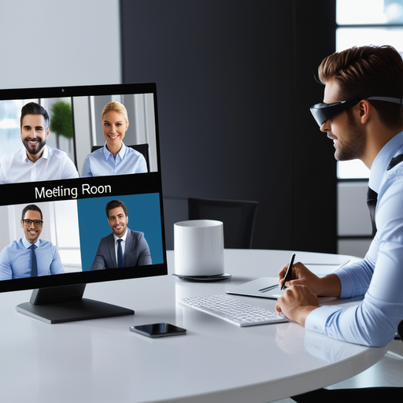

# FutureDesk: Innovating the Workspace of Tomorrow

## Summary
FutureDesk is a cutting-edge platform designed to revolutionize the modern workspace. By integrating advanced AI technology with user-friendly interfaces, it offers solutions that enhance productivity and collaboration in various professional environments. FutureDesk is committed to shaping the future of work through innovation and smart technology.

## Key Points
- Advanced AI Integration
- Enhanced Productivity Tools
- Collaborative Workspace Solutions

## Pros and Cons of FutureDesk
| Pros | Cons |
|------|------|
| State-of-the-Art AI Technology | Requires Reliable Internet Connection |
| Intuitive User Experience | Initial Learning Curve for New Users |
| Streamlined Collaboration Features | Subscription Model for Premium Features |

## Tips for the Reader 🌐
Embrace the full range of FutureDesk's capabilities to revolutionize your workspace. 🚀 Keep abreast of updates to utilize new features. 🛠 Customize your experience to fit your professional needs. 💼

## Examples
### Example 1: Efficient Project Management - FutureDesk
**Input**: 
"Organize project timelines and resources."

**Output**: 
"[Automated project management plan with resources and timelines]"

### Example 2: Real-Time Collaboration - FutureDesk
**Input**: 
"Set up a virtual meeting room for the team."

**Output**: 
"[Virtual meeting room ready for real-time collaboration]"

👉 **[Try for yourself](https://www.futuredesk.io/welcome){:target="_blank" rel="noopener"}**

## URL Address of the AI Topic / Vendor
[FutureDesk Official Website](https://www.futuredesk.io/welcome){:target="_blank"}

## Follow our Social Media for more information
- 📘 **[Facebook Group](https://www.facebook.com/groups/trionxai){:target="_blank"}**
- 👍 **[Facebook Page](https://www.facebook.com/ai.trionxai){:target="_blank"}**
- 📸 **[Instagram](https://www.instagram.com/trionxai/){:target="_blank"}**
- ▶️ **[Youtube](https://www.youtube.com/@robotdocs/){:target="_blank"}**

### SEO Tags:
FutureDesk, AI technology, workspace innovation, productivity enhancement, collaborative solutions, smart technology, modern workspace, AI integration, virtual meeting, project management, real-time collaboration, professional environment, user-friendly interface, technology updates, workspace customization, cutting-edge platform, efficient workflows, team collaboration, virtual workspace, business solutions

