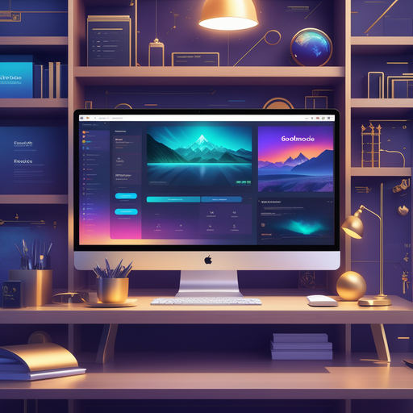

# Godmode: Unleashing Unlimited Potential

## Summary
Godmode is an innovative platform designed to empower users by providing unparalleled control and customization options in their digital workspace. It integrates advanced technologies to create a highly personalized and efficient environment, allowing users to achieve their maximum potential in productivity and creativity.

## Key Points
- Advanced Customization and Control
- Personalized Digital Workspace
- Integration of Cutting-Edge Technologies

## Pros and Cons of Godmode
| Pros | Cons |
|------|------|
| Enhanced User Control | Potential Complexity for New Users |
| High-Level Customization | Requires Regular Updates |
| Streamlined Workflow Efficiency | Dependency on Technical Proficiency |

## Tips for the Reader 🚀✨
- Embrace the full range of customization Godmode offers to tailor your digital space. 🛠️
- Regularly explore new updates and features to stay ahead. 🔍
- Balance the power of Godmode with usability to maintain an efficient workflow. ⚖️

🔹 Experiment with different settings to find your optimal workflow.
🔹 Use Godmode to enhance, not complicate, your tasks.
🔹 Remember to take regular breaks to maintain productivity and creativity.

## Examples
### Example 1: Workspace Optimization - Godmode
**Input**: 
"How can I optimize my digital workspace for maximum efficiency?"

**Output**: 
"Godmode allows you to customize your workspace with tools and widgets tailored to your specific workflow needs."

### Example 2: Creative Project Management - Godmode
**Input**: 
"Manage my creative projects more effectively."

**Output**: 
"Utilize Godmode's advanced project management features to organize, track, and execute your creative projects efficiently."

👉 **[Try for yourself](https://godmode.space/?ref=futuretools.io){:target="_blank" rel="noopener"}**

## URL Address of the AI Topic / Vendor
[Godmode Official Website](https://godmode.space/?ref=futuretools.io)

## Follow Our Social Media for More Information
- 📘 **[Facebook Group](https://www.facebook.com/groups/trionxai){:target="_blank"}**
- 👍 **[Facebook Page](https://www.facebook.com/ai.trionxai){:target="_blank"}**
- 📸 **[Instagram](https://www.instagram.com/trionxai/){:target="_blank"}**
- ▶️ **[Youtube](https://www.youtube.com/@robotdocs/){:target="_blank"}**

### SEO Tags
Godmode, Digital Workspace, Advanced Customization, User Control, Productivity Enhancement, Creative Workflow, Workspace Optimization, Cutting-Edge Technology, Streamlined Workflow, Efficient Management, Project Management, User Empowerment, Personalized Environment, Task Efficiency, Digital Tools, Creative Projects, Workspace Efficiency, Customization Features, Workflow Solutions, Technology Integration

