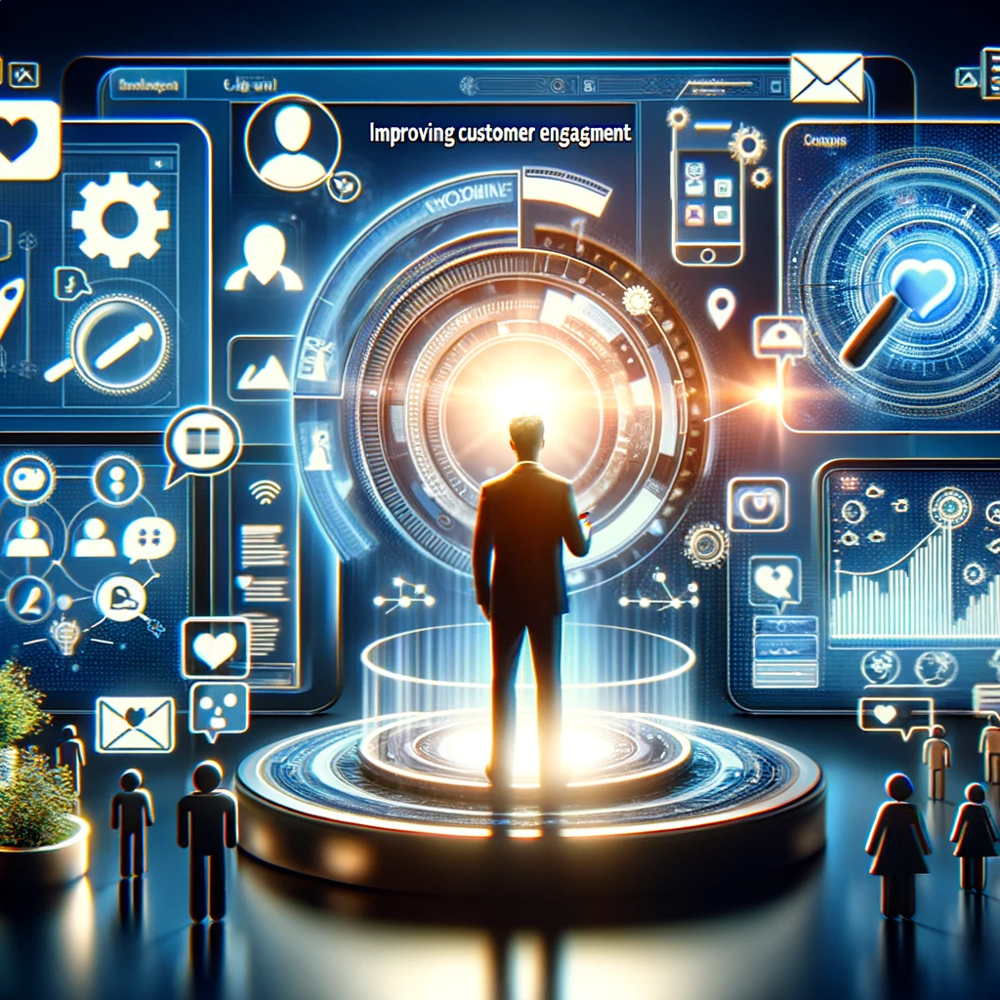

# HumanFest: Embracing Humanity in the Digital Age

## Summary
HumanFest is an innovative platform that aims to bridge the gap between digital technology and human interaction. It focuses on enhancing the human element in a world increasingly dominated by digital interfaces. HumanFest provides tools and resources for individuals and businesses to foster genuine connections and promote human-centric experiences.

## Key Points
- Human-Centric Digital Solutions
- Enhancing Real-Life Interactions
- Tools for Personal and Business Use

## Pros and Cons of HumanFest
| Pros | Cons |
|------|------|
| Encourages Genuine Human Connections | Limited to Digital Platforms |
| Versatile Applications | Requires Internet Connectivity |
| Focus on Personal Growth | Adaptation Time for Traditional Users |

## Tips for the Reader 🌟
To make the most of HumanFest, focus on integrating its tools into your daily life. 🌍 Embrace the digital solutions while maintaining real-life interactions. 🤝 Stay updated with new features to enhance your experience. 💡

## Examples
### Example 1: Connecting Communities - HumanFest
**Input**: 
"Organize a virtual community meet-up."

**Output**: 
"[Plan and resources for an engaging virtual meet-up]"

### Example 2: Enhancing Business Relations - HumanFest
**Input**: 
"Improve customer engagement through digital platforms."

**Output**: 
"[Strategies and tools for effective digital customer engagement]"

👉 **[Try for yourself](https://humanfest.chat/){:target="_blank" rel="noopener"}**

## URL Address of the AI Topic / Vendor
[HumanFest Official Website](https://humanfest.chat/){:target="_blank"}

## Follow our Social Media for more information
- 📘 **[Facebook Group](https://www.facebook.com/groups/trionxai){:target="_blank"}**
- 👍 **[Facebook Page](https://www.facebook.com/ai.trionxai){:target="_blank"}**
- 📸 **[Instagram](https://www.instagram.com/trionxai/){:target="_blank"}**
- ▶️ **[Youtube](https://www.youtube.com/@robotdocs/){:target="_blank"}**

### SEO Tags:
HumanFest, human interaction, digital technology, genuine connections, personal growth, digital solutions, real-life interaction, community engagement, business tools, internet connectivity, digital platforms, customer engagement, virtual meet-ups, personal development, digital age, human-centric, innovation, community building, digital interaction, user experience

