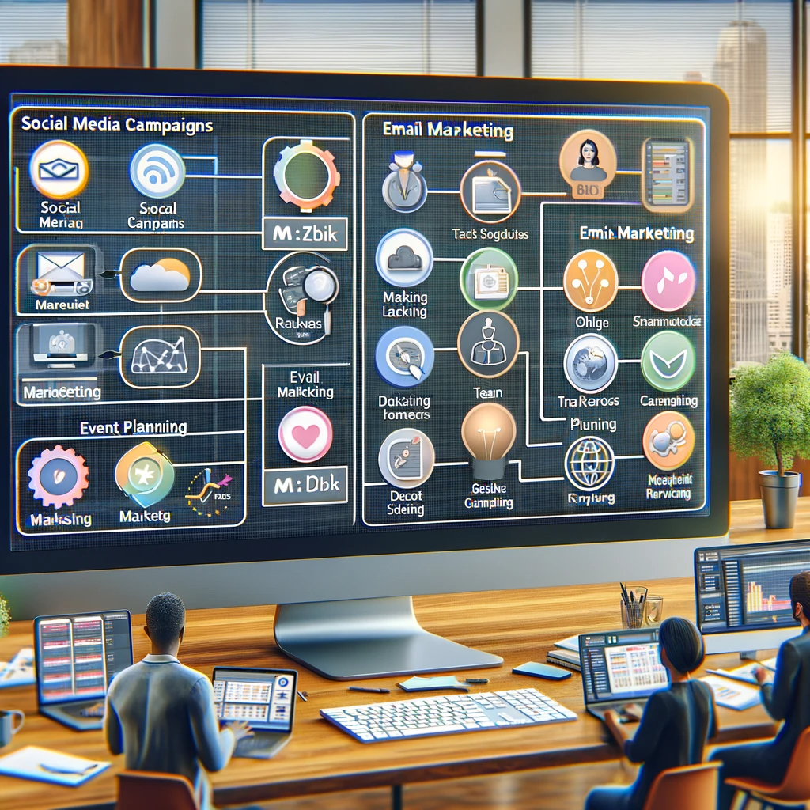

# Kahuna: Empowering Teams with Smart Collaboration Tools

## Summary
Kahuna is an innovative platform designed to enhance team collaboration and project management through advanced AI-driven tools. It offers a suite of features aimed at improving efficiency, streamlining communication, and fostering a productive work environment. Kahuna is ideal for teams looking to leverage technology for better project outcomes.

## Key Points
- AI-Driven Project Management
- Enhanced Team Collaboration
- Streamlined Communication

## Pros and Cons of Kahuna
| Pros | Cons |
|------|------|
| Efficient Project Handling | Requires Internet Connectivity |
| Collaborative Features for Teams | Initial Setup and Learning Curve |
| AI-Enhanced Productivity Tools | Subscription-Based Access to Advanced Features |

## Tips for the Reader 🌟
Utilize Kahuna to its full potential by integrating it into your daily workflow. 🚀 Explore its AI features to automate mundane tasks. 💡 Stay updated with new updates and features to continuously improve your team's efficiency. 📈

## Examples
### Example 1: Streamlined Task Assignment - Kahuna
**Input**: 
"Organize tasks for the marketing project."

**Output**: 
"[AI-assisted task distribution based on team members' strengths and availability]"

### Example 2: Optimized Meeting Scheduling - Kahuna
**Input**: 
"Find the best time for a team meeting."

**Output**: 
"[AI-suggested optimal meeting times considering all members' schedules]"

👉 **[Try for yourself](https://www.joinkahuna.com/){:target="_blank" rel="noopener"}**

## URL Address of the AI Topic / Vendor
[Kahuna Official Website](https://www.joinkahuna.com/){:target="_blank"}

## Follow our Social Media for more information
- 📘 **[Facebook Group](https://www.facebook.com/groups/trionxai){:target="_blank"}**
- 👍 **[Facebook Page](https://www.facebook.com/ai.trionxai){:target="_blank"}**
- 📸 **[Instagram](https://www.instagram.com/trionxai/){:target="_blank"}**
- ▶️ **[Youtube](https://www.youtube.com/@robotdocs/){:target="_blank"}**

### SEO Tags:
Kahuna, team collaboration, project management, AI tools, efficient communication, productivity enhancement, smart collaboration, project planning, AI-driven management, team efficiency, workflow optimization, task assignment, meeting scheduling, team projects, collaboration technology, productivity tools, business management, AI integration, team coordination, project tracking

