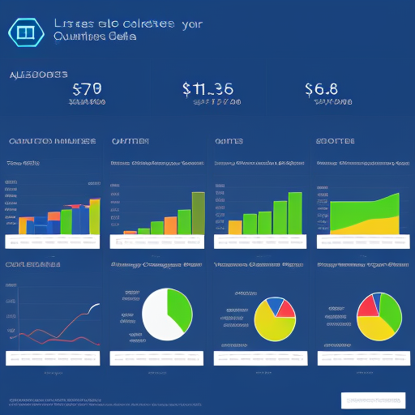

# Quino: Revolutionizing AI-Driven Solutions

## Summary
Quino is an innovative AI platform that is changing the way businesses and individuals interact with artificial intelligence. It provides a suite of tools and services designed to make AI more accessible and effective across various industries. Quino's focus on user-friendly AI solutions helps in simplifying complex tasks, enhancing productivity, and driving innovation.

## Key Points
- User-Friendly AI Tools
- Cross-Industry Applications
- Advanced AI Technology

## Pros and Cons of Quino
| Pros | Cons |
|------|------|
| Simplifies Complex AI Tasks | Requires Internet Connection |
| Versatile Across Industries | Learning Curve for New Users |
| Continuously Evolving Features | Subscription Model for Premium Services |

## Tips for the Reader 📘
To make the most out of Quino, stay curious and experiment with different features. 🚀 Embrace AI to streamline your work processes, and don't hesitate to seek support if needed. 🤖 Always keep an eye on updates to leverage the latest advancements in AI. 💡

## Examples
### Example 1: Streamlining Data Analysis - Quino
**Input**: 
"Analyze sales data from the last quarter."

**Output**: 
"[Comprehensive sales analysis report]"

### Example 2: Enhancing Customer Experience - Quino
**Input**: 
"Generate customer engagement strategies."

**Output**: 
"[List of effective strategies for customer engagement]"

👉 **[Try for yourself](https://quino.ai/){:target="_blank" rel="noopener"}**

## URL Address of the AI Topic / Vendor
[Quino Official Website](https://quino.ai/){:target="_blank"}

## Follow our Social Media for more information
- 📘 **[Facebook Group](https://www.facebook.com/groups/trionxai){:target="_blank"}**
- 👍 **[Facebook Page](https://www.facebook.com/ai.trionxai){:target="_blank"}**
- 📸 **[Instagram](https://www.instagram.com/trionxai/){:target="_blank"}**
- ▶️ **[Youtube](https://www.youtube.com/@robotdocs/){:target="_blank"}**

### SEO Tags:
AI, Quino, artificial intelligence, data analysis, customer engagement, technology solutions, AI tools, productivity, innovation, AI applications, user-friendly AI, industry solutions, AI advancements, data processing, business intelligence, AI strategy, digital transformation, AI integration, machine learning, AI services

