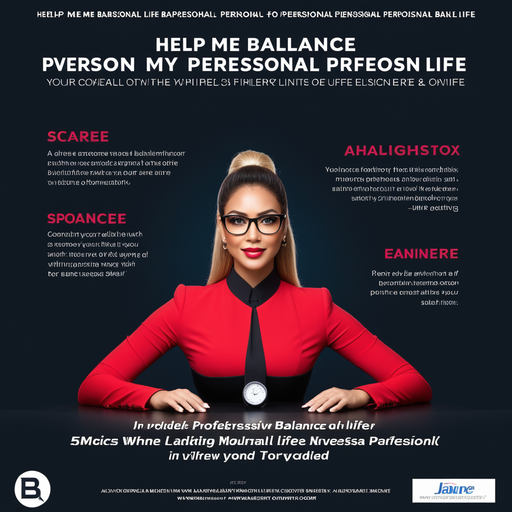

# Stream Routine: Simplifying Daily Tasks

## Summary
Stream Routine is a dynamic platform designed to streamline and optimize daily tasks and routines. By integrating advanced technology and user-friendly features, it aids in organizing and managing day-to-day activities efficiently, making it an essential tool for individuals seeking to enhance their productivity and time management.

## Key Points
- Efficient Task Management
- User-Friendly Interface
- Technology Integration for Daily Routines

## Pros and Cons of Stream Routine
| Pros | Cons |
|------|------|
| Streamlines Daily Tasks | Requires Internet Connectivity |
| Intuitive User Interface | Initial Setup and Customization Time |
| Customizable Features | Adaptation to User Preferences Over Time |

## Tips for the Reader 📅🚀
- Utilize Stream Routine to organize your day effectively. 🌟
- Customize it to fit your personal or professional needs. 🔧
- Regularly update to make the most of new features and improvements. 🔄

🔹 Embrace technology to enhance your daily productivity.
🔹 Balance digital organization with flexibility.
🔹 Use Stream Routine to complement, not override, your natural workflow.

## Examples
### Example 1: Organizing Work Schedule - Stream Routine
**Input**: 
"How can I manage my work tasks more efficiently?"

**Output**: 
"Stream Routine can organize your tasks based on priority and deadlines, ensuring efficient task management."

### Example 2: Personal Life Management - Stream Routine
**Input**: 
"Help me balance my personal and professional life."

**Output**: 
"Stream Routine can be set up to remind you of personal appointments and downtime, in addition to work-related tasks."

👉 **[Try for yourself](https://streamroutine.com/){:target="_blank" rel="noopener"}**

## URL Address of the AI Topic / Vendor
[Stream Routine Official Website](https://streamroutine.com/)

## Follow Our Social Media for More Information
- 📘 **[Facebook Group](https://www.facebook.com/groups/trionxai){:target="_blank"}**
- 👍 **[Facebook Page](https://www.facebook.com/ai.trionxai){:target="_blank"}**
- 📸 **[Instagram](https://www.instagram.com/trionxai/){:target="_blank"}**
- ▶️ **[Youtube](https://www.youtube.com/@robotdocs/){:target="_blank"}**

### SEO Tags
Stream Routine, Task Management, Time Management, Daily Routines, Productivity Enhancement, User Interface, Personal Organization, Work-Life Balance, Task Prioritization, Efficient Scheduling, Technology Integration, Daily Productivity, Professional Organization, Personal Appointments, Work Schedule, Customizable Features, Digital Organization, Workflow Optimization, Lifestyle Management, Organizational Tools

