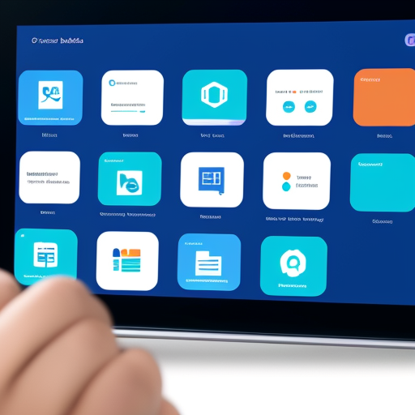

# Talkface: Redefining Communication with AI Technology

## Summary
Talkface is an innovative platform that uses AI to transform how we interact and communicate in the digital space. It employs advanced machine learning techniques to understand and respond to user needs, making digital interactions more personal and efficient. Talkface is ideal for both personal and professional use, offering a new level of engagement in virtual conversations.

## Key Points
- Advanced Machine Learning for Interaction
- Personalized Digital Communication
- Efficient and User-Friendly Interface

## Pros and Cons of Talkface
| Pros | Cons |
|------|------|
| Enhanced Communication with AI | Requires Reliable Internet Access |
| Personalization of Digital Interaction | Learning Curve for Advanced Features |
| User-Friendly and Intuitive Design | Data Privacy and Security Concerns |

## Tips for the Reader 📱💡
- Embrace AI technology to enhance your communication. 🚀
- Provide clear and detailed inputs for more accurate AI responses. 🔍
- Regularly update the platform to utilize the latest features. 🔄

🔹 Use Talkface as a tool to augment, not replace, personal interaction.  
🔹 Balance technology use with face-to-face communication.  
🔹 Be mindful of privacy and data security while interacting online.  

## Examples
### Example 1: Personalized Conversation - Talkface
**Input**: 
"How can I make my online conversations more engaging?"

**Output**: 
"Try incorporating more personalized content based on the user's interests."

### Example 2: Professional Meeting Enhancement - Talkface
**Input**: 
"Improve my team's virtual meeting experience."

**Output**: 
"Implement AI-driven tools for real-time agenda tracking and efficient meeting management."

👉 **[Try for yourself](https://talkface.ai/){:target="_blank" rel="noopener"}**

## URL Address of the AI Topic / Vendor
[Talkface Official Website](https://talkface.ai/)

## Follow Our Social Media for More Information
- 📘 **[Facebook Group](https://www.facebook.com/groups/trionxai){:target="_blank"}**
- 👍 **[Facebook Page](https://www.facebook.com/ai.trionxai){:target="_blank"}**
- 📸 **[Instagram](https://www.instagram.com/trionxai/){:target="_blank"}**
- ▶️ **[Youtube](https://www.youtube.com/@robotdocs/){:target="_blank"}**

### SEO Tags
AI Communication, Talkface, Digital Interaction, Machine Learning, Personalized Communication, Virtual Conversations, AI Technology, User-Friendly Interface, Online Communication, Professional Meetings, AI Tools, Virtual Engagement, Data Privacy, Secure Interaction, Machine Learning Techniques, Enhanced Communication, Digital Platforms, AI Responses, Conversation Personalization, Communication Technology

