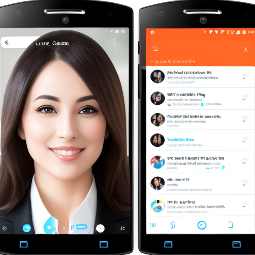
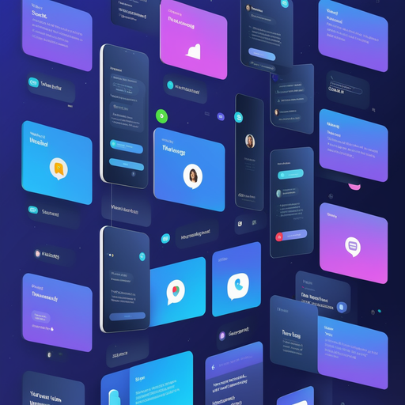

# Telechat: Revolutionizing Communication with AI

## Summary
Telechat is an innovative AI-based platform designed to transform how we communicate digitally. By integrating artificial intelligence into chat systems, Telechat offers enhanced, efficient, and intelligent conversation experiences, making it a pivotal tool for businesses and individuals who seek to optimize their communication strategies.

## Key Points
- AI-Integrated Chat Systems
- Enhanced Digital Communication
- Efficient and Intelligent Conversations

## Pros and Cons of Telechat
| Pros | Cons |
|------|------|
| Enhanced Communication Efficiency | Requires Internet Connectivity |
| Intelligent Response Capabilities | Possible Overreliance on AI for Interactions |
| Wide Applicability for Various Users | Need for Regular Updates and Maintenance |

## Tips for the Reader 📱💬
- Use Telechat to streamline your digital conversations. 🌟
- Keep abreast of updates to maximize AI benefits. 🔧
- Balance AI communication with a personal touch for a holistic experience. 🤖❤️

🔹 Experiment with different Telechat features to find your optimal communication style.
🔹 Remember, AI is a tool to assist, not replace, human interaction.
🔹 Use Telechat's analytics to understand and enhance your communication patterns.

## Examples
### Example 1: Business Communication Optimization - Telechat
**Input**: 
"How can we improve our customer service chats?"

**Output**: 
"Telechat can automate responses and provide quick, efficient service, enhancing customer satisfaction."

### Example 2: Personal Interaction Enhancement - Telechat
**Input**: 
"Seeking a way to manage personal messages more efficiently."

**Output**: 
"Telechat offers organized, AI-assisted management of personal messages, ensuring you never miss important communication."

👉 **[Try for yourself](https://telechat.ai/){:target="_blank" rel="noopener"}**

## URL Address of the AI Topic / Vendor
[Telechat Official Website](https://telechat.ai/)

## Follow Our Social Media for More Information
- 📘 **[Facebook Group](https://www.facebook.com/groups/trionxai){:target="_blank"}**
- 👍 **[Facebook Page](https://www.facebook.com/ai.trionxai){:target="_blank"}**
- 📸 **[Instagram](https://www.instagram.com/trionxai/){:target="_blank"}**
- ▶️ **[Youtube](https://www.youtube.com/@robotdocs/){:target="_blank"}**

### SEO Tags
Telechat, AI Communication, Digital Conversations, Chat Systems, Communication Efficiency, Intelligent Conversations, Business Communication, Customer Service, AI Integration, Personal Interaction, Automated Responses, Communication Strategy, AI Analytics, Chat Optimization, Online Messaging, AI-Assisted Management, Enhanced Conversations, Digital Communication Tools, AI Technology, Communication Patterns

