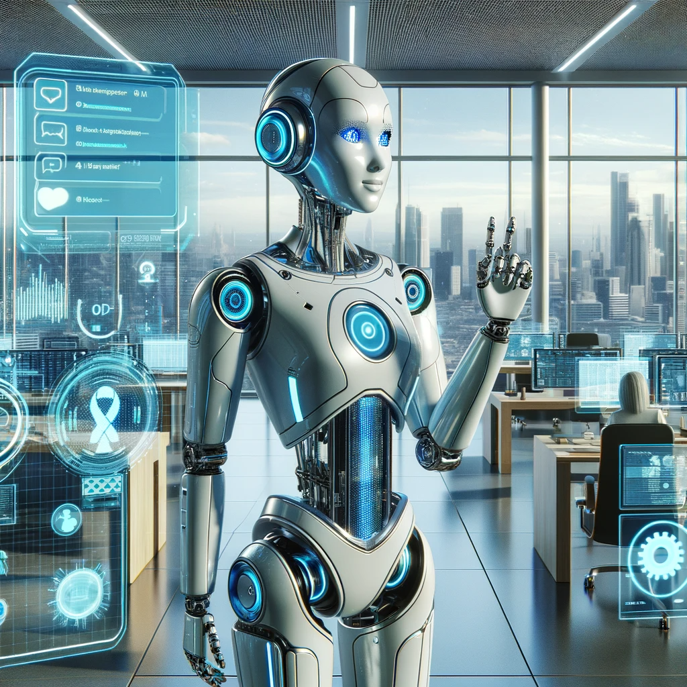
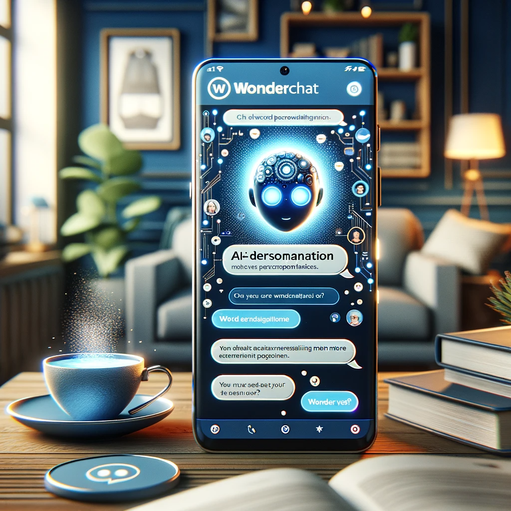
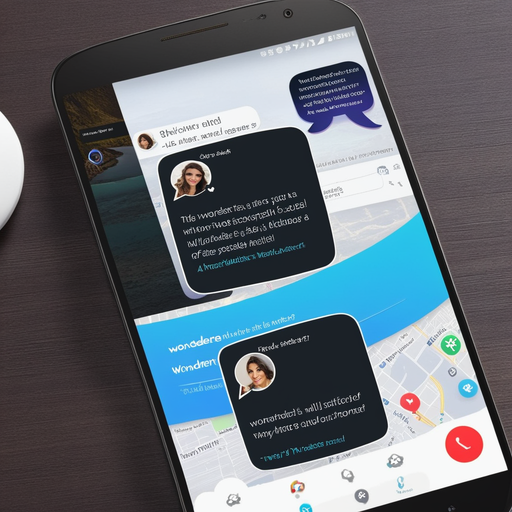

# Wonderchat: Enhancing Digital Interactions with AI

## Summary
Wonderchat is an innovative AI-powered chat platform designed to revolutionize digital interactions. By integrating advanced artificial intelligence, Wonderchat offers seamless, efficient, and intelligent communication solutions, making it a valuable tool for businesses and individuals seeking to optimize their online engagement.

## Key Points
- Advanced AI-Powered Chat Platform
- Seamless Digital Interactions
- Efficient and Intelligent Communication Solutions

## Pros and Cons of Wonderchat
| Pros | Cons |
|------|------|
| Streamlined Communication Process | Requires Internet Connectivity |
| AI-Driven Efficiency | Potential Overreliance on Automated Responses |
| Customizable to Various Needs | Need for Regular AI Updates |

## Tips for the Reader 🤖💬
- Utilize Wonderchat to elevate your digital communication strategy. 🚀
- Stay updated with AI advancements to make the most of the platform. 🔧
- Balance AI-driven chat with personalized interactions for a holistic approach. ⚖️

🔹 Embrace the power of AI to enhance, not replace, human interaction.
🔹 Experiment with different features to fully explore Wonderchat's capabilities.
🔹 Use analytics to understand and improve your communication style.

## Examples
### Example 1: Business Customer Service - Wonderchat
**Input**: 
"How can we improve customer service response time?"

**Output**: 
"Wonderchat can automate responses for quicker and more efficient customer service."

### Example 2: Personalized Interaction - Wonderchat
**Input**: 
"Enhance personal messaging experience."

**Output**: 
"Wonderchat offers AI-driven personalization to make your messaging more engaging and efficient."

👉 **[Try for yourself](https://wonderchat.io/){:target="_blank" rel="noopener"}**

## URL Address of the AI Topic / Vendor
[Wonderchat Official Website](https://wonderchat.io/)

## Follow Our Social Media for More Information
- 📘 **[Facebook Group](https://www.facebook.com/groups/trionxai){:target="_blank"}**
- 👍 **[Facebook Page](https://www.facebook.com/ai.trionxai){:target="_blank"}**
- 📸 **[Instagram](https://www.instagram.com/trionxai/){:target="_blank"}**
- ▶️ **[Youtube](https://www.youtube.com/@robotdocs/){:target="_blank"}**

### SEO Tags
Wonderchat, AI Chat Platform, Digital Interactions, Communication Solutions, Online Engagement, AI-Powered Chat, Streamlined Communication, Automated Responses, Customizable Chat, AI Advancements, Chat Platform, Digital Communication Strategy, AI-Driven Efficiency, Personalized Interactions, Automated Customer Service, Messaging Experience, Communication Technology, AI Integration, Chat Customization, Interactive AI

