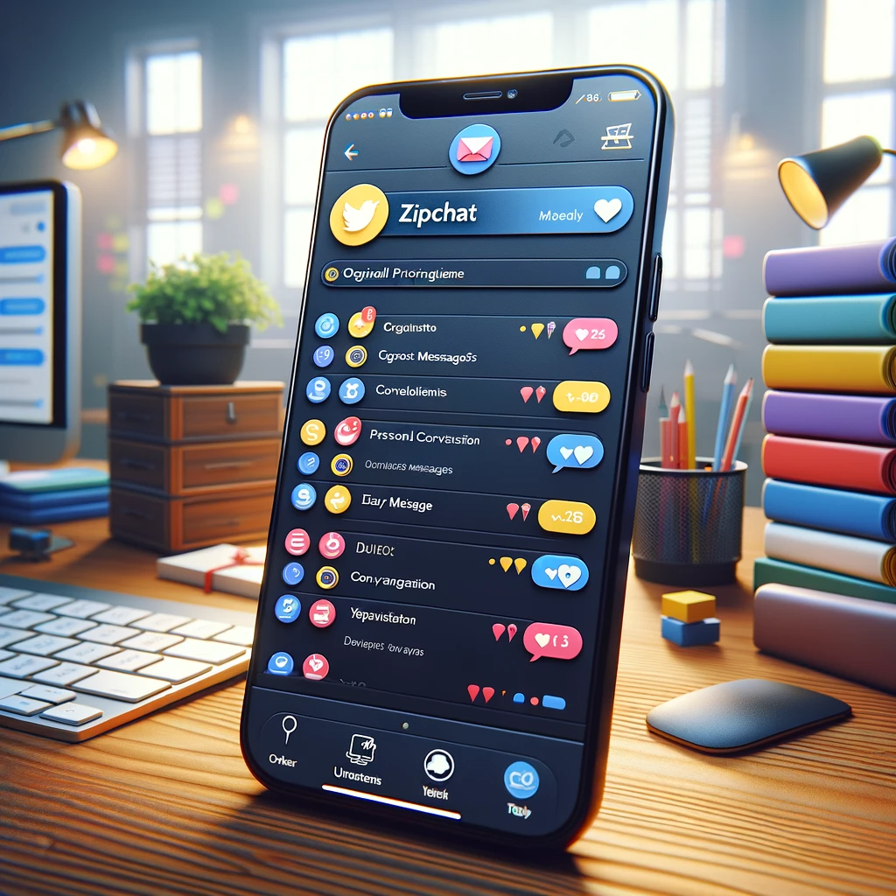

# ZipChat: Streamlining Communication with AI

## Summary
ZipChat introduces an advanced AI-driven communication platform designed to streamline and enhance digital interactions. It integrates sophisticated algorithms to provide quick, efficient, and intuitive chat experiences, making it ideal for businesses and individuals seeking smarter, faster, and more reliable online communication.

## Key Points
- AI-Driven Communication Platform
- Quick and Efficient Chat Experiences
- Ideal for Business and Personal Use

## Pros and Cons of ZipChat
| Pros | Cons |
|------|------|
| Fast and Efficient Communication | Dependence on Stable Internet Connectivity |
| Intuitive User Interface | Learning Curve for Advanced Features |
| Customizable to Various Needs | Potential Overreliance on Automated Responses |

## Tips for the Reader 🚀💬
- Leverage ZipChat for faster and more efficient communication. 📈
- Customize ZipChat settings to suit your specific communication needs. 🛠️
- Balance the use of AI with personal interaction for optimal communication. ⚖️

🔹 Explore all features of ZipChat to fully utilize its capabilities.
🔹 Stay updated with ZipChat's latest advancements for continuous improvement.
🔹 Use ZipChat's analytics to understand your communication patterns and areas for improvement.

## Examples
### Example 1: Enhancing Customer Support - ZipChat
**Input**: 
"How can we improve our online customer support?"

**Output**: 
"ZipChat can automate responses and streamline customer queries for efficient and effective support."

### Example 2: Streamlining Personal Chats - ZipChat
**Input**: 
"Need an efficient way to manage numerous personal messages."

**Output**: 
"ZipChat organizes and prioritizes personal messages, making it easy to manage and respond promptly."

👉 **[Try for yourself](https://zipchat.ai/){:target="_blank" rel="noopener"}**

## URL Address of the AI Topic / Vendor
[ZipChat Official Website](https://zipchat.ai/)

## Follow Our Social Media for More Information
- 📘 **[Facebook Group](https://www.facebook.com/groups/trionxai){:target="_blank"}**
- 👍 **[Facebook Page](https://www.facebook.com/ai.trionxai){:target="_blank"}**
- 📸 **[Instagram](https://www.instagram.com/trionxai/){:target="_blank"}**
- ▶️ **[Youtube](https://www.youtube.com/@robotdocs/){:target="_blank"}**

### SEO Tags
ZipChat, AI Communication, Efficient Chat, Digital Interactions, AI Chat Platform, Fast Communication, Online Messaging, Business Communication, Personal Chat Management, Automated Responses, User Interface, Customizable Chat, AI Technology, Online Support, Messaging Efficiency, Communication Analytics, Advanced Features, Chat Customization, Personal Interaction, Communication Improvement

