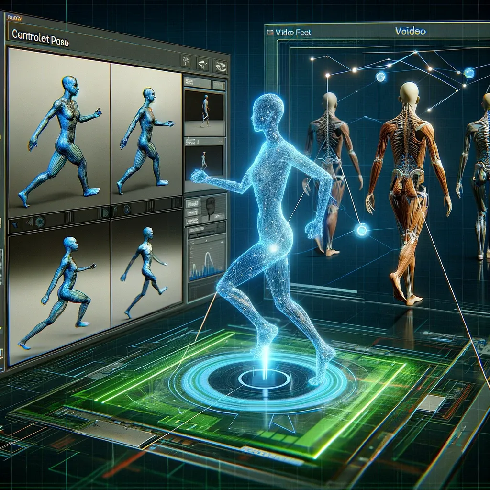

# ControlNet Pose: Advanced AI for Human Pose Estimation

## Summary:
ControlNet Pose is a state-of-the-art AI tool designed for human pose estimation. It utilizes advanced machine learning algorithms to accurately identify and track human body positions and movements. Ideal for developers and researchers in fields like animation, sports science, and physical therapy, ControlNet Pose offers precise and real-time pose analysis.

## Key Points:
- Real-time human pose estimation using AI.
- High accuracy and detail in tracking body positions.
- Useful in various applications from animation to sports analysis.

## Pros and Cons:

| Pros                                        | Cons                                     |
|---------------------------------------------|------------------------------------------|
| Precise and accurate pose detection         | Requires high-quality input data         |
| Real-time analysis for immediate feedback   | May have a learning curve for beginners   |
| Versatile applications across industries    | Dependent on the computational resources  |

## 🌟 Tips for the Reader:
- 🏋️ Experiment with different scenarios to understand the tool's capabilities.
- 💻 Ensure high-quality video or image input for best results.
- 🔄 Regularly update the software for the latest features and improvements.

## Examples:

### Example 1: Animation Character Movement
- **Prompt:** Realistic Animation Poses
- **Input:** Video of human movement.
- **Output:** Accurate pose estimation data for animating a character.

### Example 2: Sports Performance Analysis
- **Prompt:** Athletic Form Improvement
- **Input:** Athlete performing a sport.
- **Output:** Detailed pose analysis for performance enhancement.

👉 [**Try for yourself**](https://learn.thinkdiffusion.com/controlnet-openpose/){:target="_blank"} and/or [**FutureTools - ControlNet Pose**](https://www.futuretools.io/tools/controlnet-pose){:target="_blank"}

## URL Address of the AI Topic / vendor:
- [ControlNet Pose at ThinkDiffusion](https://learn.thinkdiffusion.com/controlnet-openpose/){:target="_blank"}
- [ControlNet Pose on FutureTools](https://www.futuretools.io/tools/controlnet-pose){:target="_blank"}

---

**Follow our Social Media for more information:**
- 📘 <a href="https://www.facebook.com/groups/trionxai" target="_blank">FB group: Trionx AI Group</a>
- 👍 <a href="https://www.facebook.com/ai.trionxai" target="_blank">FB page: Trionx AI Page</a>
- 📸 <a href="https://www.instagram.com/trionxai/" target="_blank">Instagram: Trionx AI Instagram</a>
- ▶️ <a href="https://www.youtube.com/@robotdocs/" target="_blank">Youtube: Trionx AI YouTube</a>

---

## SEO High Ranking Page Tags:
ControlNet Pose, human pose estimation, AI motion tracking, animation technology, sports performance analysis, machine learning, real-time pose analysis, AI for physical therapy, body movement analysis, AI algorithms, motion capture, digital animation, athletic training, sports science, biomechanics, AI technology, computer vision, pose detection, performance improvement, machine learning applications

---

