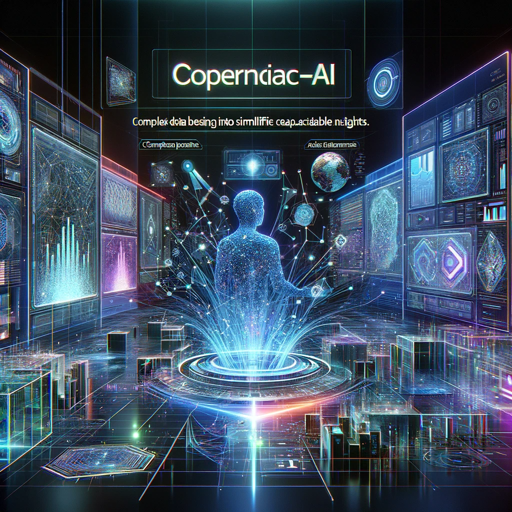

# CopernicAI: Revolutionizing Data Analysis with AI

## Summary:
CopernicAI is an advanced AI platform designed to revolutionize the way businesses and researchers analyze and interpret data. By leveraging the power of artificial intelligence, CopernicAI provides deep insights, predictive analytics, and intelligent data management solutions.

## Key Points:
- Advanced AI-driven data analysis and interpretation.
- Tailored solutions for businesses and research.
- User-friendly platform with powerful analytics tools.

## Pros and Cons:

| Pros                                         | Cons                                      |
|----------------------------------------------|-------------------------------------------|
| Innovative AI algorithms for data analysis   | May require a learning curve for new users |
| Customizable solutions for various industries| Subscription model for premium features   |
| Real-time data processing and insights       | Requires quality data for accurate results |

## 🌟 Tips for the Reader:
- 📊 Take advantage of CopernicAI's customizable dashboards for tailored insights.
- 🤖 Explore AI-driven predictive models to anticipate trends and outcomes.
- 💾 Regularly update your data sets to maintain accuracy and relevance.

## Examples:

### Example 1: Market Trend Analysis
- **Prompt:** Identifying Emerging Market Trends
- **Input:** Historical market data and current industry metrics.
- **Output:** AI-generated insights on future market trends and potential opportunities.

### Example 2: Healthcare Data Interpretation
- **Prompt:** Improving Patient Care with Data
- **Input:** Patient health records and medical data.
- **Output:** Predictive analysis for patient care and treatment optimization.

👉 [**Try for yourself**](https://copernicai.com/)

## URL Address of the AI Topic / vendor:
- [CopernicAI Official Website](https://copernicai.com/)

---

**Follow our Social Media for more information:**
- 📘 <a href="https://www.facebook.com/groups/trionxai" target="_blank">FB group: Trionx AI Group</a>
- 👍 <a href="https://www.facebook.com/ai.trionxai" target="_blank">FB page: Trionx AI Page</a>
- 📸 <a href="https://www.instagram.com/trionxai/" target="_blank">Instagram: Trionx AI Instagram</a>
- ▶️ <a href="https://www.youtube.com/@robotdocs/" target="_blank">Youtube: Trionx AI YouTube</a>

---

## SEO High Ranking Page Tags:
CopernicAI, AI data analysis, predictive analytics, data interpretation, AI technology, business intelligence, real-time insights, data-driven decisions, artificial intelligence, data management, market trends, healthcare analytics, AI algorithms, data solutions, advanced analytics, data trends, business analytics, data science, AI insights, intelligent data

