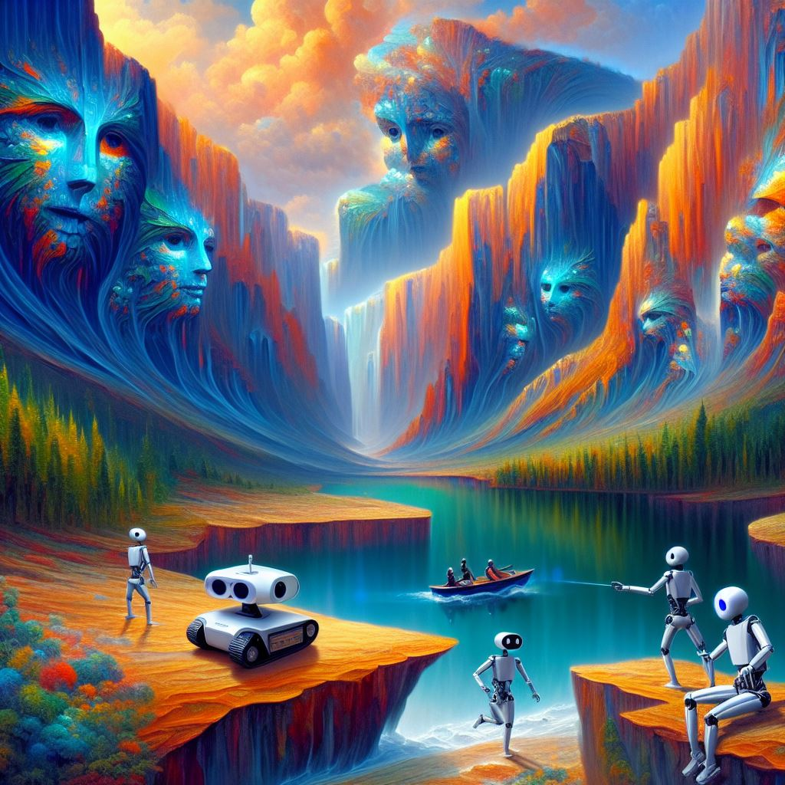

## DALL-E: Exploring OpenAI's Creativity Unleashed Through Image Generation

### Summary
DALL-E, housed within OpenAI's domain at Labs.OpenAI.com, is a groundbreaking AI model specializing in generating images from textual descriptions. This article delves into how DALL-E leverages AI to produce imaginative and contextually relevant visual representations.



### Key Points

1. **Introduction to DALL-E:** Unveiling OpenAI's innovative AI model, DALL-E, capable of image generation from textual prompts.
2. **AI's Image Generation Capabilities:** Exploring how DALL-E uses AI algorithms to understand and create images based on textual descriptions.
3. **Pros and Cons** (Table Format):

| Pros                                 | Cons                                |
|--------------------------------------|-------------------------------------|
| Unique and contextually relevant image generation | Limited availability and access   |
| Diverse range of imaginative outputs  | Potential misinterpretation of prompts |
| Augmentation of creative processes    | Challenges in fine-grained details  |

### Tips for the Reader 💡
Enhancing Image Generation with DALL-E:
- Experiment with diverse and descriptive textual prompts for varied image outputs.
- Acknowledge the model's creative potential while understanding its limitations in detailed imagery.
- Explore the platform regularly to witness AI advancements in image generation.

### Examples

#### Example 1: Image Generation from Textual Description
**Prompt:** Generating Images Using DALL-E

**Input**
```dart
image_output = DALL-E.generate_image(description)
```

**Output**
```dart
An image representation derived from the provided textual description utilizing DALL-E's AI model.
```

#### Example 2: Contextual Image Synthesis
**Prompt:** Contextual Image Synthesis with DALL-E

**Input**
```dart
contextual_image = DALL-E.synthesize_image(context)
```

**Output**
```dart
An image synthesis based on the contextual information provided, demonstrating DALL-E's contextual understanding capabilities.
```

#### Example 3: Imaginative Image Creation
**Prompt:** Imaginative Image Creation Using DALL-E

**Input**
```dart
imaginative_image = DALL-E.create_imagery(theme)
```

**Output**
```dart
An imaginative and themed image generated by DALL-E, showcasing its creative image synthesis abilities.
```

Try for Yourself 👉 <a href="https://labs.openai.com" target="_blank">Explore DALL-E at OpenAI Labs</a>

## URL Address
- <a href="https://labs.openai.com" target="_blank">DALL-E - OpenAI's Image Generation Model</a>

### Follow our Social Media for more information:
- 📘 <a href="https://www.facebook.com/groups/trionxai" target="_blank">Facebook Group</a>
- 👍 <a href="https://www.facebook.com/ai.trionxai" target="_blank">Facebook Page</a>
- 📸 <a href="https://www.instagram.com/trionxai/" target="_blank">Instagram</a>
- ▶️ <a href="https://www.youtube.com/@robotdocs/" target="_blank">Youtube</a>

<hr>

### SEO High Ranking Page Tags
AI, DALL-E, Image Generation, AI-Driven Creativity, OpenAI Model, Image Synthesis, Artificial Intelligence, Creative Outputs, AI Applications, Innovative Image Generation, AI Advancements