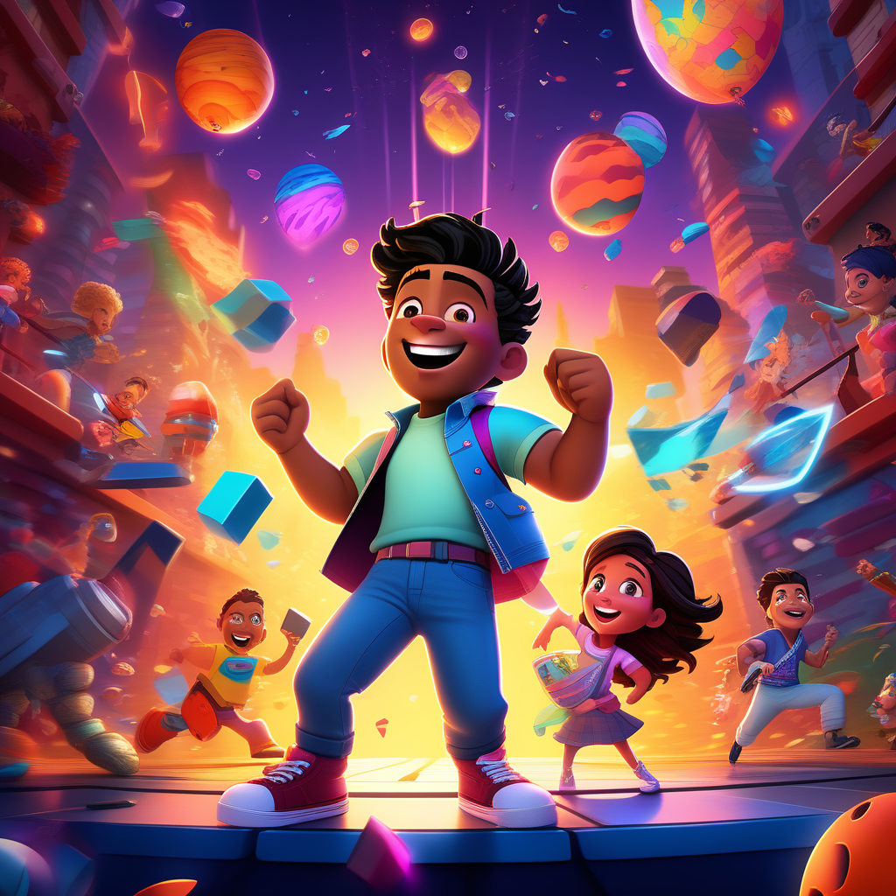
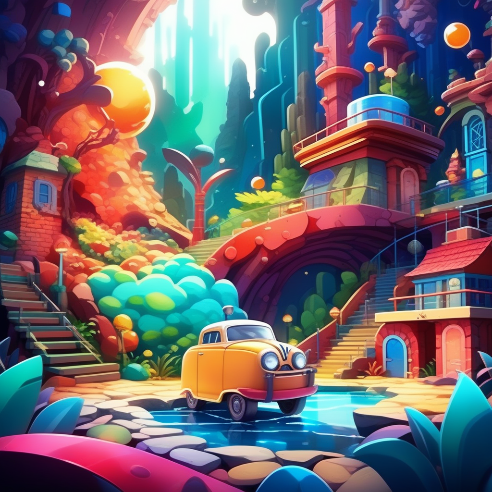
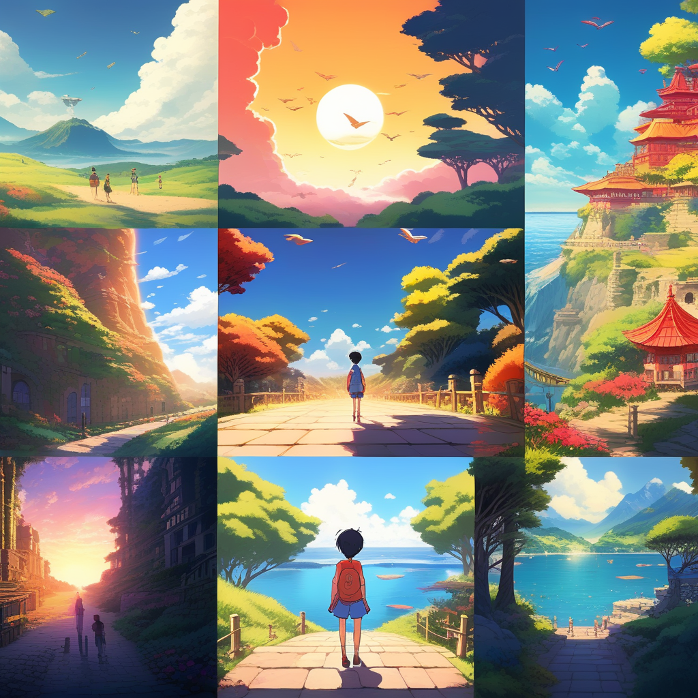

# Dashtoon Studio: Unleashing Creativity with AI

## Summary:
Dashtoon Studio is an advanced AI-powered platform designed to revolutionize the world of cartoon and animation creation. It offers a unique blend of technology and artistry, making cartoon creation accessible to both professionals and hobbyists alike.

## Key Points:
- AI-driven cartoon and animation creation tool.
- User-friendly interface suitable for all skill levels.
- Ideal for creating unique and personalized cartoons.

## Pros and Cons:

| Pros                                        | Cons                                     |
|---------------------------------------------|------------------------------------------|
| Simplifies the cartoon creation process     | Limited control over specific animation details |
| Wide range of customization options         | May require creative input for optimal results |
| No need for extensive animation skills      | Dependent on internet connectivity        |

## 🌟 Tips for the Reader:
- 🎨 Experiment with various styles and characters for unique creations.
- 📚 Use Dashtoon Studio to bring your stories to life through cartoons.
- 🌐 Stay updated with the platform's latest features to maximize its potential.

## Examples:

### Example 1: Custom Character Development
- **Prompt:** Creating a Unique Cartoon Character
- **Input:** Specific character traits and design preferences.
- **Output:** A distinct and personalized cartoon character.

### Example 2: Animated Short Story Creation
- **Prompt:** Bringing a Short Story to Life
- **Input:** A brief narrative and desired animation style.
- **Output:** A captivating animated short story.

👉 [**Try for yourself**](https://www.dashtoon.ai/)

## URL Address of the AI Topic / vendor:
- [Dashtoon Studio Official Website](https://www.dashtoon.ai/)

---

**Follow our Social Media for more information:**
- 📘 <a href="https://www.facebook.com/groups/trionxai" target="_blank">FB group: Trionx AI Group</a>
- 👍 <a href="https://www.facebook.com/ai.trionxai" target="_blank">FB page: Trionx AI Page</a>
- 📸 <a href="https://www.instagram.com/trionxai/" target="_blank">Instagram: Trionx AI Instagram</a>
- ▶️ <a href="https://www.youtube.com/@robotdocs/" target="_blank">Youtube: Trionx AI YouTube</a>

---

## SEO High Ranking Page Tags:
Dashtoon Studio, AI animation, cartoon creation, animation tool, AI-powered cartoons, digital animation, custom cartoons, creative storytelling, animation platform, Dashtoon AI, character design, animated stories, digital artistry, cartoon software, animation technology, personal animation, AI in art, storytelling tool, animation for everyone, creativity with AI

