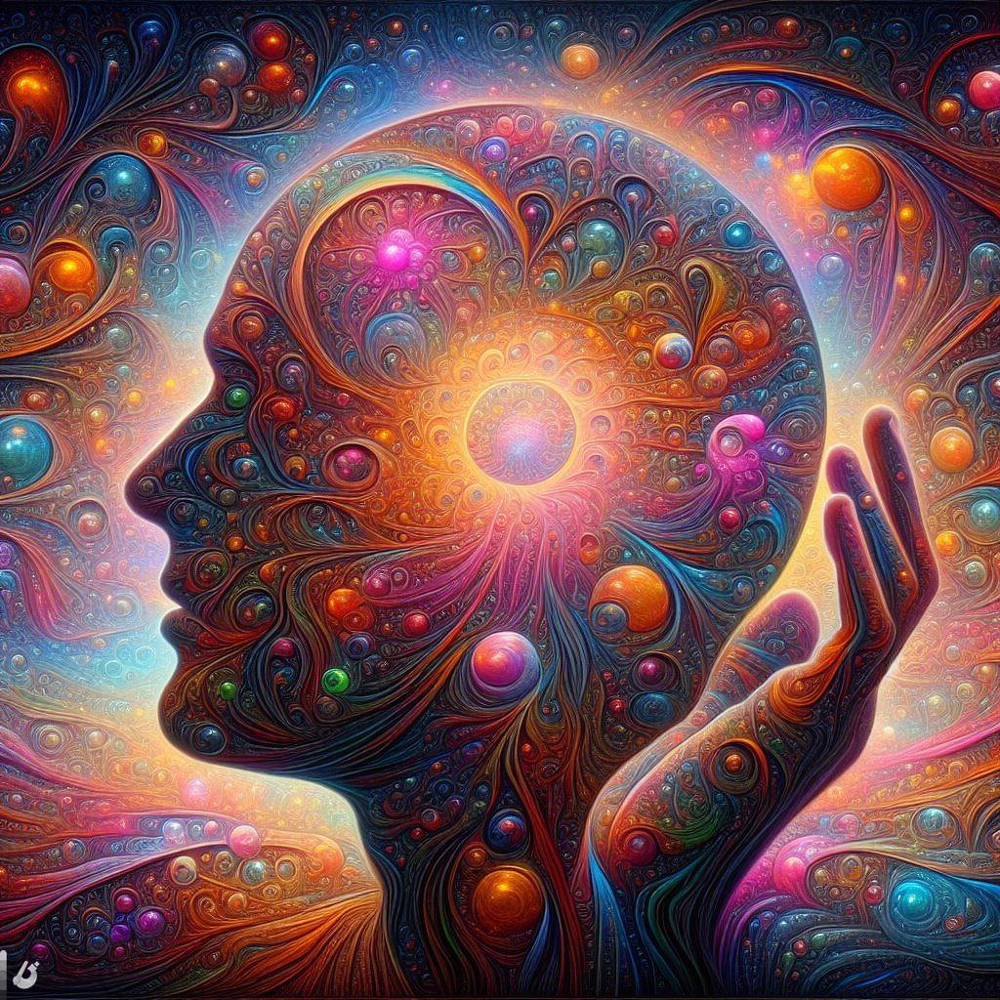

## Deep Dream Generator: Unleashing Artistic Dreams with Neural Imagery

### Summary
Deep Dream Generator takes the spotlight as an imaginative platform, unleashing artistic dreams through neural imagery. This article explores the key features of Deep Dream Generator, uncovers its pros and cons, provides actionable tips for users, and showcases real-world examples of how it transforms ordinary images into mesmerizing, dreamlike creations.



### Key Points
- Neural Imagery for Artistic Creations
- Customizable Dreamlike Features
- Intuitive Interface for Creative Expression
- Seamless Integration into Artistic Workflows

### Pros and Cons

| Pros                             | Cons                                               |
| -------------------------------- | -------------------------------------------------- |
| Neural Imagery for Artistic Creations | Some Advanced Features Limited to Premium Users  |
| Customizable Dreamlike Features   | Learning Curve for Complex Dreamlike Styles       |
| Intuitive Interface              | Internet Connection Required for Real-Time Editing |
| Artistic Workflow Integration     | Premium Subscription May Be Required for Full Access|

### Tips for the Reader 💡
Maximize your Deep Dream Generator experience with these tips:
- Experiment with various dreamlike features to enhance the artistic quality of your images.
- Utilize the intuitive interface for efficient customization and creative expression.
- Consider the premium features for access to an expanded library of advanced neural imagery.

### Examples

#### Example 1: Surreal Landscape Transformation
**Prompt:** Transforming a Landscape into a Surreal Dream with Deep Dream Generator

**Input:**
```dart
{
  "style": "surreal",
  "elements": ["nature", "fantasy elements", "vivid colors"]
}
```

**Output:**
```dart
[Deep Dream Generator-transformed surreal landscape with nature, fantasy elements, and vivid colors]
```

#### Example 2: Abstract Portrait Enhancement
**Prompt:** Enhancing an Abstract Portrait with Deep Dream Generator

**Input:**
```dart
{
  "style": "abstract",
  "elements": ["portrait", "dynamic patterns", "monochromatic tones"]
}
```

**Output:**
```dart
[Deep Dream Generator-enhanced abstract portrait with dynamic patterns and monochromatic tones]
```

👉 <a href="https://deepdreamgenerator.com/" target="_blank">Try for yourself</a>

### URL Address of the AI Topic / Vendor
<a href="https://deepdreamgenerator.com/" target="_blank">Deep Dream Generator</a>

---

Follow our Social Media for more information:

- 📘 <a href="https://www.facebook.com/groups/trionxai" target="_blank">Facebook Group</a>
- 👍 <a href="https://www.facebook.com/ai.trionxai" target="_blank">Facebook Page</a>
- 📸 <a href="https://www.instagram.com/trionxai/" target="_blank">Instagram</a>
- ▶️ <a href="https://www.youtube.com/@robotdocs/" target="_blank">YouTube</a>

### SEO High-Ranking Page Tags
Deep Dream Generator, Artistic Dreams, Neural Imagery, Dreamlike Features, Intuitive Interface, Dreamlike Styles, Premium Features, Advanced Neural Imagery