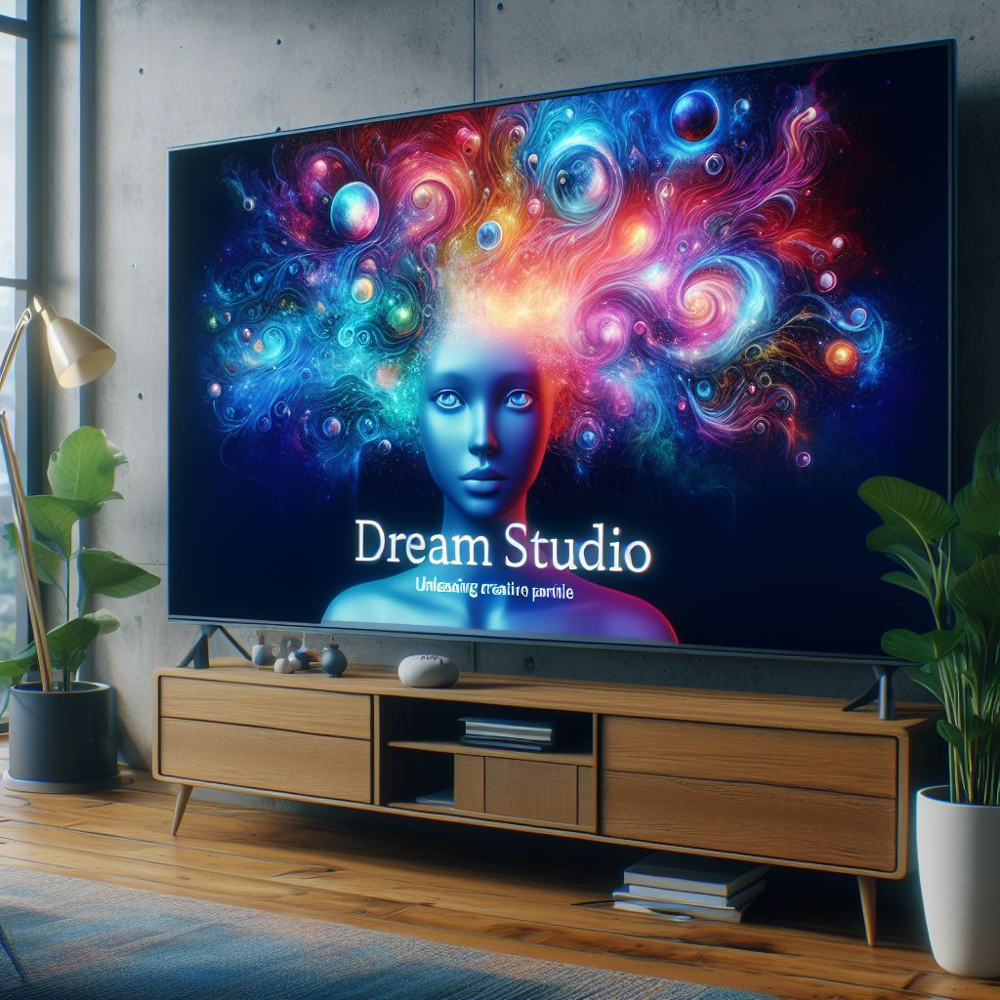

## Dream Studio: Unleashing Creative Potential with AI-Powered Artistry

### Summary
Dream Studio, accessible at beta.dreamstudio.ai, introduces an innovative platform merging creativity and AI. This article explores how Dream Studio utilizes AI algorithms to empower users in crafting diverse and imaginative artwork.



### Key Points

1. **Introduction to Dream Studio:** Unveiling beta.dreamstudio.ai's role in facilitating creative endeavors through AI-driven artistry.
2. **AI's Role in Artistic Creation:** Exploring how Dream Studio harnesses AI to aid users in producing a myriad of artistic creations.
3. **Pros and Cons** (Table Format):

| Pros                                 | Cons                                |
|--------------------------------------|-------------------------------------|
| User-friendly interface for creative expression | Learning curve for new users    |
| Diverse tools for artistic exploration| Dependency on predefined models     |
| Simplifies complex creative tasks    | Variability in output quality       |

### Tips for the Reader 💡
Exploring Creativity with Dream Studio:
- Dive into various creative tools and features available on the platform.
- Follow tutorials and engage with the community to discover new techniques and approaches.
- Embrace experimentation to leverage the AI-powered tools effectively.

### Examples

#### Example 1: AI-Enhanced Digital Painting
**Prompt:** Creating AI-Enhanced Digital Paintings with Dream Studio

**Input**
```dart
digital_painting = DreamStudio.create_digital_painting(style, elements)
```

**Output**
```dart
A digitally enhanced painting created with specified style and elements using Dream Studio's AI-assisted tools.
```

#### Example 2: AI-Driven Artistic Composition
**Prompt:** Composing Artistic Creations using Dream Studio

**Input**
```dart
artistic_composition = DreamStudio.compose_artwork(elements, techniques)
```

**Output**
```dart
An artistic composition employing specified elements and techniques using Dream Studio's AI-assisted composition tools.
```

#### Example 3: AI-Powered Image Synthesis
**Prompt:** Synthesizing Images with Dream Studio

**Input**
```dart
synthesized_image = DreamStudio.synthesize_image(input, preferences)
```

**Output**
```dart
An image synthesized based on provided input and preferences using Dream Studio's AI-driven image synthesis capabilities.
```

Try for Yourself 👉 <a href="https://beta.dreamstudio.ai" target="_blank">Explore Dream Studio</a>

## URL Address
- <a href="https://beta.dreamstudio.ai" target="_blank">Dream Studio - AI-Powered Artistry</a>

### Follow our Social Media for more information:
- 📘 <a href="https://www.facebook.com/groups/trionxai" target="_blank">Facebook Group</a>
- 👍 <a href="https://www.facebook.com/ai.trionxai" target="_blank">Facebook Page</a>
- 📸 <a href="https://www.instagram.com/trionxai/" target="_blank">Instagram</a>
- ▶️ <a href="https://www.youtube.com/@robotdocs/" target="_blank">Youtube</a>

<hr>

### SEO High Ranking Page Tags
AI, Dream Studio, AI-Powered Artistry, Creative Exploration, Artificial Intelligence, Advanced Artistic Tools, AI Applications, Creative Empowerment, AI Advancements