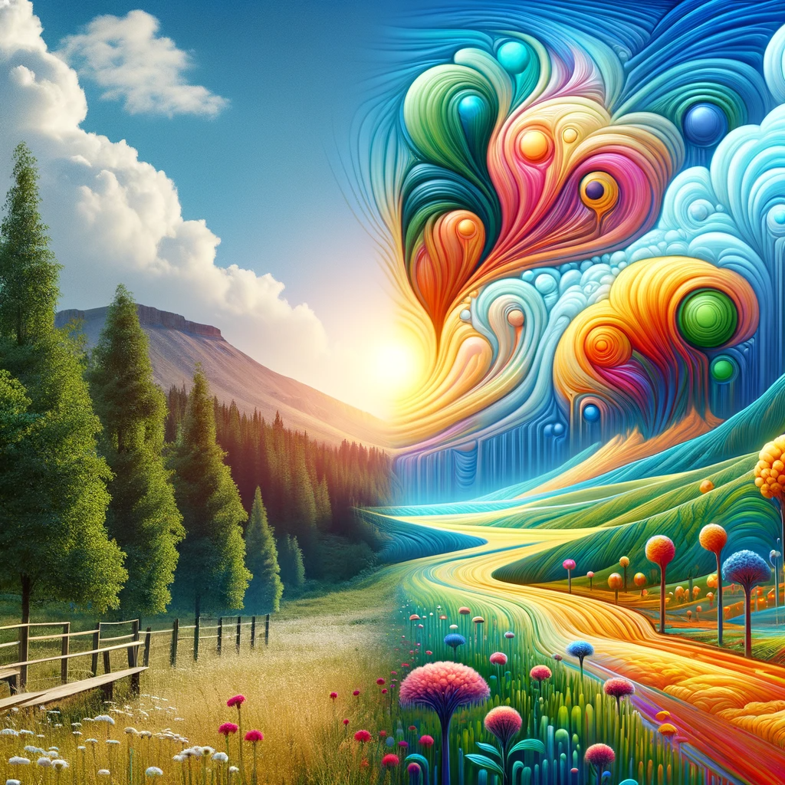
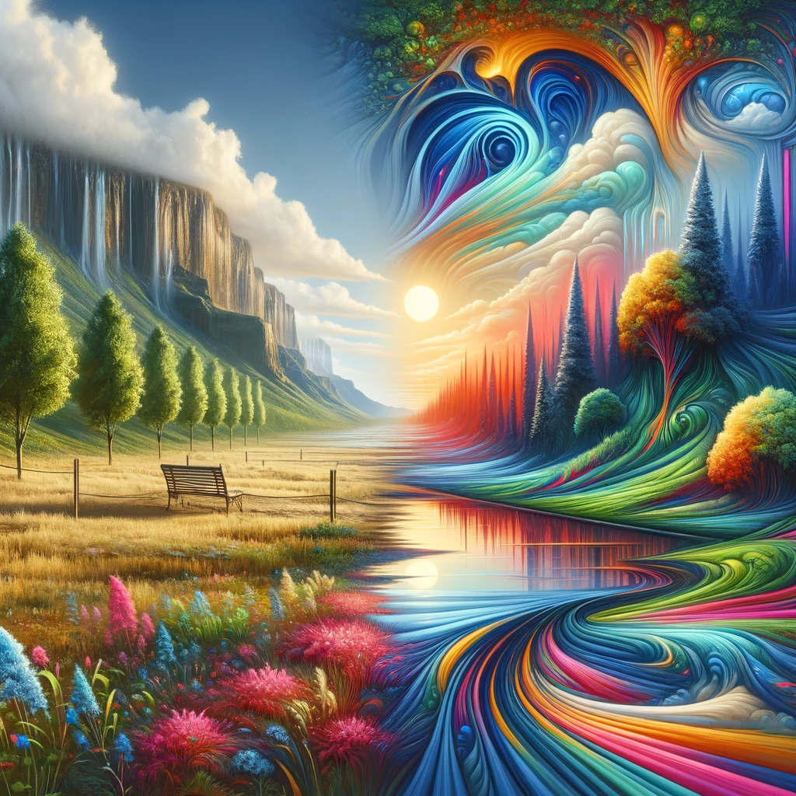

# dreamlike.art: Crafting Ethereal Visual Experiences with AI

## Summary:
dreamlike.art is an AI-powered platform that specializes in creating ethereal and surreal visual art. Leveraging advanced AI algorithms, it transforms ordinary images into dreamlike artistic creations. Perfect for artists, designers, and anyone looking to explore the fusion of technology and art, dreamlike.art offers a unique platform to unleash creativity.

## Key Points:
- Advanced AI algorithms for art creation.
- User-friendly interface for artists and designers.
- Unique blend of technology and artistic expression.

## Pros and Cons:

| Pros                                    | Cons                                        |
|-----------------------------------------|---------------------------------------------|
| Innovative artistic transformation      | May require a learning curve for new users  |
| High-quality, surreal art outputs       | Results can be unpredictable                |
| Accessible to both artists and amateurs | Limited control over specific art styles    |

## 🌟 Tips for the Reader:
- 🎨 Experiment with different images and styles to explore the AI's capabilities.
- 🖼️ Use high-resolution images for more detailed art outputs.
- 💡 Keep an open mind and embrace the unpredictability of AI art.

🔵 **Enhance your artistic journey with dreamlike.art!**

## Examples:

### Example 1: Transforming Landscapes
- **Prompt:** Ethereal Landscapes
- **Input:** Ordinary landscape photo.
- **Output:** Surreal, dreamlike interpretation of the landscape.

### Example 2: Portraits Reimagined
- **Prompt:** Surreal Portraits
- **Input:** Standard portrait photograph.
- **Output:** Dreamlike, AI-transformed artistic portrait.

👉 **[Try for yourself](https://dreamlike.art/)**

**Explore your creativity with dreamlike.art!**

## URL Address of dreamlike.art:
- [dreamlike.art Official Website](https://dreamlike.art/)

---

## Stay Updated and Inspired:

- 📘 FB group: [Join Our Facebook Group](https://www.facebook.com/groups/trionxai)
- 📖 FB page: [Like Our Facebook Page](https://www.facebook.com/ai.trionxai)
- 📸 Instagram: [Follow Us on Instagram](https://www.instagram.com/trionxai/)
- 📹 Youtube: [Subscribe to Our YouTube Channel](https://www.youtube.com/@robotdocs/)

## SEO High Ranking Page Tags:
dreamlike.art, AI art, surreal visuals, ethereal art, artistic AI, digital art, AI creativity, visual transformation, AI algorithms, art and technology, dreamlike imagery, surreal art, AI-powered art, digital creativity, artistic expression, art innovation, AI and design, surreal landscapes, dreamlike portraits, tech art

---

*Image Prompt for Dall-E 3: "A conceptual illustration of the dreamlike.art platform, depicting the transformation of a standard landscape photo into a surreal, AI-generated artwork, in a vibrant and imaginative digital art style."*

