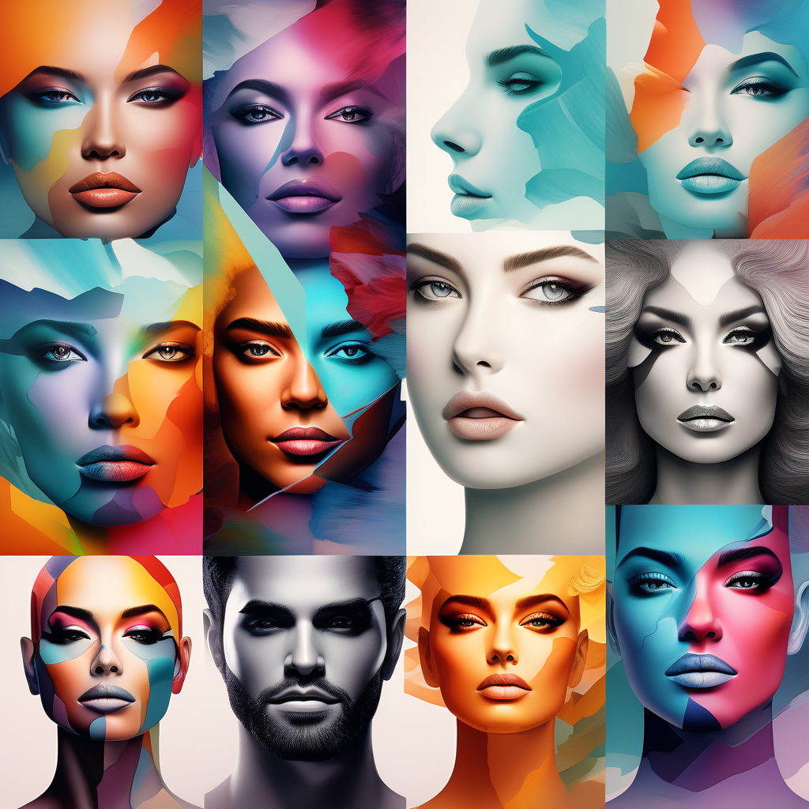
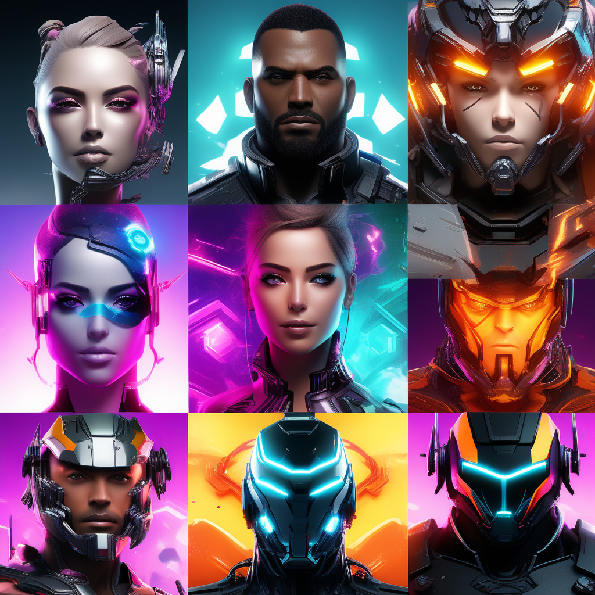
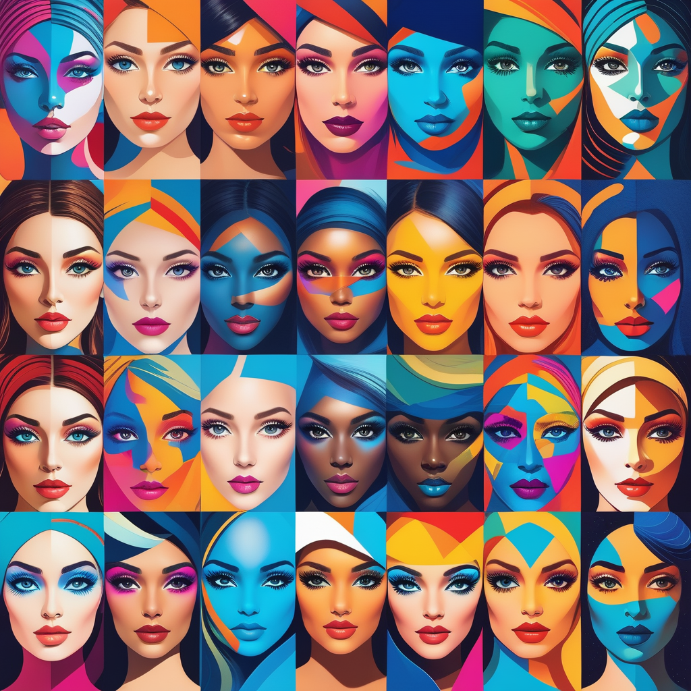
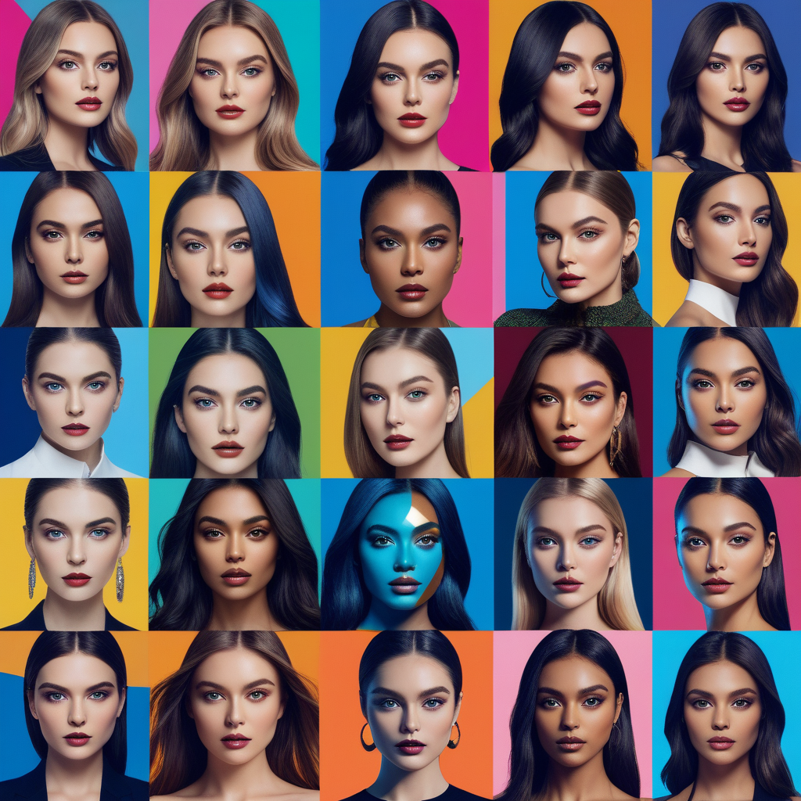

# Face Mix: Revolutionizing Digital Art with AI

## Summary:
Face Mix, powered by Playform, is an innovative AI tool designed to blend and create unique digital faces. It's a groundbreaking platform for artists, designers, and enthusiasts in the digital art world, offering an exciting way to explore and create new visual identities.

## Key Points:
- AI-driven face blending technology.
- Ideal for artists and digital creators.
- Offers unique and creative facial compositions.

## Pros and Cons:

| Pros                                  | Cons                                     |
|---------------------------------------|------------------------------------------|
| Innovative AI-driven artistic tool    | May generate unpredictable results       |
| Easy-to-use interface                 | Requires artistic insight for best use   |
| Infinite possibilities for creativity | Internet dependency for access and use   |

## 🌟 Tips for the Reader:
- 🎨 Experiment with different face combinations for unique results.
- 🖌 Use Face Mix as a tool for inspiration in digital art projects.
- 🤖 Stay updated with the platform's latest features and updates.

## Examples:

### Example 1: Surreal Portrait Creation
- **Prompt:** Generating a Surreal Face
- **Input:** Multiple facial features from diverse sources.
- **Output:** A surreal and artistic facial composition blending the inputs.

### Example 2: Character Design for Gaming
- **Prompt:** Unique Character Faces for Games
- **Input:** Desired traits for a game character's face.
- **Output:** An AI-generated face that fits the character's profile for gaming.

👉 [**Try for yourself**](https://www.playform.io/facemix)

## URL Address of the AI Topic / vendor:
- [Face Mix by Playform](https://www.playform.io/facemix)

---

**Follow our Social Media for more information:**
- 📘 <a href="https://www.facebook.com/groups/trionxai" target="_blank">FB group: Trionx AI Group</a>
- 👍 <a href="https://www.facebook.com/ai.trionxai" target="_blank">FB page: Trionx AI Page</a>
- 📸 <a href="https://www.instagram.com/trionxai/" target="_blank">Instagram: Trionx AI Instagram</a>
- ▶️ <a href="https://www.youtube.com/@robotdocs/" target="_blank">Youtube: Trionx AI YouTube</a>

---

## SEO High Ranking Page Tags:
Face Mix, AI art, digital faces, Playform, creative technology, facial composition, digital artists, AI creativity, portrait generation, character design, artistic innovation, digital creativity, AI blending, face generation, art and technology, digital portraits, AI in art, facial art, digital design, artistic exploration

