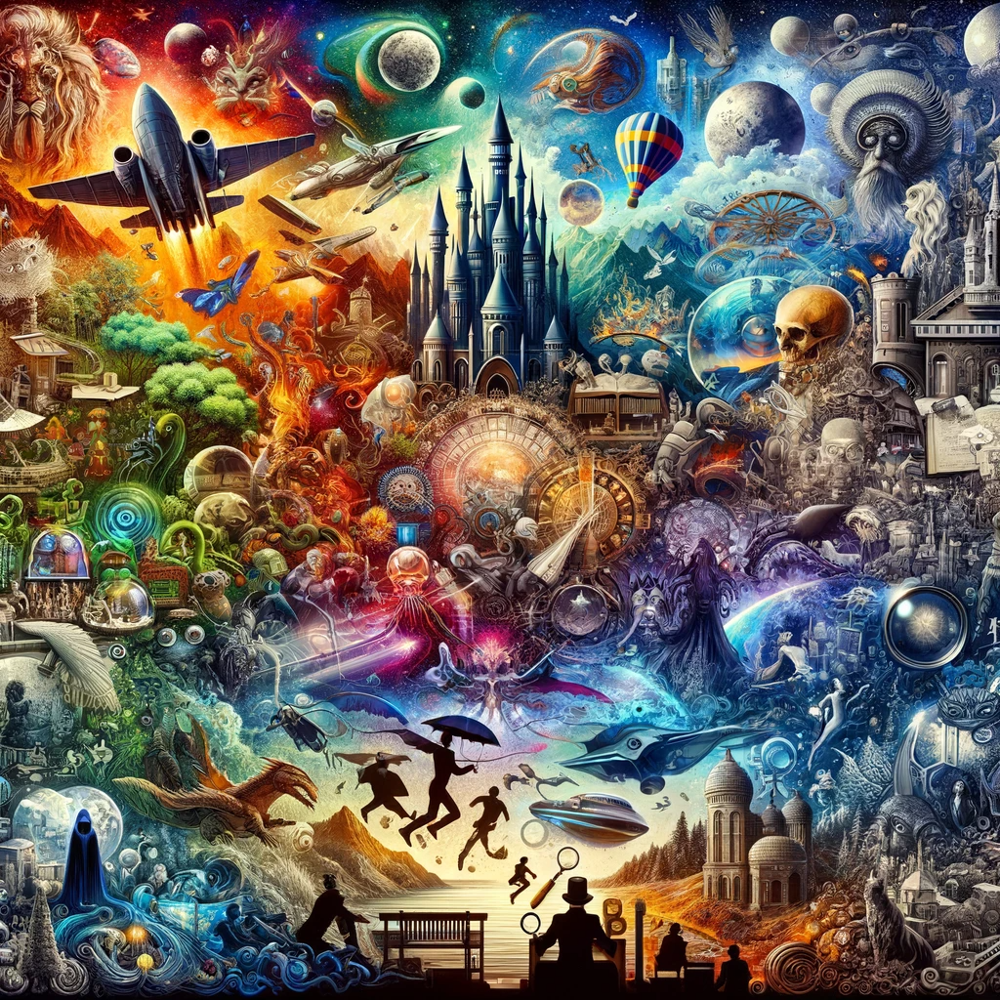
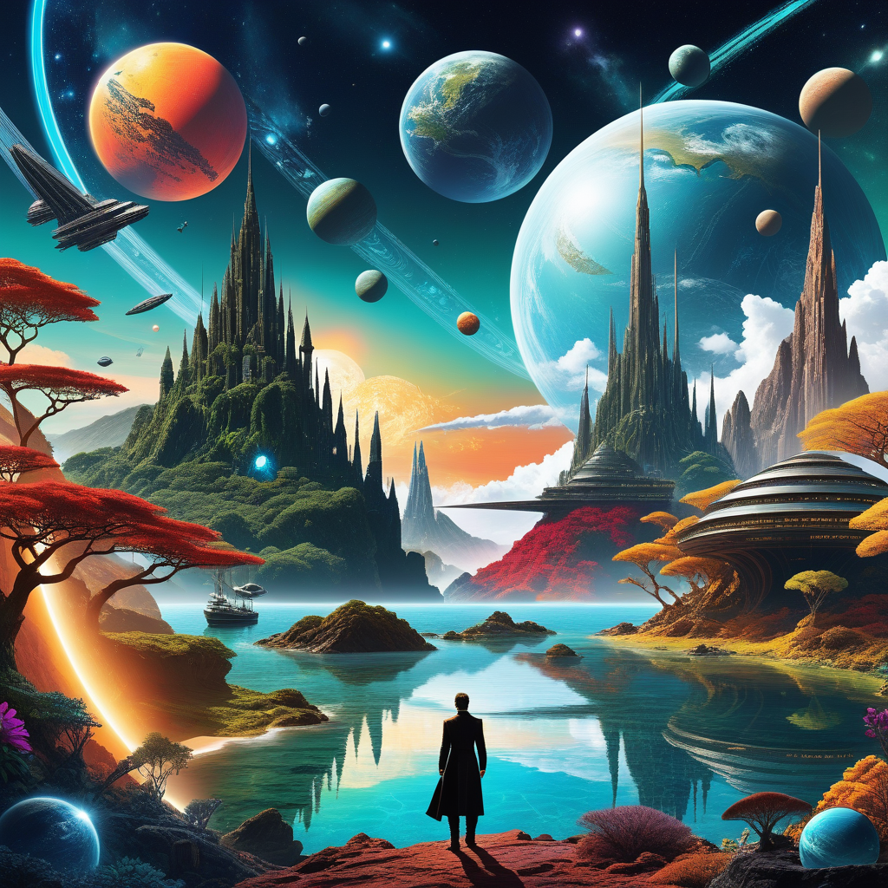

# Exploring the World of Fiction: A Journey Through Imaginative Realms

## Summary:
Fiction, a genre of literature and media that involves the creation of narratives based on imagination rather than strictly factual events, plays a crucial role in the realm of storytelling. It encompasses a wide range of genres, including fantasy, science fiction, mystery, and more, offering readers and viewers an escape into worlds of endless possibility.

## Key Points:
- Fiction allows for creative storytelling beyond the constraints of reality.
- Encompasses a variety of genres and themes.
- Offers both entertainment and a means to explore complex ideas and emotions.

## Pros and Cons:

| Pros                                  | Cons                                    |
|---------------------------------------|-----------------------------------------|
| Encourages imagination and creativity | Not always rooted in reality            |
| Can be used as a tool for social and personal exploration | May sometimes propagate unrealistic expectations |
| Provides an escape from everyday life | Quality and impact can vary widely      |

## 🌟 Tips for the Reader:
- 📚 Explore different genres to find your personal preference.
- 💭 Reflect on the themes and messages within fictional works.
- 🤔 Don't hesitate to delve into lesser-known authors or works for unique experiences.

## Examples:

### Example 1: Immersive Fantasy World
- **Prompt:** Creating a Fantasy Universe
- **Input:** A basic outline of a fantasy world.
- **Output:** A richly detailed narrative set in a vivid and imaginative fantasy universe.

### Example 2: Science Fiction Adventure
- **Prompt:** Futuristic Exploration
- **Input:** Setting in a technologically advanced future.
- **Output:** A story that explores futuristic themes and innovations.

👉 [**Try for yourself**](https://ai-fiction.com/)

## URL Address of the AI Topic / vendor:
- [AI Fiction Official Website](https://ai-fiction.com/)

---

**Follow our Social Media for more information:**
- 📘 <a href="https://www.facebook.com/groups/trionxai" target="_blank">FB group: Trionx AI Group</a>
- 👍 <a href="https://www.facebook.com/ai.trionxai" target="_blank">FB page: Trionx AI Page</a>
- 📸 <a href="https://www.instagram.com/trionxai/" target="_blank">Instagram: Trionx AI Instagram</a>
- ▶️ <a href="https://www.youtube.com/@robotdocs/" target="_blank">Youtube: Trionx AI YouTube</a>

---

## SEO High Ranking Page Tags:
Fiction, imaginative storytelling, literary genres, fantasy worlds, science fiction, narrative exploration, creative literature, fictional universes, character development, storytelling art, emotional engagement, cultural narratives, imaginative escape, speculative fiction, narrative creativity, literary escapism, emotional storytelling, thematic exploration, literary diversity, fictional narratives

