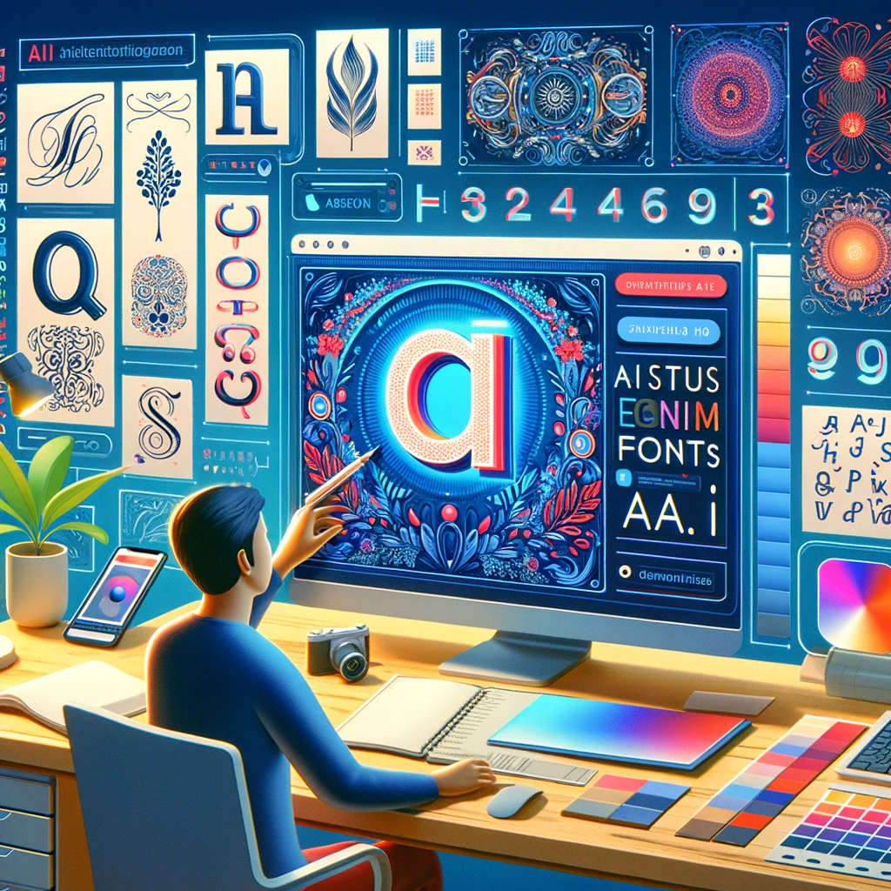

# Fontis.ai: Revolutionizing Typography with AI

## Summary:
Fontis.ai is a cutting-edge platform that utilizes artificial intelligence to create and customize fonts. Tailored for designers, marketers, and businesses, it offers a unique way to enhance branding and design projects with personalized typography.

## Key Points:
- AI-driven font creation and customization.
- Ideal for unique branding and design projects.
- User-friendly interface with flexible customization options.

## Pros and Cons:

| Pros                                       | Cons                                    |
|--------------------------------------------|-----------------------------------------|
| Innovative AI technology for font creation | May require design knowledge to fully utilize |
| Wide range of customization options        | Subscription-based for full features    |
| Saves time in font design and selection    | Limited to digital format outputs       |

## 🌟 Tips for the Reader:
- 🎨 Experiment with different styles and customizations.
- 🖋 Use Fontis.ai to match fonts with your brand identity.
- 💡 Keep exploring new updates and features for fresh ideas.

## Examples:

### Example 1: Brand Identity Font
- **Prompt:** Custom Font for Branding
- **Input:** Brand values and visual identity.
- **Output:** A custom font that aligns with and enhances the brand's identity.

### Example 2: Event Typography
- **Prompt:** Event-Specific Typography
- **Input:** Theme and details of the event.
- **Output:** A unique font designed to complement the event's theme.

👉 [**Try for yourself**](https://fontis.ai/)

## URL Address of the AI Topic / vendor:
- [Fontis.ai Official Website](https://fontis.ai/)

---

**Follow our Social Media for more information:**
- 📘 <a href="https://www.facebook.com/groups/trionxai" target="_blank">FB group: Trionx AI Group</a>
- 👍 <a href="https://www.facebook.com/ai.trionxai" target="_blank">FB page: Trionx AI Page</a>
- 📸 <a href="https://www.instagram.com/trionxai/" target="_blank">Instagram: Trionx AI Instagram</a>
- ▶️ <a href="https://www.youtube.com/@robotdocs/" target="_blank">Youtube: Trionx AI YouTube</a>

---

## SEO High Ranking Page Tags:
Fontis.ai, AI typography, custom fonts, branding fonts, design innovation, AI font generator, typography design, personalized fonts, digital typography, brand identity, font customization, AI technology in design, creative fonts, typography solutions, visual branding, digital font design, unique fonts, graphic design, font creation, typography enhancement

