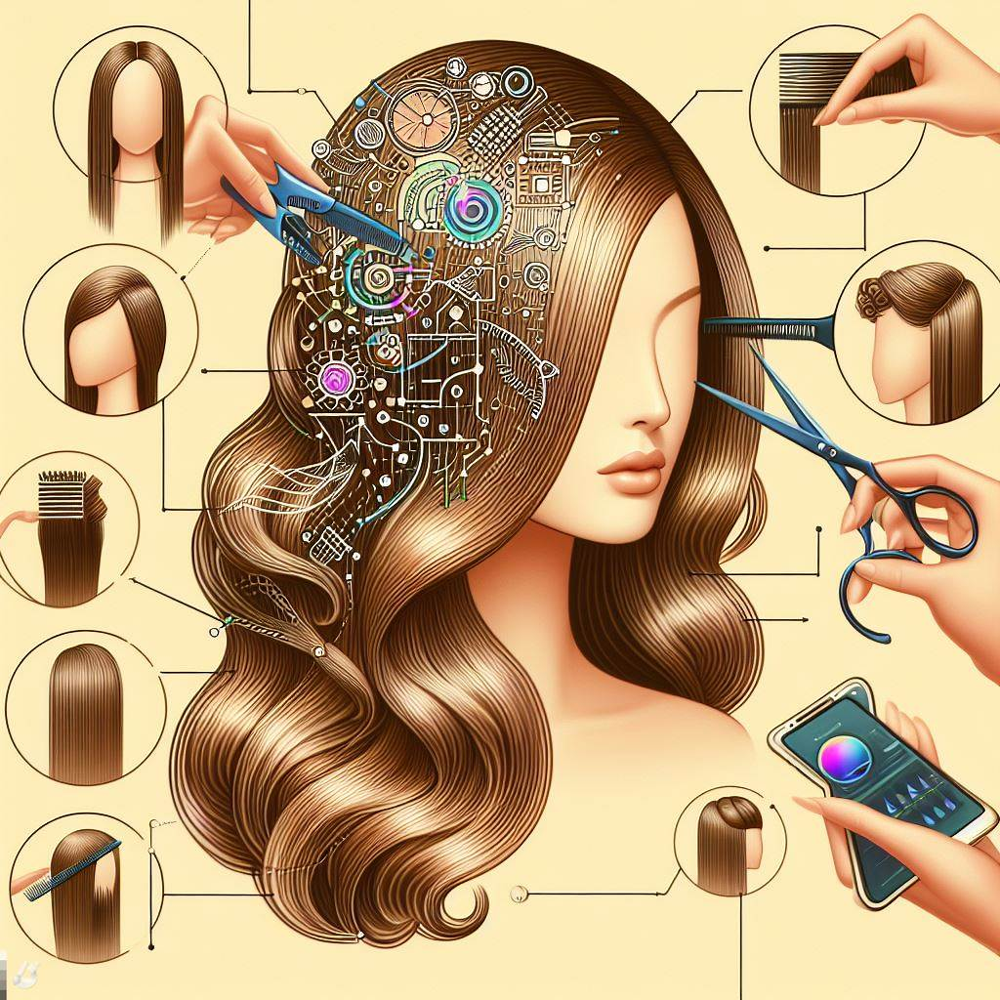

## Hairstyle AI: Transforming Tresses with Smart Style Suggestions

### Summary
Hairstyle AI, an innovative platform at the intersection of technology and beauty, is reshaping the hairstyling experience. This article delves into the key features of Hairstyle AI, explores its pros and cons, offers practical tips for users, and presents real-world examples of how it's revolutionizing hair fashion.



### Key Points
- AI-Driven Hairstyle Recommendations
- Virtual Try-On for Various Haircuts
- Personalized Styling Suggestions
- Accessible Anytime, Anywhere

### Pros and Cons

| Pros                                | Cons                                            |
| ----------------------------------- | ----------------------------------------------- |
| Instant Hairstyle Recommendations   | Limited Hair Color Simulation                   |
| Virtual Try-On for Realistic Preview | Internet Connection Required for Virtual Try-On |
| Diversity in Styling Options         | Advanced Features Limited to Premium Users      |
| User-Friendly Interface              | Device Compatibility May Vary                  |

### Tips for the Reader 💡
Elevate your Hairstyle AI experience with these tips:
- Experiment with various hairstyles using the virtual try-on feature.
- Save your favorite looks for easy reference during your next salon visit.
- Consider the premium features for access to advanced styling suggestions.

### Examples

#### Example 1: Casual Everyday Look
**Prompt:** Finding a Casual Everyday Hairstyle with Hairstyle AI

**Input:**
```dart
{
  "occasion": "casual",
  "hair_length": "medium",
  "style": "effortless"
}
```

**Output:**
```dart
[Generated virtual try-on image of a casual everyday hairstyle]
```

#### Example 2: Elegant Evening Updo
**Prompt:** Discovering an Elegant Updo for Evening Events

**Input:**
```dart
{
  "occasion": "evening",
  "hair_length": "long",
  "style": "updo"
}
```

**Output:**
```dart
[Generated virtual try-on image of an elegant evening updo]
```

👉 <a href="https://www.hairstyleai.com/" target="_blank">Try for yourself</a>

### URL Address of the AI Topic / Vendor
<a href="https://www.hairstyleai.com/" target="_blank">Hairstyle AI</a>

---

Follow our Social Media for more information:

- 📘 <a href="https://www.facebook.com/groups/trionxai" target="_blank">Facebook Group</a>
- 👍 <a href="https://www.facebook.com/ai.trionxai" target="_blank">Facebook Page</a>
- 📸 <a href="https://www.instagram.com/trionxai/" target="_blank">Instagram</a>
- ▶️ <a href="https://www.youtube.com/@robotdocs/" target="_blank">YouTube</a>

### SEO High-Ranking Page Tags
Hairstyle AI, Smart Style Suggestions, Virtual Try-On, Hair Fashion, Hairstyle Recommendations, Beauty Tech, Personalized Styling, Premium Features