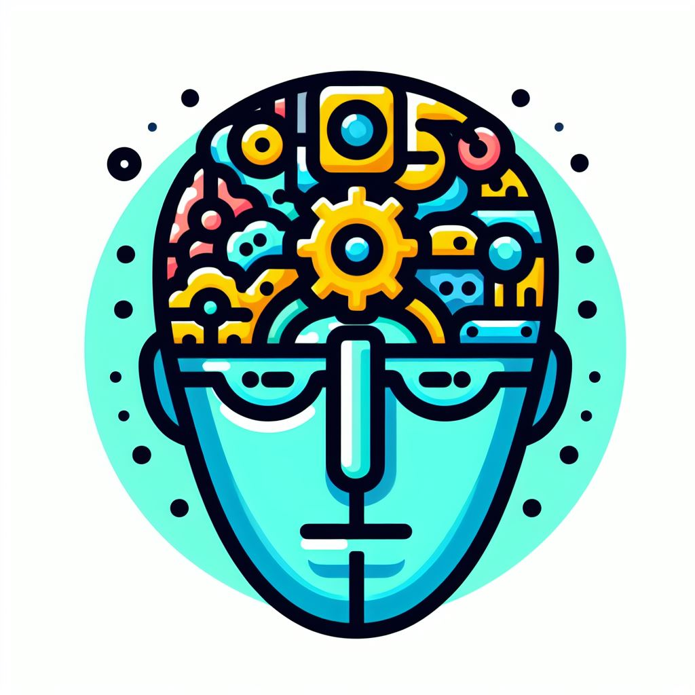

## IconifyAI: Revolutionizing Design with AI-Generated Icons

### Summary
IconifyAI, accessible at [www.iconifyai.com](https://www.iconifyai.com), introduces a revolutionary platform utilizing AI to create diverse and innovative icons. This article delves into how IconifyAI employs AI algorithms to generate a myriad of design elements effortlessly.



### Key Points

1. **Introduction to IconifyAI:** Unveiling [www.iconifyai.com](https://www.iconifyai.com)'s role in transforming design through AI-generated icons.
2. **AI's Role in Icon Creation:** Exploring how IconifyAI leverages AI to produce a wide array of customizable and diverse iconography.
3. **Pros and Cons** (Table Format):

| Pros                                 | Cons                                |
|--------------------------------------|-------------------------------------|
| Diverse and customizable icon designs| Limitations in detailed customizations|
| Simplifies icon creation processes    | Dependency on predefined icon styles |
| Enhances design workflow              | Variability in output quality       |

### Tips for the Reader 💡
Crafting Designs with IconifyAI:
- Experiment with various icon styles and customization options available on the platform.
- Acknowledge the platform's strengths while understanding its limitations in intricate icon detailing.
- Utilize community resources and tutorials to enhance design outputs.

### Examples

#### Example 1: AI-Generated Icon Creation
**Prompt:** Creating AI-Generated Icons with IconifyAI

**Input**
```dart
icon = IconifyAI.generate_icon(style, elements)
```

**Output**
```dart
A uniquely generated icon based on the specified style and elements utilizing IconifyAI's AI-powered platform.
```

#### Example 2: Customized Icon Styling
**Prompt:** Customizing Icons with IconifyAI

**Input**
```dart
custom_icon = IconifyAI.customize_icon(icon, preferences)
```

**Output**
```dart
A customized icon tailored according to specified preferences using IconifyAI's customization tools.
```

#### Example 3: AI-Driven Icon Theme Creation
**Prompt:** Generating Icon Themes with IconifyAI

**Input**
```dart
icon_theme = IconifyAI.generate_theme(theme)
```

**Output**
```dart
A themed set of icons generated based on specified theme preferences using IconifyAI's AI-driven tools.
```

Try for Yourself 👉 [Explore IconifyAI](https://www.iconifyai.com)

## URL Address
- [IconifyAI - AI-Generated Icon Revolution](https://www.iconifyai.com)

### Follow our Social Media for more information:
- 📘 <a href="https://www.facebook.com/groups/trionxai" target="_blank">Facebook Group</a>
- 👍 <a href="https://www.facebook.com/ai.trionxai" target="_blank">Facebook Page</a>
- 📸 <a href="https://www.instagram.com/trionxai/" target="_blank">Instagram</a>
- ▶️ <a href="https://www.youtube.com/@robotdocs/" target="_blank">Youtube</a>

<hr>

### SEO High Ranking Page Tags
AI, IconifyAI, Icon Generation, AI-Driven Design, Innovative Iconography, Artificial Intelligence, Customizable Icons, AI Applications, Design Enhancements, AI Advancements