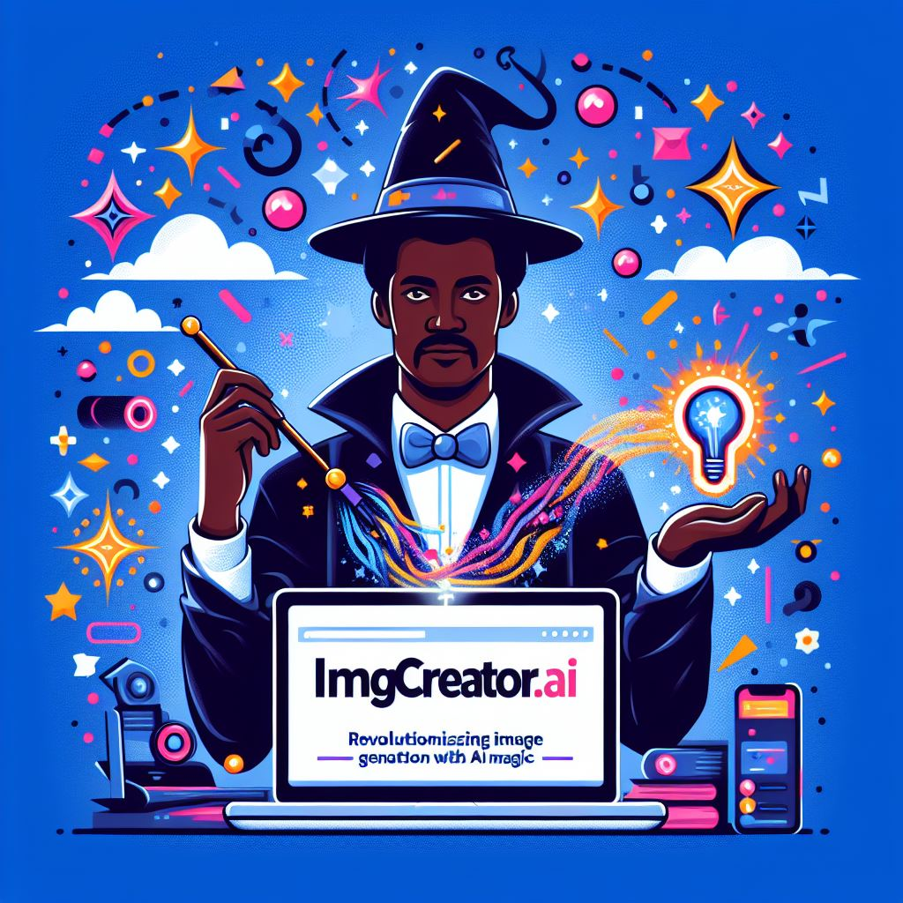

## IMGCreator.ai: Revolutionizing Image Generation with AI Magic

### Summary
IMGCreator.ai, a revolutionary AI-powered image generation tool, is making waves in the creative space. This article delves into the key features of IMGCreator.ai, explores its pros and cons, provides actionable tips for users, and showcases real-world examples of the magic it brings to image creation.



### Key Points
- AI-Powered Image Generation
- Streamlined Creative Workflow
- Versatile Applications in Design and Marketing
- User-Friendly Interface

### Pros and Cons

| Pros                              | Cons                                       |
| --------------------------------- | ------------------------------------------ |
| Rapid Image Generation            | Limited Advanced Editing Capabilities      |
| Intuitive User Interface          | Internet Connectivity Dependency         |
| Diverse Style and Theme Options   | Complex Projects Might Require Pro Plan   |
| Time-Efficient Creative Process   | Free Version Contains Watermarked Images |

### Tips for the Reader 💡
Maximize your IMGCreator.ai experience with these tips:
- Explore various styles and themes to discover the perfect fit for your project.
- Save your projects frequently to avoid potential data loss.
- Consider the Pro Plan for advanced editing features and watermark-free images.

### Examples

#### Example 1: Social Media Graphics
**Prompt:** Creating Engaging Social Media Graphics with IMGCreator.ai

**Input:**
```dart
{
  "theme": "modern",
  "elements": ["text", "icons", "background"]
}
```

**Output:**
```dart
[Generated social media graphic]
```

#### Example 2: Marketing Campaign Imagery
**Prompt:** Designing Eye-Catching Images for Marketing Campaigns

**Input:**
```dart
{
  "theme": "vibrant",
  "elements": ["products", "branding", "call-to-action"]
}
```

**Output:**
```dart
[Generated marketing campaign image]
```

👉 <a href="https://imgcreator.zmo.ai/" target="_blank">Try for yourself</a>

### URL Address of the AI Topic / Vendor
<a href="https://imgcreator.zmo.ai/" target="_blank">IMGCreator.ai</a>

---

Follow our Social Media for more information:

- 📘 <a href="https://www.facebook.com/groups/trionxai" target="_blank">Facebook Group</a>
- 👍 <a href="https://www.facebook.com/ai.trionxai" target="_blank">Facebook Page</a>
- 📸 <a href="https://www.instagram.com/trionxai/" target="_blank">Instagram</a>
- ▶️ <a href="https://www.youtube.com/@robotdocs/" target="_blank">YouTube</a>

### SEO High-Ranking Page Tags
IMGCreator.ai, Image Generation, AI Magic, Creative Workflow, Design and Marketing, User-Friendly Interface, Pro Plan, Creative Process, Watermarked Images