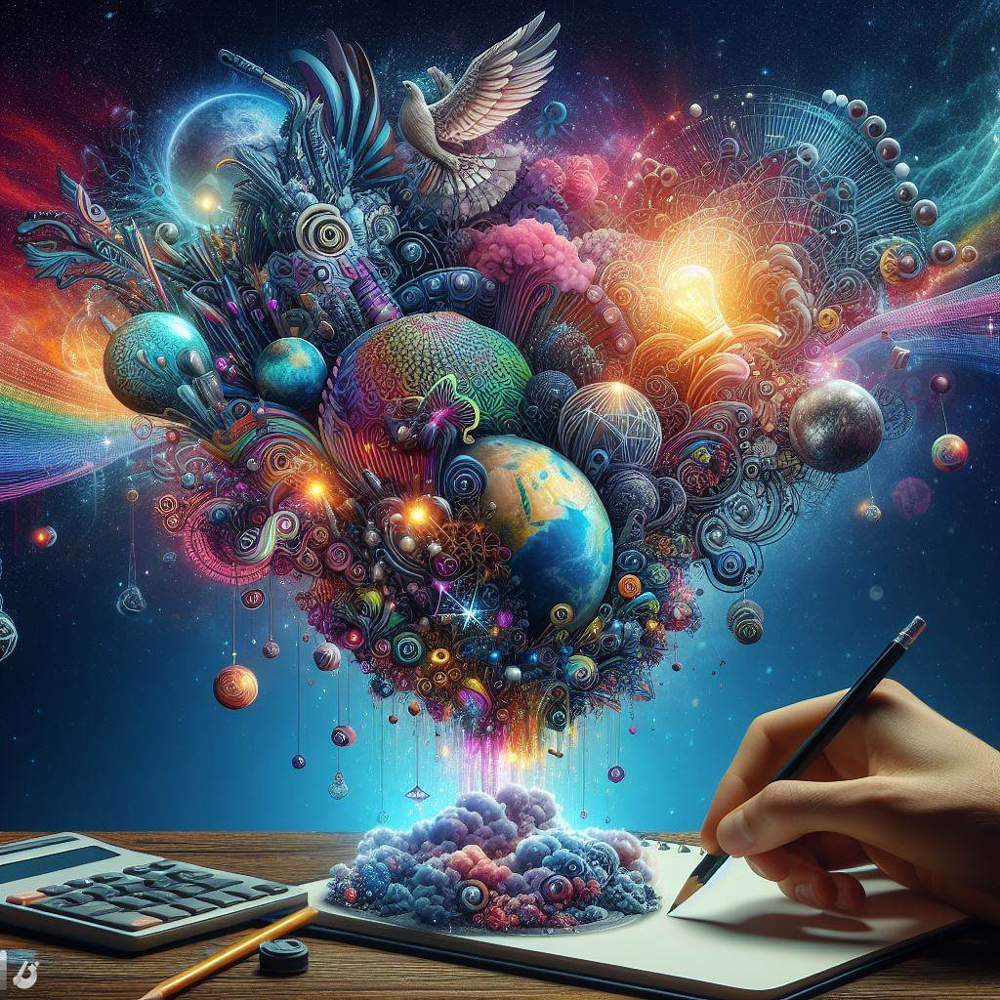

## instaVerse: Navigating the Multiverse of Intelligent Creativity

### Summary
instaVerse stands at the forefront, offering a captivating journey through the multiverse of intelligent creativity. This article explores the key features of instaVerse, delves into its pros and cons, provides actionable tips for users, and showcases real-world examples of how it transforms artistic visions into digital realities.



### Key Points
- Multiverse of Intelligent Creativity
- Customizable Artistic Elements
- Intuitive Digital Creation Tools
- Seamless Integration into Creative Workflows

### Pros and Cons

| Pros                             | Cons                                               |
| -------------------------------- | -------------------------------------------------- |
| Diverse Intelligent Creativity    | Some Advanced Features Limited to Premium Users   |
| Customizable Artistic Elements    | Learning Curve for Complex Creative Styles       |
| Intuitive Digital Creation Tools  | Internet Connection Required for Real-Time Editing |
| Creative Workflow Integration     | Premium Subscription May Be Required for Full Access|

### Tips for the Reader 💡
Maximize your instaVerse experience with these tips:
- Explore various creative styles and customize them to match your artistic vision.
- Utilize the intuitive digital creation tools for efficient tweaks and adjustments.
- Consider the premium features for access to an expanded library of advanced creative elements.

### Examples

#### Example 1: Dynamic Digital Artwork
**Prompt:** Creating Dynamic Digital Artwork with instaVerse

**Input:**
```dart
{
  "style": "dynamic",
  "elements": ["bold colors", "abstract shapes", "motion elements"]
}
```

**Output:**
```dart
[instaVerse-generated dynamic digital artwork with bold colors, abstract shapes, and motion elements]
```

#### Example 2: Surreal Mixed-Media Composition
**Prompt:** Designing a Surreal Mixed-Media Composition with instaVerse

**Input:**
```dart
{
  "style": "surreal",
  "elements": ["blend of photos", "dreamlike atmosphere", "fantastical elements"]
}
```

**Output:**
```dart
[instaVerse-generated surreal mixed-media composition with a blend of photos, dreamlike atmosphere, and fantastical elements]
```

👉 <a href="https://ilumineai.github.io/instaverse/" target="_blank">Try for yourself</a>

### URL Address of the AI Topic / Vendor
<a href="https://ilumineai.github.io/instaverse/" target="_blank">instaVerse</a>

---

Follow our Social Media for more information:

- 📘 <a href="https://www.facebook.com/groups/trionxai" target="_blank">Facebook Group</a>
- 👍 <a href="https://www.facebook.com/ai.trionxai" target="_blank">Facebook Page</a>
- 📸 <a href="https://www.instagram.com/trionxai/" target="_blank">Instagram</a>
- ▶️ <a href="https://www.youtube.com/@robotdocs/" target="_blank">YouTube</a>

### SEO High-Ranking Page Tags
instaVerse, Multiverse of Creativity, Intelligent Creativity, Customizable Elements, Digital Creation, Creative Styles, Premium Features, Advanced Creative Elements