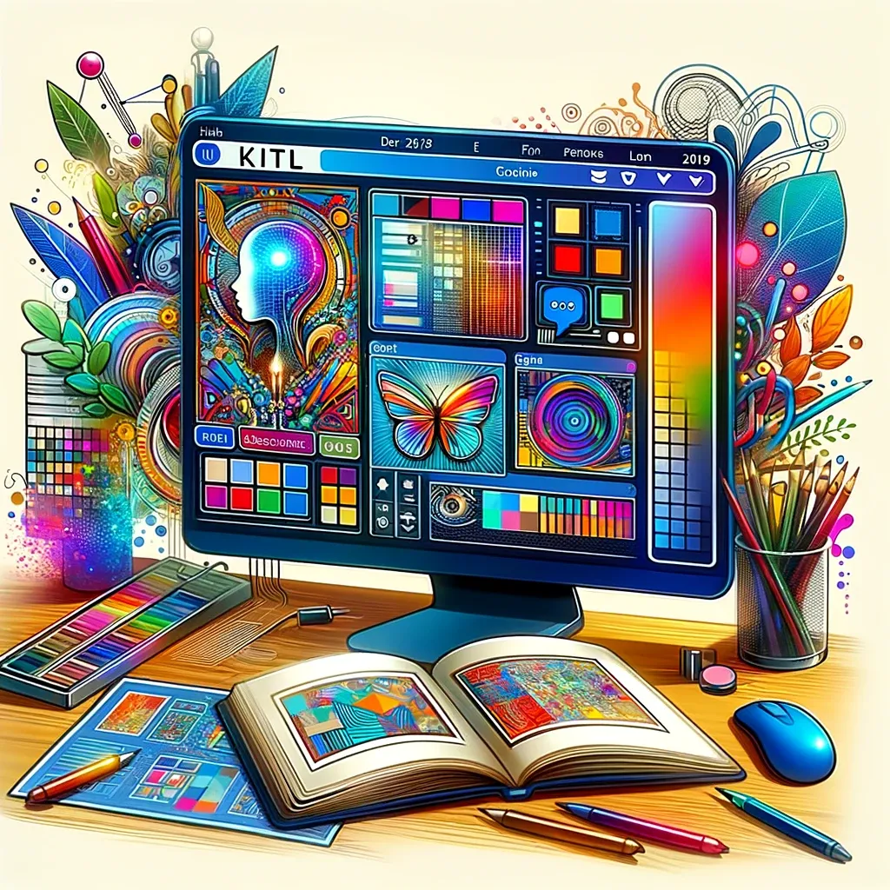

# Kittl: Redefining Design with AI Integration

## Summary:
Kittl is an AI-driven design platform that revolutionizes the way professionals and hobbyists create visual content. It combines intuitive tools with AI capabilities to streamline the design process, making it more accessible and efficient. From graphic design to branding, Kittl offers a versatile solution for a wide range of creative needs.

## Key Points:
- AI-powered design tools for efficiency.
- User-friendly interface for beginners and professionals.
- Wide range of templates and customization options.

## Pros and Cons:

| Pros                                 | Cons                                 |
|--------------------------------------|--------------------------------------|
| Simplifies complex design tasks      | Limited control over AI-generated elements |
| Accessible to users with varying skill levels | Subscription required for premium features |
| High-quality templates and assets    | Depends on user creativity for unique designs |

## 🌟 Tips for the Reader:
- 🎨 Experiment with different templates to find your style.
- 🖌️ Use custom elements to add a personal touch.
- 💡 Keep updated with new features for continuous learning.

## Examples:

### Example 1: Brand Logo Creation
- **Prompt:** Innovative Company Logo
- **Input:** Company name and industry.
- **Output:** A unique and modern logo design.

### Example 2: Social Media Graphics
- **Prompt:** Engaging Social Media Content
- **Input:** Theme and message for a social media campaign.
- **Output:** Visually appealing graphics tailored to the campaign.

👉 [**Try for yourself**](https://www.kittl.com/feature/kittl-ai)

## URL Address of the AI Topic / vendor:
- [Kittl AI Official Website](https://www.kittl.com/feature/kittl-ai)

---

**Follow our Social Media for more information:**
- 📘 <a href="https://www.facebook.com/groups/trionxai" target="_blank">FB group: Trionx AI Group</a>
- 👍 <a href="https://www.facebook.com/ai.trionxai" target="_blank">FB page: Trionx AI Page</a>
- 📸 <a href="https://www.instagram.com/trionxai/" target="_blank">Instagram: Trionx AI Instagram</a>
- ▶️ <a href="https://www.youtube.com/@robotdocs/" target="_blank">Youtube: Trionx AI YouTube</a>

---

## SEO High Ranking Page Tags:
Kittl, AI design platform, graphic design tools, creative AI, design automation, visual content creation, branding solutions, digital art, AI technology, graphic templates, design innovation, user-friendly design software, social media graphics, custom design, design for business, marketing materials, creative graphics, artistic AI, design trends, Kittl AI features

