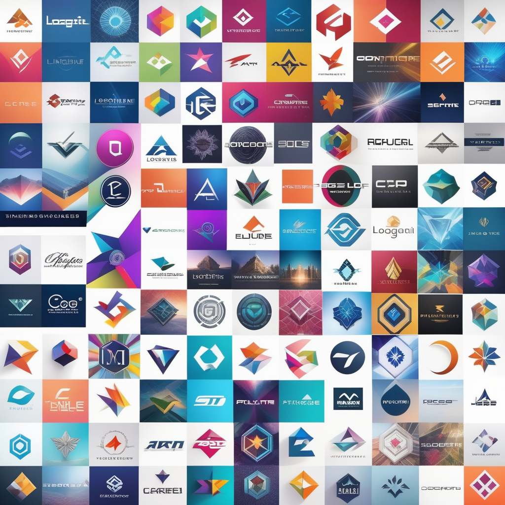
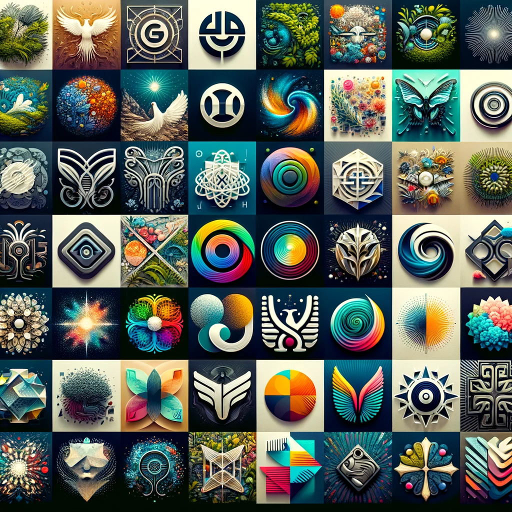

# LogoPicture AI: The Future of Logo Design

## Summary:
LogoPicture AI is an innovative platform that leverages artificial intelligence to create unique and compelling logos. Designed for businesses, designers, and branding agencies, it offers a fast, efficient, and creative way to generate logos that resonate with brand identities.

## Key Points:
- AI-powered logo design tool.
- Suitable for businesses and individual designers.
- Quick and efficient logo generation with a creative edge.

## Pros and Cons:

| Pros                                       | Cons                                  |
|--------------------------------------------|---------------------------------------|
| Fast and efficient logo creation           | May lack the personal touch of a human designer |
| Wide variety of design options             | Limited control over specific design elements |
| No need for extensive design skills        | Dependent on AI algorithms for outcomes |

## 🌟 Tips for the Reader:
- 🎨 Experiment with different styles and inputs for diverse results.
- 🌐 Use LogoPicture AI to quickly brainstorm logo ideas.
- 💡 Keep up with the latest design trends to inform your inputs.

## Examples:

### Example 1: Startup Logo Creation
- **Prompt:** Innovative and Modern Logo for a Tech Startup
- **Input:** Company values, color preferences, and industry type.
- **Output:** A modern, AI-generated logo that reflects the startup's innovative spirit.

### Example 2: Rebranding for an Established Business
- **Prompt:** Refreshed Logo for a Rebranding Campaign
- **Input:** Existing logo elements, new brand direction, and color scheme.
- **Output:** An updated logo that maintains brand heritage while introducing a fresh look.

👉 [**Try for yourself**](https://logopictureai.com/)

## URL Address of the AI Topic / vendor:
- [LogoPicture AI Official Website](https://logopictureai.com/)

---

**Follow our Social Media for more information:**
- 📘 <a href="https://www.facebook.com/groups/trionxai" target="_blank">FB group: Trionx AI Group</a>
- 👍 <a href="https://www.facebook.com/ai.trionxai" target="_blank">FB page: Trionx AI Page</a>
- 📸 <a href="https://www.instagram.com/trionxai/" target="_blank">Instagram: Trionx AI Instagram</a>
- ▶️ <a href="https://www.youtube.com/@robotdocs/" target="_blank">Youtube: Trionx AI YouTube</a>

---

## SEO High Ranking Page Tags:
LogoPicture AI, AI logo design, automated logo creation, branding with AI, creative logos, business branding, AI in design, logo generation, digital logos, AI technology in branding, logo design tool, AI-driven design, graphic design AI, custom logos, logo creation platform, innovative logo design, brand identity, AI for marketing, visual branding, logo design trends

